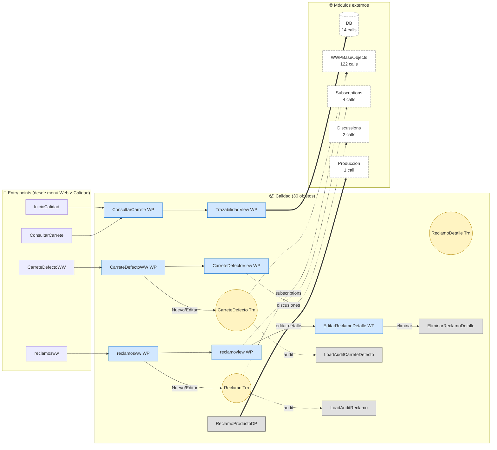
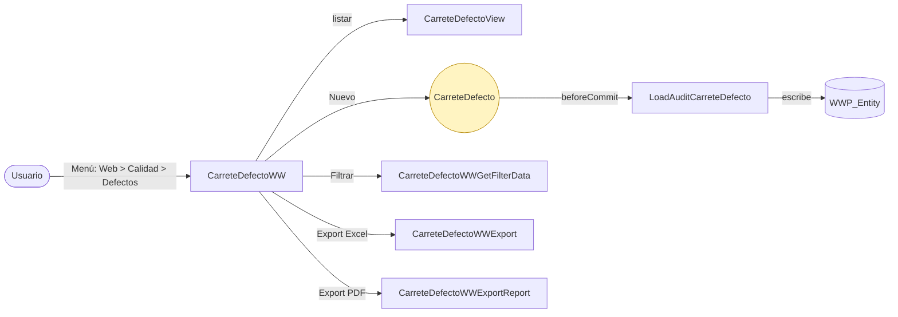
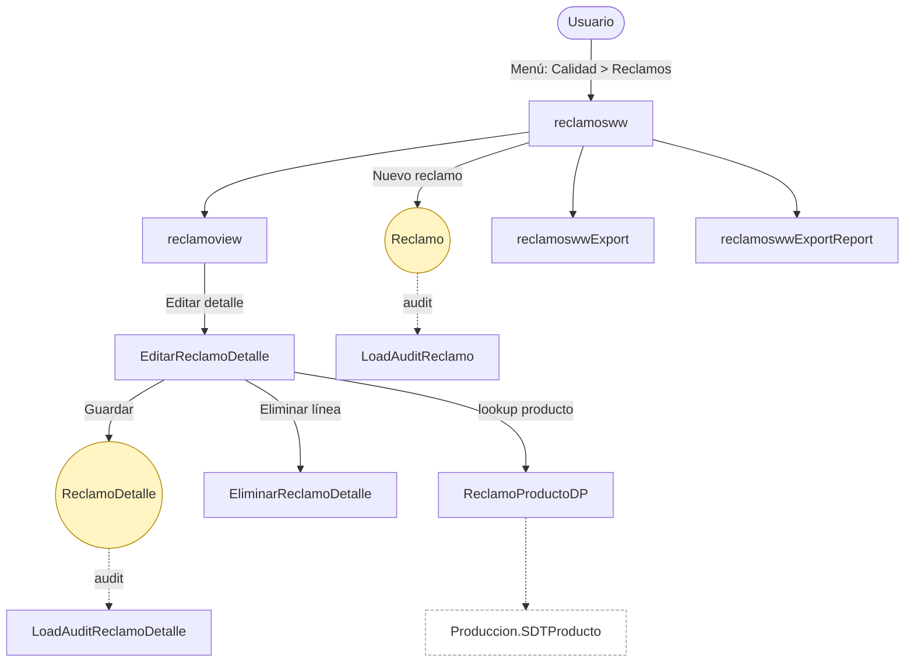
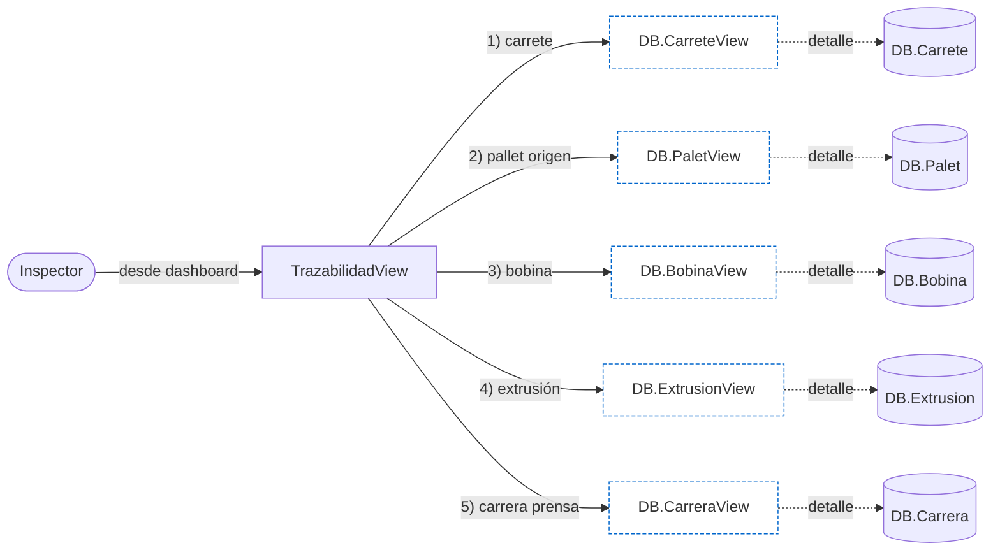

# Flujo del módulo: Calidad

> Diagramas de flujo generados a partir de `_index.json` + `Modules/Calidad.md` + `Processes/proc_calidad_*`.
> Renderización: Mermaid (VS Code con extensión Mermaid Preview, GitHub, GitLab).

---

## 📊 Resumen

| Métrica | Valor |
|---|---|
| Objetos totales | 30 |
| Transactions | 3 (Reclamo, CarreteDefecto, ReclamoDetalle) |
| WebPanels | 12 |
| Procedures | 14 |
| DataProviders | 1 |
| Módulos que LLAMA | 6 (WWP, DB, Subscriptions, Discussions, Common, Produccion) |
| Módulos que LO LLAMAN | 2 (Web vía menú, WWPBaseObjects vía ListWWPPrograms) |
| Procesos canónicos | 3 |

---

## 🚪 Entry points

| Entry | Tipo | Ruta / quién invoca |
|---|---|---|
| `InicioCalidad` | menú | Web > Calidad > Inicio |
| `CarreteDefectoWW` | menú | Web > Calidad > Defectos |
| `reclamosww` | menú | Web > Calidad > Reclamos |
| `ConsultarCarrete` | menú | Web > Calidad > Consultar |

---

## 🔀 Diagrama general del módulo

**Leyenda:**
- 🟡 círculo = Transaction (entidad de negocio)
- 🔵 caja = WebPanel (pantalla)
- ⬜ caja gris = Procedure / DataProvider
- ➡️ sólida = navegación/invocación de negocio
- ➡️ punteada = llamada secundaria (audit, discussions, subscriptions)
- ➡️ gruesa `==>` = dependencia de datos pesada

---

## 📦 Procesos del módulo

### Proceso 1 — `proc_calidad_carrete_defecto_ww` (CRUD de defectos)

**7 objetos. Textbook WWP CRUD.**

---

### Proceso 2 — `proc_calidad_reclamos_ww` (gestión de reclamos)

**~142 objetos en el bundle (incluye infra WWP).** Cluster más grande del módulo.

---

### Proceso 3 — `proc_calidad_trazabilidad_view` (trazabilidad cruzada)

**El corazón de la trazabilidad.** Un carrete defectuoso se puede rastrear hacia atrás: carrete → pallet → bobina → extrusión → lote de materia prima. Cruza 5 entidades del módulo DB en una sola vista.

---

## 🔗 Llamadas cross-module detalladas

### → Llama a otros módulos

| Módulo destino | Llamadas | Top 3 objetos invocados |
|---|---|---|
| WWPBaseObjects | 122 | `SecGAMIsAuthByFunctionalityKey`, `LoadWWPContext`, `WWP_GetAppliedFiltersDescription` |
| DB | 14 | `ExtrusionView`, `BobinaView`, `PaletView` (los 5 View de trazabilidad) |
| WWPBaseObjects.Subscriptions | 4 | `WWP_HasSubscriptionsToDisplay` (en cada view) |
| WWPBaseObjects.Discussions | 2 | `WWP_HasDiscussionMessages` (reclamoview, CarreteDefectoView) |
| GeneXus.Common | 1 | `Messages` (en EditarReclamoDetalle) |
| Produccion | 1 | `SDTProducto` (desde ReclamoProductoDP) |

### ← Lo llaman desde

| Módulo origen | Llamadas | Cómo |
|---|---|---|
| Web | 5 | `MenuCalidad` (DP) dispatcheando a 3 WP + `InicioCalidad` |
| WWPBaseObjects | 2 | `ListWWPPrograms` listando CarreteDefectoWW y reclamosww |

---

## 🗃️ Datos tocados (extraído de la matrix)

| Entidad | Operación por Calidad | Procesos que lo hacen |
|---|---|---|
| `CarreteDefecto` | **C** (ciclo de vida completo) | proc_calidad_carrete_defecto_ww |
| `Reclamo` | **C** | proc_calidad_reclamos_ww |
| `ReclamoDetalle` | **C** | proc_calidad_reclamos_ww (sub-proceso) |
| `Bobina`, `Carrete`, `Palet`, `Extrusion`, `Carrera` | **R** | proc_calidad_trazabilidad_view |
| `WWP_Entity` (audit) | **W** (indirecto) | todos los CRUD |

---

## 🧭 Lectura rápida del módulo

- **Propósito:** control de calidad + trazabilidad del producto.
- **Patrón dominante:** WWP standard (CRUD con audit automático).
- **Valor diferencial:** `TrazabilidadView` es la funcionalidad que justifica el módulo — cruza 5 entidades de DB para rastrear defectos hasta el origen físico.
- **Acoplamiento externo:** mínimo (1 llamada a Produccion para lookup, resto es infra WWP). Módulo candidato a migración aislada.
- **Riesgo de migración:** la trazabilidad depende de que los 5 `*View` de DB existan en el target. Si se migra Calidad antes que DB, `TrazabilidadView` queda sin funcionar.
