# Flujo del módulo: DB

> Generado por `Scripts/generate-module-flows.ps1` a partir de `_index.json` + `_menu.json` + `_processes.json` + `Modules/DB.md`.
> Renderización: Mermaid (VS Code Mermaid Preview, GitHub, GitLab).

---

## 📊 Resumen

| Métrica | Valor |
|---|---|
| Objetos totales | 240 |
| Transactions | 53 (PrensadoBobina, ExtrusionResultado, Carrera, Carrete, Order, Extrusora, ExtrusoraMezcladora, Palet, Producto, PrensadoResultado, Lote, PrensadoInterrupcion, Interrupcion, StatementOfIncome, Silo, Inventario, Turno, Budget, Extrusion, EmbarqueDetalle, ProductoCategoria, PrensaCarrera, ExistenciaProducto, ExistenciaSilo, Company, LoteReporte, FTB, ExtrusionInterrupcion, Operador, PrensaTroquel, Configuracion, OrdenEtiquetado, EmbarquePallet, Product, PaletCarrete, Troquel, Remission, PrensaProducto, Consolidated, Prensado, Documento, SalesPerson, ExtrusoraProducto, Embarque, Prensa, ProductoTerminado, EtiquetadoOperador, ExtrusoraBobina, Existencia, Customer, BarCode, Document, Bobina) |
| WebPanels | 85 |
| Procedures | 102 |
| DataProviders | 0 |
| SDTs | 0 |
| Módulos que LLAMA | 13 (1890 calls) |
| Módulos que LO LLAMAN | 12 (608 calls) |
| Procesos canónicos | 56 |

---

## 🚪 Entry points

| Entry | Tipo | Ruta / quién invoca |
|---|---|---|
| `BobinaView` | externo | Calidad.TrazabilidadView, Produccion.vwAnaliticaBobina |
| `CarreraView` | externo | Calidad.TrazabilidadView, Produccion.vwAnaliticaCarrete |
| `CompanyWW` | externo | WWPBaseObjects.ListWWPPrograms |
| `ConsolidatedWW` | externo | WWPBaseObjects.ListWWPPrograms |
| `Document` | externo | Root.wpImportarPermisosPorRol |
| `Embarque` | externo | Embarques.BuscarEmbarqueRemission, Embarques.CargarEmbarque |
| `EmbarqueDetalle` | externo | Embarques.CargarEmbarque, Embarques.ContarEmbarqueLineasValidadas |
| `EmbarquePallet` | externo | Embarques.CargarEmbarque, Embarques.EmbarqueDetallePalletWCGetFilterData |
| `EmbarqueView` | externo | Embarques.ListadoEmbarques |
| `EtiquetadoOperador` | externo | Produccion.SDEtiquetadoOperador, Produccion.SDOrdenEtiquetado |
| `Existencia` | externo | Existencia.FechaExistenciaAnterior, Existencia.ObtenerExistenciaProducto |
| `ExistenciaProducto` | externo | Existencia.GuardarExistenciaProducto, Existencia.ObtenerExistenciaProducto |
| `ExistenciaSilo` | externo | Existencia.GuardarExistenciaSilo, Existencia.ObtenerExistenciaSilo |
| `ExtrusionInterrupcionWW` | externo | WWPBaseObjects.ListWWPPrograms |
| `ExtrusionResultado` | externo | Existencia.ExistenciaBobinasPorTurnoId, Produccion.GuardarExtrusionResultado |
| `ExtrusoraBobina` | externo | Produccion.SDExtrusoraBobina, Produccion.SDPausarBobinas |
| `InterrupcionView` | externo | Produccion.vwAnaliticaBobina |
| `LlenadoBobinaInterrupcion` | externo | Produccion.vwAnaliticaBobina |
| `Lote` | externo | Existencia.ObtenerExistenciaSilo, Produccion.gestionarLote |
| `OrdenEtiquetado` | externo | Produccion.CrearOrdenEtiquetado, Produccion.GuardarOrdenEtiquetado |
| `Order` | externo | Embarques.CrearEmbarque, Embarques.InicializarEmbarque |
| `Prensa` | externo | Produccion.gestionarPrensa, Produccion.listarPrensas |
| `PrensaCarrera` | externo | Produccion.SDCerrarPrensado, Produccion.SDPrensaCarrera |
| `PrensadoBobina` | externo | Produccion.CrearPrensadoBobina, Produccion.IniciarCarrera |
| `PrensadoBobinaWW` | externo | WWPBaseObjects.ListWWPPrograms |
| `PrensadoInterrupcion` | externo | Produccion.ObtenerInterrupcionCarrera, Produccion.PrensaDetenida |
| `PrensadoResultado` | externo | Existencia.ExistenciaPalletPorTurnoId, Produccion.GuardarOrdenEtiquetado |
| `PrensaTroquel` | externo | Produccion.ObtenerPrensaPorTroquelId, Produccion.SDCrearPrensaTroquel |
| `Product` | externo | Embarques.ProductsWW, Embarques.ProductsWWExport |
| `ProductoTerminadoWW` | externo | WWPBaseObjects.ListWWPPrograms |
| `Remission` | externo | Embarques.CrearEmbarque, Embarques.InicializarEmbarque |
| `Silo` | externo | Existencia.ObtenerExistenciaSilo, Produccion.ArchivarSilos |
| `StatementOfIncomeWW` | externo | WWPBaseObjects.ListWWPPrograms |
| `Troquel` | externo | Produccion.gestionarTroquel, Produccion.listarTroquel |
| `Turno` | externo | Produccion.CrearExtrusion, Produccion.ExclusionDelDia |
| `BobinaWW` | menú | Web > Producción > Extrusión > Bobinas |
| `BudgetWW` | menú | Web > Reportes > Budget |
| `CarreraWW` | menú | Web > Prensado > Operación > Carreras |
| `CarreteWW` | menú | Web > Producción > Prensado > Carretes |
| `CustomerWW` | menú | Web > Reportes > Customer |
| `ExistenciaWW` | menú | Web > Inventarios > Inventario |
| `ExtrusionWW` | menú | Web > Extrusión > Operación > Extrusiones |
| `ExtrusoraMezcladoraWW` | menú | Web > Producción > Referencias > ExtrusoraMezcladora |
| `FTBWW` | menú | Web > Reportes > Report FTB |
| `PaletWW` | menú | Web > Prensado > Operación > Palets |
| `PrensadoWW` | menú | Web > Producción > Prensado > Prensados |
| `SalesPersonWW` | menú | Web > Reportes > SalesPerson |
| `TroquelWW` | menú | Web > Prensado > Troqueles |
| `WWConfiguracion` | menú | Web > Producción > Referencias > Configuración |
| `WWExtrusora` | menú | Web > Producción > Catálogos > Extrusoras |
| `WWExtrusoraProducto` | menú | Web > Producción > Referencias > ExtrusoraProducto |
| `WWInventario` | menú | Web > Producción > Catálogos > Inventarios |
| `WWOperador` | menú | Web > Producción > Catálogos > Operadores |
| `WWPrensaProducto` | menú | Web > Producción > Referencias > PrensaProducto |
| `WWProducto` | menú | Web > Producción > Catálogos > Productos |
| `WWProductoCategoria` | menú | Web > Producción > Catálogos > Categorías |

---

## 🧬 Familias de entidades

Las 53 Trns de DB agrupadas por familia semántica. Una Trn puede aparecer en varias familias -- es una vista categorial, no una partición.

| Familia | Trns |
|---|---|
| Bobina | `Bobina`, `ExtrusoraBobina`, `PaletCarrete`, `PrensadoBobina` |
| Carrete | `Carrete`, `PaletCarrete` |
| Prensa | `Carrera`, `Prensa`, `PrensaCarrera`, `Prensado`, `PrensadoBobina`, `PrensadoInterrupcion`, `PrensadoResultado`, `PrensaProducto`, `PrensaTroquel`, `Troquel` |
| Extrusión | `Extrusion`, `ExtrusionInterrupcion`, `ExtrusionResultado`, `Extrusora`, `ExtrusoraBobina`, `ExtrusoraMezcladora`, `ExtrusoraProducto` |
| Silo/Lote | `BarCode`, `Existencia`, `ExistenciaProducto`, `ExistenciaSilo`, `Lote`, `LoteReporte`, `Producto`, `ProductoCategoria`, `ProductoTerminado`, `Silo` |
| Embarque | `Document`, `Embarque`, `EmbarqueDetalle`, `EmbarquePallet`, `FTB`, `Order`, `Remission` |
| SAE | `Budget`, `Consolidated`, `Customer`, `SalesPerson`, `StatementOfIncome` |
| Operación | `EtiquetadoOperador`, `Interrupcion`, `Operador`, `Turno` |
| Config/Sistema | `Company`, `Configuracion` |
| Otros | `Documento`, `Inventario`, `OrdenEtiquetado`, `Palet`, `Product` |

---

## 🔀 Diagrama general del módulo

```mermaid
flowchart LR
    subgraph MENU["🚪 Entry points (menú)"]
        M1[WWOperador]
        M2[BobinaWW]
        M3[CustomerWW]
        M4[BudgetWW]
        M5[TroquelWW]
        M6[PaletWW]
        M7[FTBWW]
        M8[WWConfiguracion]
        M9[WWProductoCategoria]
        M10[ExtrusoraMezcladoraWW]
        M11[PrensadoWW]
        M12[SalesPersonWW]
        M13[ExistenciaWW]
        M14[CarreraWW]
        M15[WWPrensaProducto]
        M16[ExtrusionWW]
        M17[WWExtrusora]
        M18[WWExtrusoraProducto]
        M19[CarreteWW]
        M20[WWInventario]
        M21[WWProducto]
    end

    subgraph XEN["⚙️ Entry points (externos)"]
        X1[Document]
        X2[Existencia]
        X3[ExtrusoraBobina]
        X4[StatementOfIncomeWW]
        X5[Prensa]
        X6[PrensadoBobinaWW]
        X7[BobinaView]
        X8[LlenadoBobinaInterrupcion]
        X9[EmbarquePallet]
        X10[Remission]
        X11[Product]
        X12[CompanyWW]
        X13[OrdenEtiquetado]
        X14[InterrupcionView]
        X15[PrensaTroquel]
        X16[Embarque]
        X17[ExistenciaSilo]
        X18[ExistenciaProducto]
        X19[PrensaCarrera]
        X20[ExtrusionInterrupcionWW]
        X21[EmbarqueDetalle]
        X22[Turno]
        X23[CarreraView]
        X24[PrensadoInterrupcion]
        X25[Silo]
        X26[Lote]
        X27[PrensadoResultado]
        X28[ConsolidatedWW]
        X29[EmbarqueView]
        X30[Order]
        X31[ProductoTerminadoWW]
        X32[ExtrusionResultado]
        X33[PrensadoBobina]
        X34[EtiquetadoOperador]
        X35[Troquel]
    end

    subgraph MOD["📦 DB (240 objetos)"]
        direction TB
    T_PrensadoBobina((PrensadoBobina))
    T_Troquel((Troquel))
    WP_BobinaWW[BobinaWW WP]
    WP_BudgetWW[BudgetWW WP]
    WP_CarreraWW[CarreraWW WP]
    WP_CarreteWW[CarreteWW WP]
    WP_CompanyWW[CompanyWW WP]
    WP_ConsolidatedWW[ConsolidatedWW WP]
    WP_CustomerWW[CustomerWW WP]
    WP_ExistenciaWW[ExistenciaWW WP]
    WP_ExtrusionWW[ExtrusionWW WP]
    WP_ExtrusoraMezcladoraWW[ExtrusoraMezcladoraWW WP]
    WP_FTBWW[FTBWW WP]
    WP_PaletWW[PaletWW WP]
    WP_PrensadoBobinaWW[PrensadoBobinaWW WP]
    WP_PrensadoWW[PrensadoWW WP]
    WP_ProductoTerminadoWW[ProductoTerminadoWW WP]
    WP_SalesPersonWW[SalesPersonWW WP]
    WP_StatementOfIncomeWW[StatementOfIncomeWW WP]
    WP_TroquelWW[TroquelWW WP]
        OTROS[+220 objetos internos]
    end

    subgraph EXT["🌐 Módulos externos"]
        E_WWPBaseObjects[WWPBaseObjects<br/>1750 calls]
        E_WWPBaseObjects_Subscriptions[WWPBaseObjects.Subscriptions<br/>40 calls]
        E_Root[Root<br/>23 calls]
        E_WWPBaseObjects_Discussions[WWPBaseObjects.Discussions<br/>20 calls]
        E_PrinterSD[PrinterSD<br/>18 calls]
        E_Produccion[Produccion<br/>17 calls]
        E_GeneXus_Common[GeneXus.Common<br/>8 calls]
        E_SAE[SAE<br/>4 calls]
        E_WWPBaseObjects_Notifications_Common[WWPBaseObjects.Notifications.Common<br/>3 calls]
        E_Web[Web<br/>2 calls]
        E_Embarques[Embarques<br/>2 calls]
        E_Reportes[Reportes<br/>2 calls]
        E_Existencia[Existencia<br/>1 calls]
    end

    M2 --> WP_BobinaWW
    M3 --> WP_CustomerWW
    M4 --> WP_BudgetWW
    M5 --> WP_TroquelWW
    M6 --> WP_PaletWW
    M7 --> WP_FTBWW
    M10 --> WP_ExtrusoraMezcladoraWW
    M11 --> WP_PrensadoWW
    M12 --> WP_SalesPersonWW
    M13 --> WP_ExistenciaWW
    M14 --> WP_CarreraWW
    M16 --> WP_ExtrusionWW
    M19 --> WP_CarreteWW
    X4 --> WP_StatementOfIncomeWW
    X6 --> WP_PrensadoBobinaWW
    X12 --> WP_CompanyWW
    X28 --> WP_ConsolidatedWW
    X31 --> WP_ProductoTerminadoWW
    X33 --> T_PrensadoBobina
    X35 --> T_Troquel
    WP_TroquelWW --> T_Troquel
    WP_PrensadoBobinaWW --> T_PrensadoBobina
    T_PrensadoBobina --> WP_PrensadoBobinaWW
    T_Troquel --> WP_TroquelWW
    OTROS -.-> WP_CarreraWW
    WP_CarreraWW ==> E_WWPBaseObjects
    WP_CarreraWW ==> E_WWPBaseObjects_Subscriptions
    WP_CarreraWW -.-> E_PrinterSD
    WP_CarreraWW -.-> E_Produccion
    WP_BobinaWW ==> E_WWPBaseObjects
    WP_BobinaWW ==> E_WWPBaseObjects_Subscriptions
    WP_BobinaWW -.-> E_Produccion
    WP_BobinaWW -.-> E_PrinterSD
    WP_PaletWW ==> E_WWPBaseObjects
    WP_PaletWW ==> E_WWPBaseObjects_Subscriptions
    WP_PaletWW -.-> E_PrinterSD
    WP_CarreteWW ==> E_WWPBaseObjects
    WP_CarreteWW -.-> E_PrinterSD
    WP_CarreteWW -.-> E_Web
    WP_CarreteWW -.-> E_Produccion
    WP_ExtrusionWW ==> E_WWPBaseObjects
    WP_ExtrusionWW -.-> E_PrinterSD
    WP_PrensadoWW ==> E_WWPBaseObjects
    WP_PrensadoWW ==> E_WWPBaseObjects_Subscriptions
    WP_PrensadoWW -.-> E_PrinterSD
    WP_TroquelWW ==> E_WWPBaseObjects
    WP_TroquelWW ==> E_WWPBaseObjects_Subscriptions
    WP_BudgetWW ==> E_WWPBaseObjects
    WP_BudgetWW ==> E_WWPBaseObjects_Subscriptions
    WP_PrensadoBobinaWW ==> E_WWPBaseObjects
    WP_PrensadoBobinaWW ==> E_WWPBaseObjects_Subscriptions
    WP_ExtrusoraMezcladoraWW ==> E_WWPBaseObjects
    WP_ExtrusoraMezcladoraWW ==> E_WWPBaseObjects_Subscriptions
    WP_StatementOfIncomeWW ==> E_WWPBaseObjects
    WP_StatementOfIncomeWW ==> E_WWPBaseObjects_Subscriptions
    WP_CompanyWW ==> E_WWPBaseObjects
    WP_CompanyWW ==> E_WWPBaseObjects_Subscriptions
    WP_SalesPersonWW ==> E_WWPBaseObjects
    WP_SalesPersonWW ==> E_WWPBaseObjects_Subscriptions
    WP_CustomerWW ==> E_WWPBaseObjects
    WP_CustomerWW ==> E_WWPBaseObjects_Subscriptions
    WP_FTBWW ==> E_WWPBaseObjects
    WP_FTBWW ==> E_WWPBaseObjects_Subscriptions
    WP_ExistenciaWW ==> E_WWPBaseObjects
    WP_ExistenciaWW ==> E_WWPBaseObjects_Subscriptions
    WP_ExistenciaWW -.-> E_Existencia
    T_PrensadoBobina ==> E_WWPBaseObjects
    T_PrensadoBobina -.-> E_WWPBaseObjects_Notifications_Common
    T_Troquel -.-> E_Produccion
    T_Troquel ==> E_WWPBaseObjects
    WP_ProductoTerminadoWW ==> E_WWPBaseObjects
    WP_ConsolidatedWW ==> E_WWPBaseObjects
    WP_ConsolidatedWW ==> E_WWPBaseObjects_Subscriptions

    classDef trn fill:#fff4c2,stroke:#b38600
    classDef wp fill:#d1e7ff,stroke:#0066cc
    classDef proc fill:#e0e0e0,stroke:#666
    classDef ext fill:#fff,stroke:#999,stroke-dasharray: 4 2
    class T_PrensadoBobina,T_Troquel trn
    class WP_CarreraWW,WP_BobinaWW,WP_PaletWW,WP_CarreteWW,WP_ExtrusionWW,WP_PrensadoWW,WP_TroquelWW,WP_BudgetWW,WP_PrensadoBobinaWW,WP_ExtrusoraMezcladoraWW,WP_StatementOfIncomeWW,WP_CompanyWW,WP_SalesPersonWW,WP_CustomerWW,WP_FTBWW,WP_ExistenciaWW,WP_ProductoTerminadoWW,WP_ConsolidatedWW wp
    class E_WWPBaseObjects_Discussions,E_Root,E_Produccion,E_WWPBaseObjects_Subscriptions,E_Existencia,E_Reportes,E_Web,E_PrinterSD,E_SAE,E_WWPBaseObjects,E_Embarques,E_GeneXus_Common,E_WWPBaseObjects_Notifications_Common ext
```

**Leyenda:**
- 🟡 círculo = Transaction (entidad de negocio)
- 🔵 caja = WebPanel (pantalla)
- ⬜ caja gris = Procedure / DataProvider / SDT
- ➡️ sólida = navegación/invocación principal
- ➡️ punteada = llamada secundaria (audit, cross-module)
- ➡️ gruesa `==>` = dependencia pesada (>30 calls al mismo peer)

---

## 📦 Procesos del módulo

### Proceso 1 -- `proc_db_embarque` (Embarque)

**77 objetos · 11 módulos tocados.**

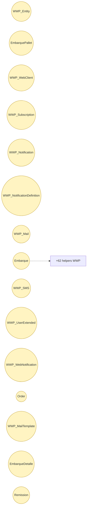

### Proceso 2 -- `proc_db_prensado_bobina_ww` (PrensadoBobinaWW)

**75 objetos · 9 módulos tocados.**

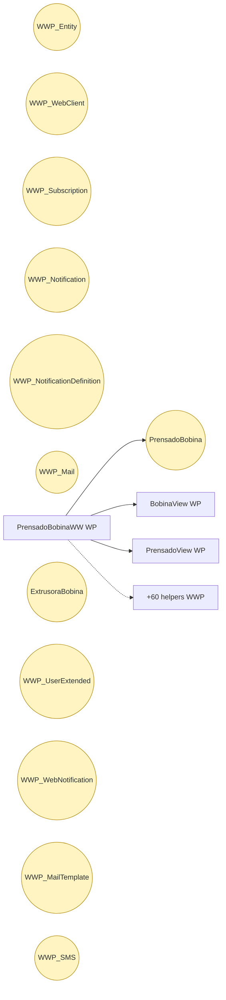

### Proceso 3 -- `proc_db_prensado_bobina` (PrensadoBobina)

**74 objetos · 10 módulos tocados.**

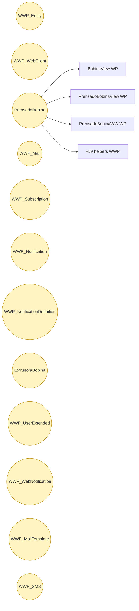

### Proceso 4 -- `proc_db_existencia` (Existencia)

**55 objetos · 10 módulos tocados.**

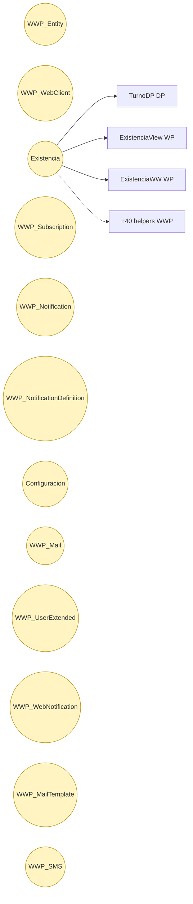

### Proceso 5 -- `proc_db_carrera_ww` (Carreras)

**50 objetos · 5 módulos tocados.**

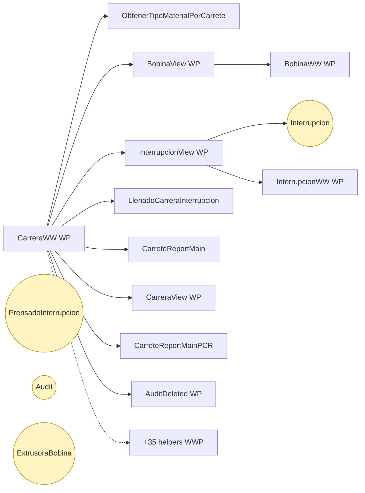

### Proceso 6 -- `proc_db_embarque_view` (EmbarqueView)

**48 objetos · 8 módulos tocados.**

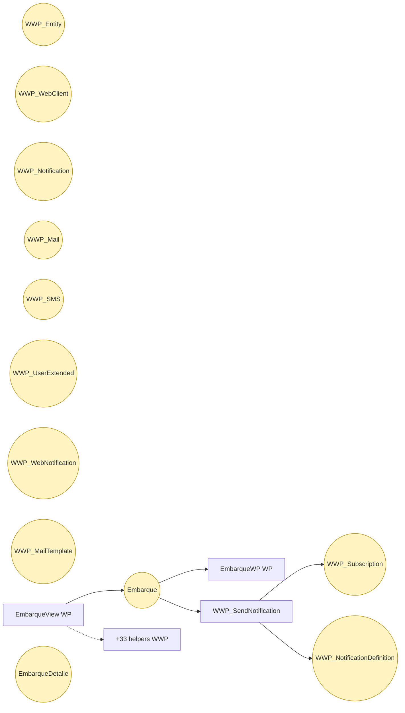

### Proceso 7 -- `proc_db_existencia_ww` (Inventario)

**48 objetos · 11 módulos tocados.**

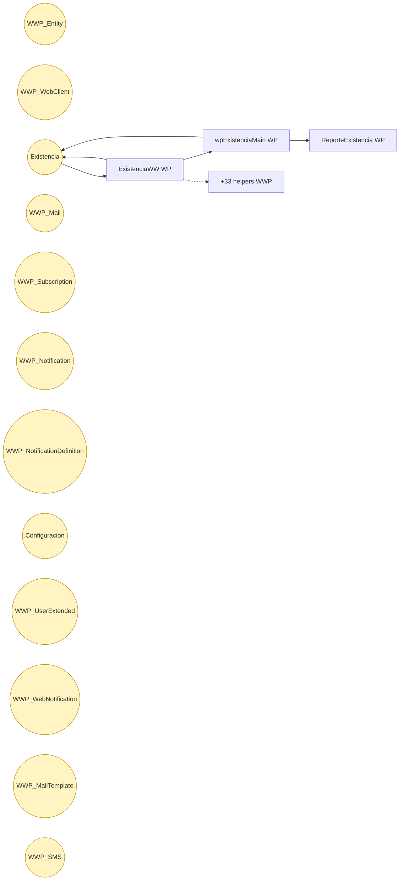

### Proceso 8 -- `proc_db_carrera_view` (CarreraView)

**38 objetos · 5 módulos tocados.**

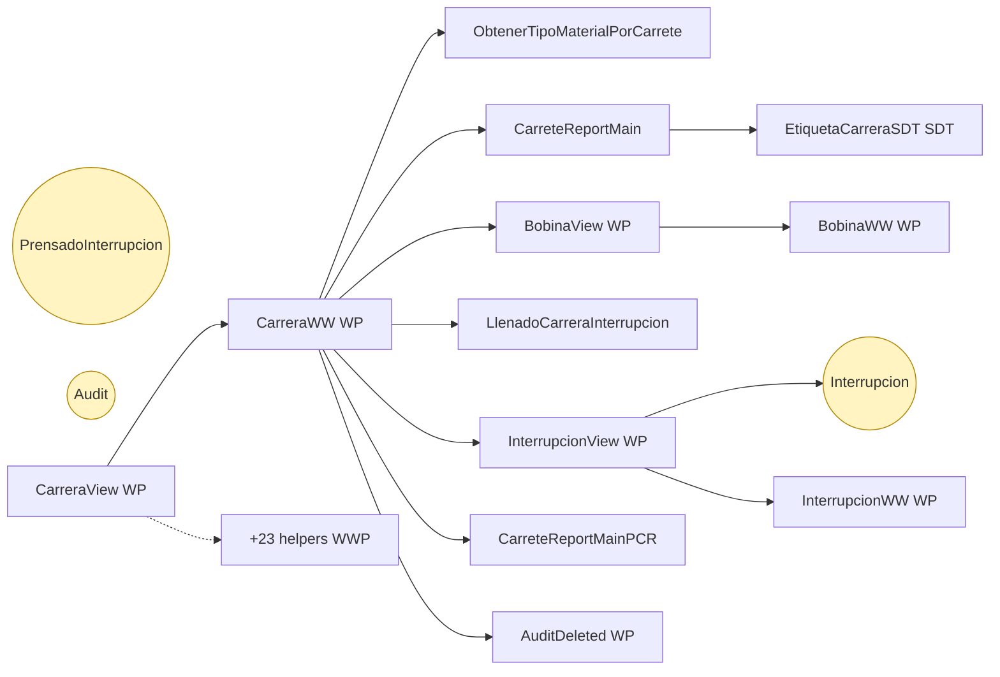

### Proceso 9 -- `proc_db_bobina_ww` (Bobinas)

**29 objetos · 4 módulos tocados.**

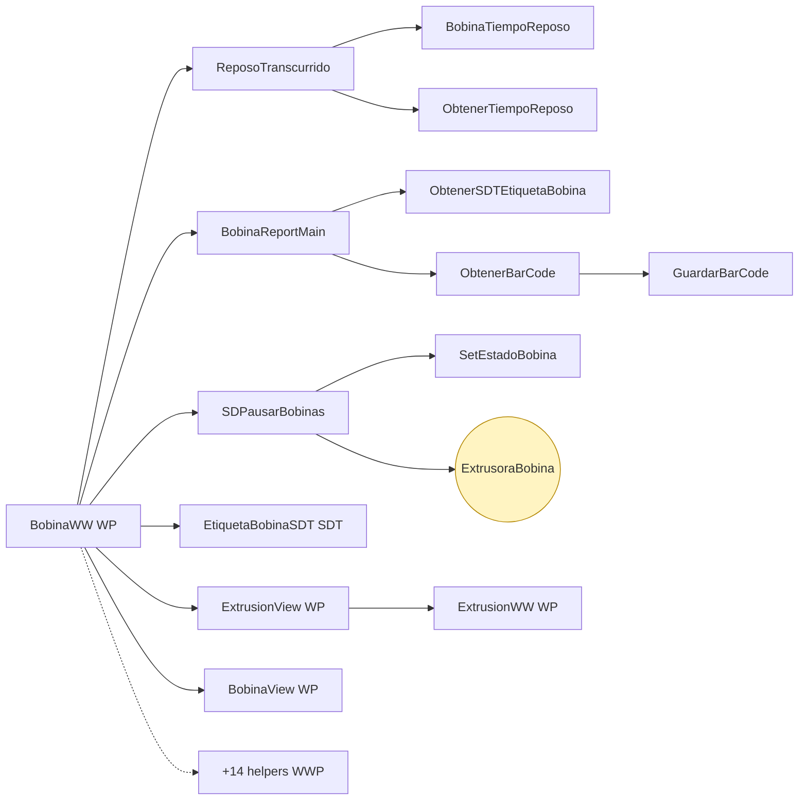

### Proceso 10 -- `proc_db_prensado_ww` (Prensados)

**24 objetos · 3 módulos tocados.**

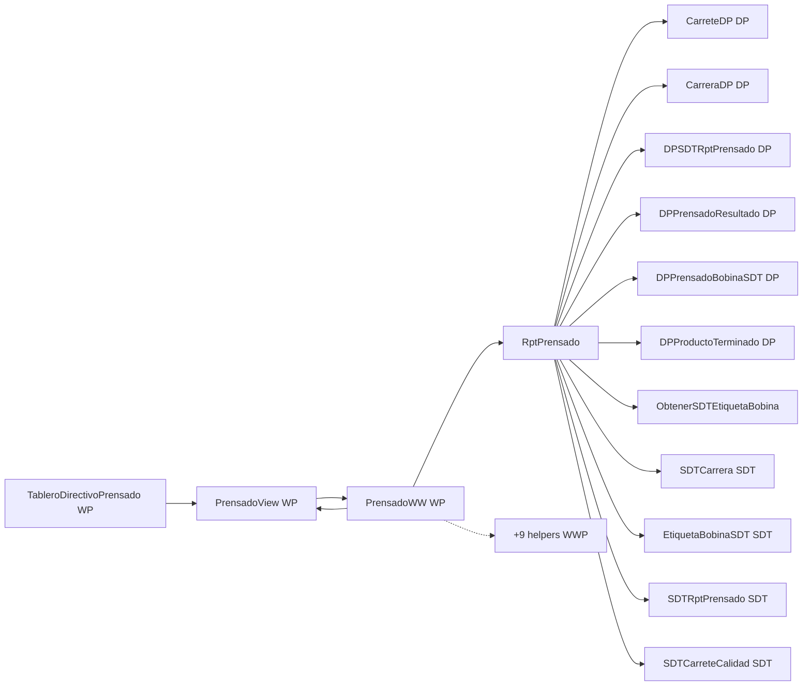

### Proceso 11 -- `proc_db_bobina_view` (BobinaView)

**22 objetos · 3 módulos tocados.**

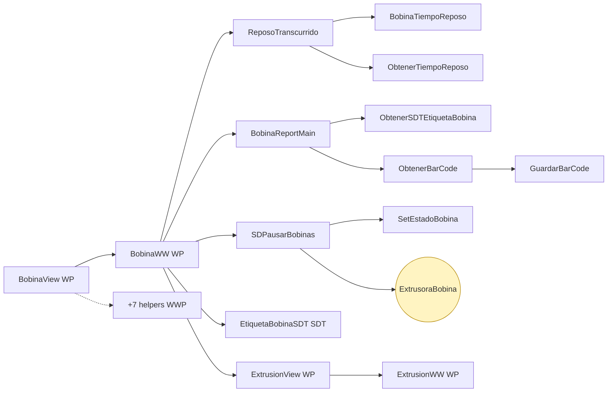

### Proceso 12 -- `proc_db_troquel` (Troquel)

**19 objetos · 5 módulos tocados.**

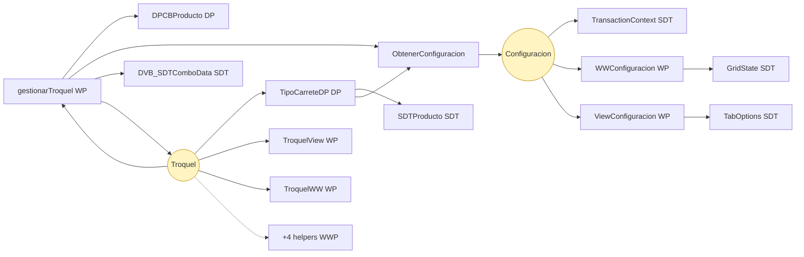

### Proceso 13 -- `proc_db_extrusion_ww` (Extrusiones)

**16 objetos · 4 módulos tocados.**

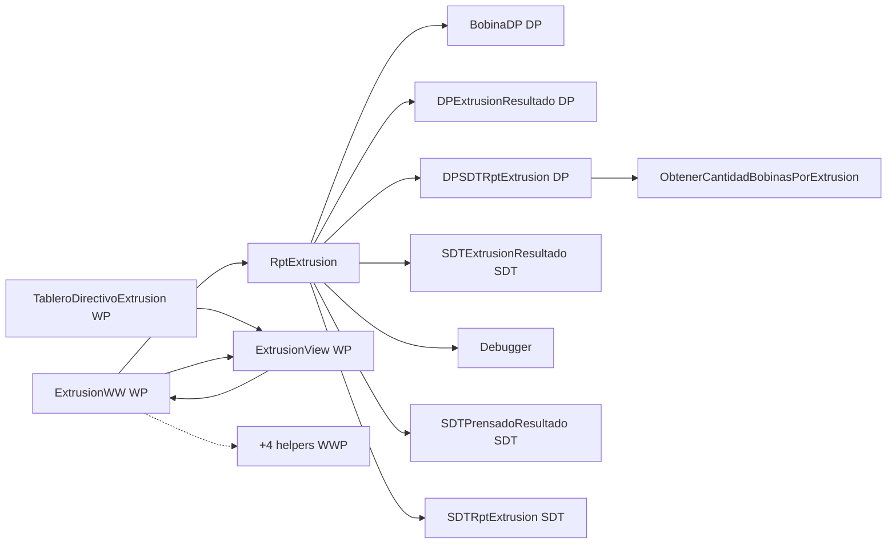

### Proceso 14 -- `proc_db_prensa_troquel` (PrensaTroquel)

**16 objetos · 3 módulos tocados.**

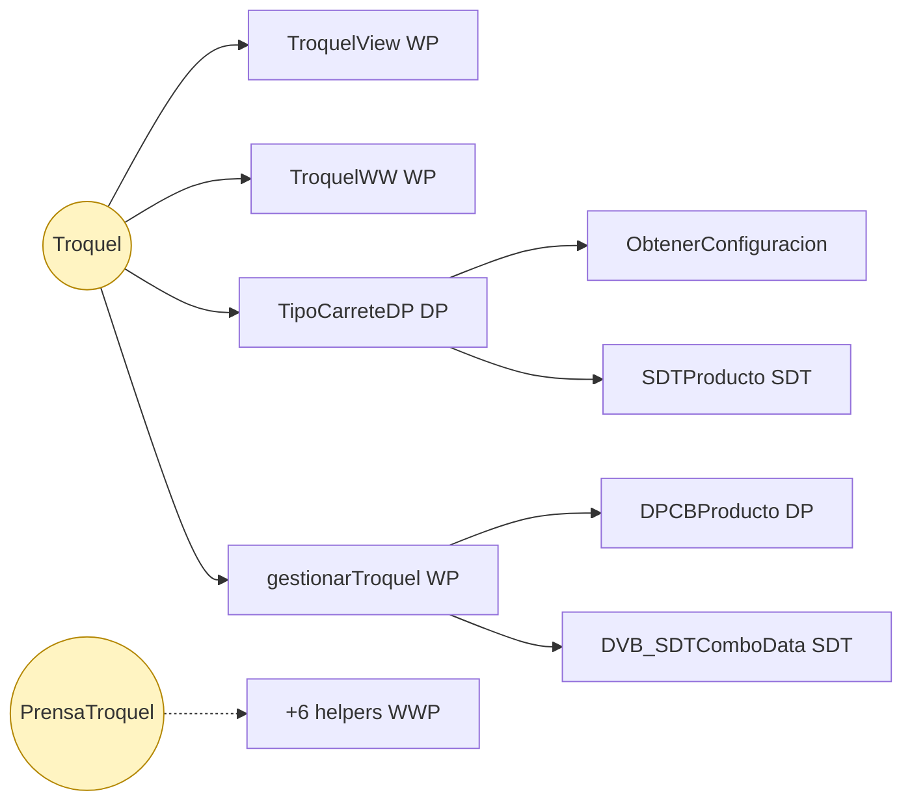

### Proceso 15 -- `proc_db_llenado_bobina_interrupcion` (LlenadoBobinaInterrupcion)

**15 objetos · 2 módulos tocados.**

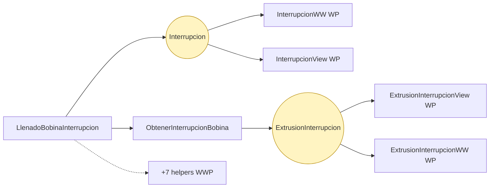

### Proceso 16 -- `proc_db_carrete_ww` (Carretes)

**14 objetos · 4 módulos tocados.**

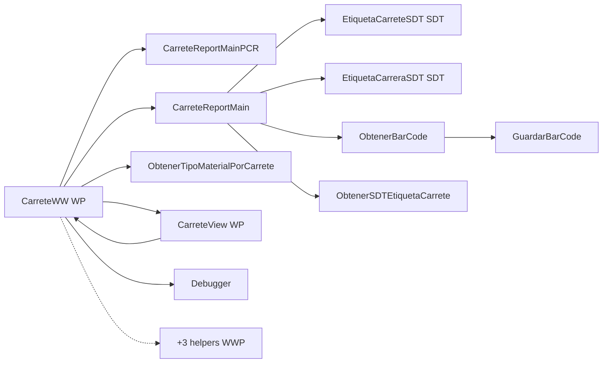

### Proceso 17 -- `proc_db_troquel_ww` (Troqueles)

**14 objetos · 3 módulos tocados.**

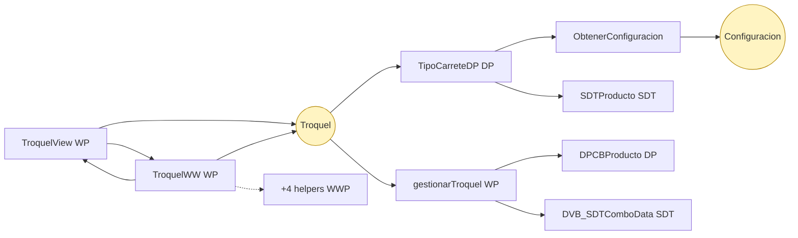

### Proceso 18 -- `proc_db_wwextrusora_producto` (ExtrusoraProducto)

**14 objetos · 3 módulos tocados.**

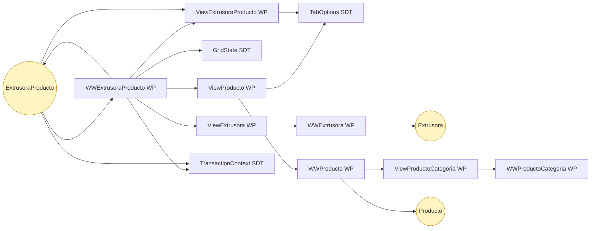

### Proceso 19 -- `proc_db_palet_ww` (Palets)

**13 objetos · 3 módulos tocados.**

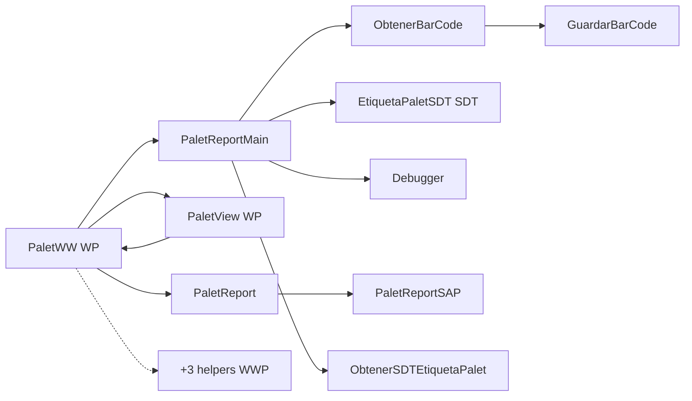

### Proceso 20 -- `proc_db_budget_ww` (Budget)

**11 objetos · 2 módulos tocados.**

```mermaid
flowchart LR
    S_SDTBudget[SDTBudget SDT]
    WP_BudgetView[BudgetView WP]
    P_Actualizando[Actualizando]
    WP_outlookww[outlookww WP]
    WP_BudgetWW[BudgetWW WP]
    WP_EditBudget[EditBudget WP]
    T_Budget((Budget))
    INFRA[+4 helpers WWP]
    WP_outlookww --> S_SDTBudget
    WP_outlookww --> T_Budget
    T_Budget --> WP_BudgetView
    T_Budget --> WP_EditBudget
    T_Budget --> WP_BudgetWW
    WP_EditBudget --> S_SDTBudget
    P_Actualizando --> T_Budget
    WP_EditBudget --> T_Budget
    WP_BudgetWW --> T_Budget
    WP_BudgetWW --> WP_BudgetView
    WP_BudgetWW -.-> INFRA

    classDef trn fill:#fff4c2,stroke:#b38600
    classDef wp fill:#d1e7ff,stroke:#0066cc
    classDef proc fill:#e0e0e0,stroke:#666
    class T_Budget trn
```

### Proceso 21 -- `proc_db_wwproducto` (Productos)

**9 objetos · 3 módulos tocados.**

```mermaid
flowchart LR
    WP_WWProducto[WWProducto WP]
    S_GridState[GridState SDT]
    S_TransactionContext[TransactionContext SDT]
    T_Producto((Producto))
    T_ProductoCategoria((ProductoCategoria))
    WP_ViewProductoCategoria[ViewProductoCategoria WP]
    S_TabOptions[TabOptions SDT]
    WP_WWProductoCategoria[WWProductoCategoria WP]
    WP_ViewProducto[ViewProducto WP]
    T_Producto --> S_TransactionContext
    T_Producto --> WP_WWProducto
    T_Producto --> WP_ViewProducto
    WP_WWProducto --> S_GridState
    WP_WWProducto --> WP_ViewProductoCategoria
    WP_ViewProducto --> S_TabOptions
    WP_ViewProductoCategoria --> WP_WWProductoCategoria
    WP_WWProductoCategoria --> T_ProductoCategoria
    WP_WWProducto --> S_TransactionContext
    WP_WWProducto --> T_Producto
    WP_WWProducto --> WP_ViewProducto

    classDef trn fill:#fff4c2,stroke:#b38600
    classDef wp fill:#d1e7ff,stroke:#0066cc
    classDef proc fill:#e0e0e0,stroke:#666
    class T_Producto,T_ProductoCategoria trn
```

### Proceso 22 -- `proc_db_ftbww` (Report FTB)

**8 objetos · 2 módulos tocados.**

```mermaid
flowchart LR
    WP_UpdateFTB[UpdateFTB WP]
    WP_FTBWW[FTBWW WP]
    T_FTB((FTB))
    S_SDTFTB[SDTFTB SDT]
    INFRA[+4 helpers WWP]
    WP_UpdateFTB --> S_SDTFTB
    WP_UpdateFTB --> T_FTB
    T_FTB --> WP_FTBWW
    T_FTB --> WP_UpdateFTB
    WP_FTBWW --> T_FTB
    WP_FTBWW -.-> INFRA

    classDef trn fill:#fff4c2,stroke:#b38600
    classDef wp fill:#d1e7ff,stroke:#0066cc
    classDef proc fill:#e0e0e0,stroke:#666
    class T_FTB trn
```

### Proceso 23 -- `proc_db_company_ww` (CompanyWW)

**7 objetos · 1 módulos tocados.**

```mermaid
flowchart LR
    WP_CompanyView[CompanyView WP]
    WP_CompanyWW[CompanyWW WP]
    T_Company((Company))
    INFRA[+4 helpers WWP]
    WP_CompanyView --> T_Company
    WP_CompanyView --> WP_CompanyWW
    WP_CompanyWW --> T_Company
    WP_CompanyWW --> WP_CompanyView
    WP_CompanyWW -.-> INFRA

    classDef trn fill:#fff4c2,stroke:#b38600
    classDef wp fill:#d1e7ff,stroke:#0066cc
    classDef proc fill:#e0e0e0,stroke:#666
    class T_Company trn
```

### Proceso 24 -- `proc_db_embarque_pallet` (EmbarquePallet)

**7 objetos · 1 módulos tocados.**

```mermaid
flowchart LR
    WP_EmbarquePalletView[EmbarquePalletView WP]
    T_EmbarquePallet((EmbarquePallet))
    WP_EmbarquePalletWW[EmbarquePalletWW WP]
    INFRA[+4 helpers WWP]
    WP_EmbarquePalletWW --> T_EmbarquePallet
    T_EmbarquePallet --> WP_EmbarquePalletView
    T_EmbarquePallet --> WP_EmbarquePalletWW
    T_EmbarquePallet -.-> INFRA

    classDef trn fill:#fff4c2,stroke:#b38600
    classDef wp fill:#d1e7ff,stroke:#0066cc
    classDef proc fill:#e0e0e0,stroke:#666
    class T_EmbarquePallet trn
```

### Proceso 25 -- `proc_db_etiquetado_operador` (EtiquetadoOperador)

**7 objetos · 1 módulos tocados.**

```mermaid
flowchart LR
    WP_EtiquetadoOperadorView[EtiquetadoOperadorView WP]
    WP_EtiquetadoOperadorWW[EtiquetadoOperadorWW WP]
    T_EtiquetadoOperador((EtiquetadoOperador))
    INFRA[+4 helpers WWP]
    WP_EtiquetadoOperadorWW --> T_EtiquetadoOperador
    WP_EtiquetadoOperadorWW --> WP_EtiquetadoOperadorView
    T_EtiquetadoOperador --> WP_EtiquetadoOperadorView
    T_EtiquetadoOperador --> WP_EtiquetadoOperadorWW
    T_EtiquetadoOperador -.-> INFRA

    classDef trn fill:#fff4c2,stroke:#b38600
    classDef wp fill:#d1e7ff,stroke:#0066cc
    classDef proc fill:#e0e0e0,stroke:#666
    class T_EtiquetadoOperador trn
```

### Proceso 26 -- `proc_db_extrusion_interrupcion_ww` (ExtrusionInterrupcionWW)

**7 objetos · 2 módulos tocados.**

```mermaid
flowchart LR
    T_ExtrusionInterrupcion((ExtrusionInterrupcion))
    WP_ExtrusionInterrupcionView[ExtrusionInterrupcionView WP]
    P_ObtenerInterrupcionBobina[ObtenerInterrupcionBobina]
    WP_ExtrusionInterrupcionWW[ExtrusionInterrupcionWW WP]
    INFRA[+3 helpers WWP]
    P_ObtenerInterrupcionBobina --> T_ExtrusionInterrupcion
    T_ExtrusionInterrupcion --> WP_ExtrusionInterrupcionView
    T_ExtrusionInterrupcion --> WP_ExtrusionInterrupcionWW
    WP_ExtrusionInterrupcionWW --> T_ExtrusionInterrupcion
    WP_ExtrusionInterrupcionWW -.-> INFRA

    classDef trn fill:#fff4c2,stroke:#b38600
    classDef wp fill:#d1e7ff,stroke:#0066cc
    classDef proc fill:#e0e0e0,stroke:#666
    class T_ExtrusionInterrupcion trn
```

### Proceso 27 -- `proc_db_extrusora_mezcladora_ww` (ExtrusoraMezcladora)

**7 objetos · 1 módulos tocados.**

```mermaid
flowchart LR
    WP_ExtrusoraMezcladoraWW[ExtrusoraMezcladoraWW WP]
    WP_ExtrusoraMezcladoraView[ExtrusoraMezcladoraView WP]
    T_ExtrusoraMezcladora((ExtrusoraMezcladora))
    INFRA[+4 helpers WWP]
    WP_ExtrusoraMezcladoraWW --> T_ExtrusoraMezcladora
    WP_ExtrusoraMezcladoraWW --> WP_ExtrusoraMezcladoraView
    WP_ExtrusoraMezcladoraView --> T_ExtrusoraMezcladora
    WP_ExtrusoraMezcladoraView --> WP_ExtrusoraMezcladoraWW
    T_ExtrusoraMezcladora --> WP_ExtrusoraMezcladoraView
    T_ExtrusoraMezcladora --> WP_ExtrusoraMezcladoraWW
    WP_ExtrusoraMezcladoraWW -.-> INFRA

    classDef trn fill:#fff4c2,stroke:#b38600
    classDef wp fill:#d1e7ff,stroke:#0066cc
    classDef proc fill:#e0e0e0,stroke:#666
    class T_ExtrusoraMezcladora trn
```

### Proceso 28 -- `proc_db_interrupcion_view` (InterrupcionView)

**7 objetos · 1 módulos tocados.**

```mermaid
flowchart LR
    WP_InterrupcionWW[InterrupcionWW WP]
    WP_InterrupcionView[InterrupcionView WP]
    T_Interrupcion((Interrupcion))
    INFRA[+4 helpers WWP]
    WP_InterrupcionWW --> T_Interrupcion
    WP_InterrupcionWW --> WP_InterrupcionView
    T_Interrupcion --> WP_InterrupcionView
    T_Interrupcion --> WP_InterrupcionWW
    WP_InterrupcionView --> T_Interrupcion
    WP_InterrupcionView --> WP_InterrupcionWW
    WP_InterrupcionView -.-> INFRA

    classDef trn fill:#fff4c2,stroke:#b38600
    classDef wp fill:#d1e7ff,stroke:#0066cc
    classDef proc fill:#e0e0e0,stroke:#666
    class T_Interrupcion trn
```

### Proceso 29 -- `proc_db_prensado_interrupcion` (PrensadoInterrupcion)

**7 objetos · 2 módulos tocados.**

```mermaid
flowchart LR
    T_PrensadoInterrupcion((PrensadoInterrupcion))
    P_PrensadoInterrupMin[PrensadoInterrupMin]
    WP_PrensadoInterrupcionWW[PrensadoInterrupcionWW WP]
    WP_PrensadoInterrupcionView[PrensadoInterrupcionView WP]
    INFRA[+3 helpers WWP]
    P_PrensadoInterrupMin --> T_PrensadoInterrupcion
    T_PrensadoInterrupcion --> WP_PrensadoInterrupcionView
    T_PrensadoInterrupcion --> WP_PrensadoInterrupcionWW
    WP_PrensadoInterrupcionWW --> T_PrensadoInterrupcion
    T_PrensadoInterrupcion -.-> INFRA

    classDef trn fill:#fff4c2,stroke:#b38600
    classDef wp fill:#d1e7ff,stroke:#0066cc
    classDef proc fill:#e0e0e0,stroke:#666
    class T_PrensadoInterrupcion trn
```

### Proceso 30 -- `proc_db_sales_person_ww` (SalesPerson)

**7 objetos · 1 módulos tocados.**

```mermaid
flowchart LR
    WP_SalesPersonView[SalesPersonView WP]
    T_SalesPerson((SalesPerson))
    WP_SalesPersonWW[SalesPersonWW WP]
    INFRA[+4 helpers WWP]
    WP_SalesPersonWW --> T_SalesPerson
    T_SalesPerson --> WP_SalesPersonView
    WP_SalesPersonWW -.-> INFRA

    classDef trn fill:#fff4c2,stroke:#b38600
    classDef wp fill:#d1e7ff,stroke:#0066cc
    classDef proc fill:#e0e0e0,stroke:#666
    class T_SalesPerson trn
```

### Proceso 31 -- `proc_db_statement_of_income_ww` (StatementOfIncomeWW)

**7 objetos · 1 módulos tocados.**

```mermaid
flowchart LR
    T_StatementOfIncome((StatementOfIncome))
    WP_StatementOfIncomeWW[StatementOfIncomeWW WP]
    WP_StatementOfIncomeView[StatementOfIncomeView WP]
    INFRA[+4 helpers WWP]
    WP_StatementOfIncomeWW --> T_StatementOfIncome
    WP_StatementOfIncomeWW --> WP_StatementOfIncomeView
    WP_StatementOfIncomeWW -.-> INFRA

    classDef trn fill:#fff4c2,stroke:#b38600
    classDef wp fill:#d1e7ff,stroke:#0066cc
    classDef proc fill:#e0e0e0,stroke:#666
    class T_StatementOfIncome trn
```

### Proceso 32 -- `proc_db_wwconfiguracion` (Configuración)

**7 objetos · 4 módulos tocados.**

```mermaid
flowchart LR
    WP_WWConfiguracion[WWConfiguracion WP]
    S_GridState[GridState SDT]
    S_TransactionContext[TransactionContext SDT]
    S_TabOptions[TabOptions SDT]
    T_Configuracion((Configuracion))
    WP_ViewConfiguracion[ViewConfiguracion WP]
    P_ObtenerConfiguracion[ObtenerConfiguracion]
    P_ObtenerConfiguracion --> T_Configuracion
    T_Configuracion --> S_TransactionContext
    T_Configuracion --> WP_WWConfiguracion
    T_Configuracion --> WP_ViewConfiguracion
    WP_WWConfiguracion --> S_GridState
    WP_ViewConfiguracion --> S_TabOptions
    WP_WWConfiguracion --> S_TransactionContext
    WP_WWConfiguracion --> T_Configuracion
    WP_WWConfiguracion --> WP_ViewConfiguracion

    classDef trn fill:#fff4c2,stroke:#b38600
    classDef wp fill:#d1e7ff,stroke:#0066cc
    classDef proc fill:#e0e0e0,stroke:#666
    class T_Configuracion trn
```

### Proceso 33 -- `proc_db_wwinventario` (Inventarios)

**7 objetos · 3 módulos tocados.**

```mermaid
flowchart LR
    S_GridState[GridState SDT]
    S_TransactionContext[TransactionContext SDT]
    WP_WWInventario[WWInventario WP]
    WP_ViewInventario[ViewInventario WP]
    S_TabOptions[TabOptions SDT]
    T_Inventario((Inventario))
    INFRA[+1 helpers WWP]
    T_Inventario --> WP_WWInventario
    T_Inventario --> WP_ViewInventario
    WP_WWInventario --> S_GridState
    WP_WWInventario --> S_TransactionContext
    WP_ViewInventario --> S_TabOptions
    WP_WWInventario --> T_Inventario
    WP_WWInventario --> WP_ViewInventario
    WP_WWInventario -.-> INFRA

    classDef trn fill:#fff4c2,stroke:#b38600
    classDef wp fill:#d1e7ff,stroke:#0066cc
    classDef proc fill:#e0e0e0,stroke:#666
    class T_Inventario trn
```

### Proceso 34 -- `proc_db_consolidated_ww` (ConsolidatedWW)

**6 objetos · 1 módulos tocados.**

```mermaid
flowchart LR
    T_Consolidated((Consolidated))
    WP_ConsolidatedWW[ConsolidatedWW WP]
    INFRA[+4 helpers WWP]
    WP_ConsolidatedWW --> T_Consolidated
    WP_ConsolidatedWW -.-> INFRA

    classDef trn fill:#fff4c2,stroke:#b38600
    classDef wp fill:#d1e7ff,stroke:#0066cc
    classDef proc fill:#e0e0e0,stroke:#666
    class T_Consolidated trn
```

### Proceso 35 -- `proc_db_customer_ww` (Customer)

**6 objetos · 1 módulos tocados.**

```mermaid
flowchart LR
    T_Customer((Customer))
    WP_CustomerWW[CustomerWW WP]
    INFRA[+4 helpers WWP]
    WP_CustomerWW --> T_Customer
    WP_CustomerWW -.-> INFRA

    classDef trn fill:#fff4c2,stroke:#b38600
    classDef wp fill:#d1e7ff,stroke:#0066cc
    classDef proc fill:#e0e0e0,stroke:#666
    class T_Customer trn
```

### Proceso 36 -- `proc_db_wwextrusora` (Extrusoras)

**6 objetos · 3 módulos tocados.**

```mermaid
flowchart LR
    T_Extrusora((Extrusora))
    S_GridState[GridState SDT]
    S_TransactionContext[TransactionContext SDT]
    WP_ViewExtrusora[ViewExtrusora WP]
    S_TabOptions[TabOptions SDT]
    WP_WWExtrusora[WWExtrusora WP]
    WP_WWExtrusora --> S_GridState
    WP_WWExtrusora --> S_TransactionContext
    WP_WWExtrusora --> T_Extrusora
    WP_WWExtrusora --> WP_ViewExtrusora
    WP_ViewExtrusora --> S_TabOptions
    T_Extrusora --> S_TransactionContext
    T_Extrusora --> WP_WWExtrusora
    T_Extrusora --> WP_ViewExtrusora

    classDef trn fill:#fff4c2,stroke:#b38600
    classDef wp fill:#d1e7ff,stroke:#0066cc
    classDef proc fill:#e0e0e0,stroke:#666
    class T_Extrusora trn
```

### Proceso 37 -- `proc_db_wwoperador` (Operadores)

**6 objetos · 3 módulos tocados.**

```mermaid
flowchart LR
    WP_WWOperador[WWOperador WP]
    S_GridState[GridState SDT]
    S_TransactionContext[TransactionContext SDT]
    WP_ViewOperador[ViewOperador WP]
    T_Operador((Operador))
    S_TabOptions[TabOptions SDT]
    T_Operador --> S_TransactionContext
    T_Operador --> WP_WWOperador
    T_Operador --> WP_ViewOperador
    WP_WWOperador --> S_GridState
    WP_ViewOperador --> S_TabOptions
    WP_WWOperador --> S_TransactionContext
    WP_WWOperador --> T_Operador
    WP_WWOperador --> WP_ViewOperador

    classDef trn fill:#fff4c2,stroke:#b38600
    classDef wp fill:#d1e7ff,stroke:#0066cc
    classDef proc fill:#e0e0e0,stroke:#666
    class T_Operador trn
```

### Proceso 38 -- `proc_db_wwprensa_producto` (PrensaProducto)

**6 objetos · 3 módulos tocados.**

```mermaid
flowchart LR
    S_GridState[GridState SDT]
    S_TransactionContext[TransactionContext SDT]
    T_PrensaProducto((PrensaProducto))
    S_TabOptions[TabOptions SDT]
    WP_WWPrensaProducto[WWPrensaProducto WP]
    WP_ViewPrensaProducto[ViewPrensaProducto WP]
    T_PrensaProducto --> S_TransactionContext
    T_PrensaProducto --> WP_WWPrensaProducto
    T_PrensaProducto --> WP_ViewPrensaProducto
    WP_WWPrensaProducto --> S_GridState
    WP_ViewPrensaProducto --> S_TabOptions
    WP_WWPrensaProducto --> S_TransactionContext
    WP_WWPrensaProducto --> T_PrensaProducto
    WP_WWPrensaProducto --> WP_ViewPrensaProducto

    classDef trn fill:#fff4c2,stroke:#b38600
    classDef wp fill:#d1e7ff,stroke:#0066cc
    classDef proc fill:#e0e0e0,stroke:#666
    class T_PrensaProducto trn
```

### Proceso 39 -- `proc_db_wwproducto_categoria` (Categorías)

**6 objetos · 3 módulos tocados.**

```mermaid
flowchart LR
    S_GridState[GridState SDT]
    S_TransactionContext[TransactionContext SDT]
    T_ProductoCategoria((ProductoCategoria))
    WP_ViewProductoCategoria[ViewProductoCategoria WP]
    S_TabOptions[TabOptions SDT]
    WP_WWProductoCategoria[WWProductoCategoria WP]
    T_ProductoCategoria --> S_TransactionContext
    T_ProductoCategoria --> WP_WWProductoCategoria
    T_ProductoCategoria --> WP_ViewProductoCategoria
    WP_WWProductoCategoria --> S_GridState
    WP_ViewProductoCategoria --> S_TabOptions
    WP_WWProductoCategoria --> S_TransactionContext
    WP_WWProductoCategoria --> T_ProductoCategoria
    WP_WWProductoCategoria --> WP_ViewProductoCategoria

    classDef trn fill:#fff4c2,stroke:#b38600
    classDef wp fill:#d1e7ff,stroke:#0066cc
    classDef proc fill:#e0e0e0,stroke:#666
    class T_ProductoCategoria trn
```

### Proceso 40 -- `proc_db_producto_terminado_ww` (ProductoTerminadoWW)

**5 objetos · 1 módulos tocados.**

```mermaid
flowchart LR
    WP_ProductoTerminadoWW[ProductoTerminadoWW WP]
    WP_ProductoTerminadoView[ProductoTerminadoView WP]
    INFRA[+3 helpers WWP]
    WP_ProductoTerminadoWW --> WP_ProductoTerminadoView
    WP_ProductoTerminadoWW -.-> INFRA

    classDef trn fill:#fff4c2,stroke:#b38600
    classDef wp fill:#d1e7ff,stroke:#0066cc
    classDef proc fill:#e0e0e0,stroke:#666
```

### Proceso 41 -- `proc_db_embarque_detalle` (EmbarqueDetalle)

**3 objetos · 1 módulos tocados.**

```mermaid
flowchart LR
    T_EmbarqueDetalle((EmbarqueDetalle))
    WP_EmbarqueDetalleView[EmbarqueDetalleView WP]
    INFRA[+1 helpers WWP]
    T_EmbarqueDetalle --> WP_EmbarqueDetalleView
    T_EmbarqueDetalle -.-> INFRA

    classDef trn fill:#fff4c2,stroke:#b38600
    classDef wp fill:#d1e7ff,stroke:#0066cc
    classDef proc fill:#e0e0e0,stroke:#666
    class T_EmbarqueDetalle trn
```

### Proceso 42 -- `proc_db_lote` (Lote)

**2 objetos · 1 módulos tocados.**

```mermaid
flowchart LR
    T_Lote((Lote))
    INFRA[+1 helpers WWP]
    T_Lote -.-> INFRA

    classDef trn fill:#fff4c2,stroke:#b38600
    classDef wp fill:#d1e7ff,stroke:#0066cc
    classDef proc fill:#e0e0e0,stroke:#666
    class T_Lote trn
```

### Proceso 43 -- `proc_db_product` (Product)

**2 objetos · 1 módulos tocados.**

```mermaid
flowchart LR
    T_Product((Product))
    INFRA[+1 helpers WWP]
    T_Product -.-> INFRA

    classDef trn fill:#fff4c2,stroke:#b38600
    classDef wp fill:#d1e7ff,stroke:#0066cc
    classDef proc fill:#e0e0e0,stroke:#666
    class T_Product trn
```

### Proceso 44 -- `proc_db_remission` (Remission)

**2 objetos · 1 módulos tocados.**

```mermaid
flowchart LR
    T_Remission((Remission))
    INFRA[+1 helpers WWP]
    T_Remission -.-> INFRA

    classDef trn fill:#fff4c2,stroke:#b38600
    classDef wp fill:#d1e7ff,stroke:#0066cc
    classDef proc fill:#e0e0e0,stroke:#666
    class T_Remission trn
```

### Proceso 45 -- `proc_db_document` (Document)

**1 objetos · 1 módulos tocados.**

```mermaid
flowchart LR
    T_Document((Document))

    classDef trn fill:#fff4c2,stroke:#b38600
    classDef wp fill:#d1e7ff,stroke:#0066cc
    classDef proc fill:#e0e0e0,stroke:#666
    class T_Document trn
```

### Proceso 46 -- `proc_db_existencia_producto` (ExistenciaProducto)

**1 objetos · 1 módulos tocados.**

```mermaid
flowchart LR
    T_ExistenciaProducto((ExistenciaProducto))

    classDef trn fill:#fff4c2,stroke:#b38600
    classDef wp fill:#d1e7ff,stroke:#0066cc
    classDef proc fill:#e0e0e0,stroke:#666
    class T_ExistenciaProducto trn
```

### Proceso 47 -- `proc_db_existencia_silo` (ExistenciaSilo)

**1 objetos · 1 módulos tocados.**

```mermaid
flowchart LR
    T_ExistenciaSilo((ExistenciaSilo))

    classDef trn fill:#fff4c2,stroke:#b38600
    classDef wp fill:#d1e7ff,stroke:#0066cc
    classDef proc fill:#e0e0e0,stroke:#666
    class T_ExistenciaSilo trn
```

### Proceso 48 -- `proc_db_extrusion_resultado` (ExtrusionResultado)

**1 objetos · 1 módulos tocados.**

```mermaid
flowchart LR
    T_ExtrusionResultado((ExtrusionResultado))

    classDef trn fill:#fff4c2,stroke:#b38600
    classDef wp fill:#d1e7ff,stroke:#0066cc
    classDef proc fill:#e0e0e0,stroke:#666
    class T_ExtrusionResultado trn
```

### Proceso 49 -- `proc_db_extrusora_bobina` (ExtrusoraBobina)

**1 objetos · 1 módulos tocados.**

```mermaid
flowchart LR
    T_ExtrusoraBobina((ExtrusoraBobina))

    classDef trn fill:#fff4c2,stroke:#b38600
    classDef wp fill:#d1e7ff,stroke:#0066cc
    classDef proc fill:#e0e0e0,stroke:#666
    class T_ExtrusoraBobina trn
```

### Proceso 50 -- `proc_db_orden_etiquetado` (OrdenEtiquetado)

**1 objetos · 1 módulos tocados.**

```mermaid
flowchart LR
    T_OrdenEtiquetado((OrdenEtiquetado))

    classDef trn fill:#fff4c2,stroke:#b38600
    classDef wp fill:#d1e7ff,stroke:#0066cc
    classDef proc fill:#e0e0e0,stroke:#666
    class T_OrdenEtiquetado trn
```

### Proceso 51 -- `proc_db_order` (Order)

**1 objetos · 1 módulos tocados.**

```mermaid
flowchart LR
    T_Order((Order))

    classDef trn fill:#fff4c2,stroke:#b38600
    classDef wp fill:#d1e7ff,stroke:#0066cc
    classDef proc fill:#e0e0e0,stroke:#666
    class T_Order trn
```

### Proceso 52 -- `proc_db_prensa` (Prensa)

**1 objetos · 1 módulos tocados.**

```mermaid
flowchart LR
    T_Prensa((Prensa))

    classDef trn fill:#fff4c2,stroke:#b38600
    classDef wp fill:#d1e7ff,stroke:#0066cc
    classDef proc fill:#e0e0e0,stroke:#666
    class T_Prensa trn
```

### Proceso 53 -- `proc_db_prensa_carrera` (PrensaCarrera)

**1 objetos · 1 módulos tocados.**

```mermaid
flowchart LR
    T_PrensaCarrera((PrensaCarrera))

    classDef trn fill:#fff4c2,stroke:#b38600
    classDef wp fill:#d1e7ff,stroke:#0066cc
    classDef proc fill:#e0e0e0,stroke:#666
    class T_PrensaCarrera trn
```

### Proceso 54 -- `proc_db_prensado_resultado` (PrensadoResultado)

**1 objetos · 1 módulos tocados.**

```mermaid
flowchart LR
    T_PrensadoResultado((PrensadoResultado))

    classDef trn fill:#fff4c2,stroke:#b38600
    classDef wp fill:#d1e7ff,stroke:#0066cc
    classDef proc fill:#e0e0e0,stroke:#666
    class T_PrensadoResultado trn
```

### Proceso 55 -- `proc_db_silo` (Silo)

**1 objetos · 1 módulos tocados.**

```mermaid
flowchart LR
    T_Silo((Silo))

    classDef trn fill:#fff4c2,stroke:#b38600
    classDef wp fill:#d1e7ff,stroke:#0066cc
    classDef proc fill:#e0e0e0,stroke:#666
    class T_Silo trn
```

### Proceso 56 -- `proc_db_turno` (Turno)

**1 objetos · 1 módulos tocados.**

```mermaid
flowchart LR
    T_Turno((Turno))

    classDef trn fill:#fff4c2,stroke:#b38600
    classDef wp fill:#d1e7ff,stroke:#0066cc
    classDef proc fill:#e0e0e0,stroke:#666
    class T_Turno trn
```

---

## 🔗 Llamadas cross-module detalladas

### → Llama a otros módulos

| Módulo destino | Llamadas | Top 3 objetos invocados |
|---|---:|---|
| `WWPBaseObjects` | 1750 | `LoadWWPContext`, `WWPContext`, `LoadGridState` |
| `WWPBaseObjects.Subscriptions` | 40 | `WWP_HasSubscriptionsToDisplay` |
| `Root` | 23 | `TransactionContext`, `TabOptions` |
| `WWPBaseObjects.Discussions` | 20 | `WWP_HasDiscussionMessages` |
| `PrinterSD` | 18 | `CarreteReportMainPCR`, `CarreteReportMain`, `PaletReport` |
| `Produccion` | 17 | `ObtenerTipoMaterialPorCarrete`, `TipoCarreteDP`, `gestionarTroquel` |
| `GeneXus.Common` | 8 | `GridState` |
| `SAE` | 4 | `EditBudget`, `UpdateFTB` |
| `WWPBaseObjects.Notifications.Common` | 3 | `WWP_SendNotification` |
| `Web` | 2 | `Debugger` |
| `Embarques` | 2 | `EmbarqueWP` |
| `Reportes` | 2 | `PrensadoInterrupMin`, `PrensadoInterrupEnCurso` |
| `Existencia` | 1 | `wpExistenciaMain` |

### ← Lo llaman desde

| Módulo origen | Llamadas | Top 3 callers |
|---|---:|---|
| `Produccion` | 378 | `MenuDP`, `vwTrazabilidad`, `IniciarCarrera` |
| `Embarques` | 53 | `InicializarEmbarque`, `CrearEmbarque`, `CargarEmbarque` |
| `Reportes` | 51 | `SiguienteInterrupcion`, `ActualizarTiemposInterrupcion`, `vwPrensadoResultado` |
| `Web` | 43 | `MenuProduccion`, `MenuMateriaPrima`, `MenuPrensado` |
| `WWPBaseObjects` | 23 | `ListWWPPrograms` |
| `Existencia` | 14 | `ObtenerExistenciaProducto`, `ObtenerExistenciaSilo`, `wpExistenciaMain` |
| `Calidad` | 14 | `TrazabilidadView`, `ConsultarCarrete`, `ReclamoSumarioCarrete` |
| `PrinterSD` | 10 | `PaletReport`, `ObtenerSDTEtiquetaCarrete`, `PalletCarreteReportMain` |
| `Root` | 8 | `SDPAddNotification`, `GAMUserRoleSelect`, `EsCarreteEnPallet` |
| `SAE` | 8 | `NotificarFechaEmbarque`, `priceww`, `EditBudget` |
| `admin` | 4 | `InsertarManualenteBobinas`, `ImprimirBobinas`, `AgregarBobinas` |
| `Seguridad` | 2 | `HabilitarOperador`, `DeshabilitarOperador` |

---

## 🗃️ Datos tocados (extraído de la matrix)

| Entidad | Operación | Procesos del módulo que la tocan |
|---|---|---|
| `Audit` | **W** | `proc_db_carrera_view`, `proc_db_carrera_ww` |
| `Bobina` | **RW** | `proc_db_prensado_bobina_ww`, `proc_db_bobina_view`, `proc_db_llenado_bobina_interrupcion` _(+4)_ |
| `Budget` | **W** | `proc_db_budget_ww` |
| `Carrera` | **W** | `proc_db_carrera_view`, `proc_db_carrera_ww` |
| `Carrete` | **R** | `proc_db_carrete_ww` |
| `Company` | **W** | `proc_db_company_ww` |
| `Configuracion` | **W** | `proc_db_existencia`, `proc_db_existencia_ww`, `proc_db_wwconfiguracion` _(+2)_ |
| `Consolidated` | **W** | `proc_db_consolidated_ww` |
| `Customer` | **W** | `proc_db_customer_ww` |
| `Document` | **C** | `proc_db_document` |
| `Embarque` | **CW** | `proc_db_embarque`, `proc_db_embarque_view` |
| `EmbarqueDetalle` | **CW** | `proc_db_embarque`, `proc_db_embarque_detalle`, `proc_db_embarque_view` |
| `EmbarquePallet` | **CW** | `proc_db_embarque_pallet`, `proc_db_embarque` |
| `EtiquetadoOperador` | **C** | `proc_db_etiquetado_operador` |
| `Existencia` | **CW** | `proc_db_existencia`, `proc_db_existencia_ww` |
| `ExistenciaProducto` | **C** | `proc_db_existencia_producto` |
| `ExistenciaSilo` | **C** | `proc_db_existencia_silo` |
| `Extrusion` | **R** | `proc_db_prensado_bobina_ww`, `proc_db_bobina_view`, `proc_db_carrera_view` _(+4)_ |
| `ExtrusionInterrupcion` | **W** | `proc_db_llenado_bobina_interrupcion`, `proc_db_extrusion_interrupcion_ww` |
| `ExtrusionResultado` | **C** | `proc_db_extrusion_resultado` |
| `Extrusora` | **W** | `proc_db_wwextrusora_producto`, `proc_db_wwextrusora` |
| `ExtrusoraBobina` | **CW** | `proc_db_extrusora_bobina`, `proc_db_prensado_bobina_ww`, `proc_db_bobina_view` _(+4)_ |
| `ExtrusoraMezcladora` | **W** | `proc_db_extrusora_mezcladora_ww` |
| `ExtrusoraProducto` | **W** | `proc_db_wwextrusora_producto` |
| `FTB` | **W** | `proc_db_ftbww` |
| `Interrupcion` | **W** | `proc_db_llenado_bobina_interrupcion`, `proc_db_interrupcion_view`, `proc_db_carrera_view` _(+1)_ |
| `Inventario` | **W** | `proc_db_wwinventario` |
| `Lote` | **C** | `proc_db_lote` |
| `Operador` | **W** | `proc_db_wwoperador` |
| `OrdenEtiquetado` | **C** | `proc_db_orden_etiquetado` |
| `Order` | **CRW** | `proc_db_llenado_bobina_interrupcion`, `proc_db_embarque`, `proc_db_extrusion_interrupcion_ww` _(+3)_ |
| `Palet` | **R** | `proc_db_palet_ww` |
| `Prensa` | **C** | `proc_db_prensa` |
| `PrensaCarrera` | **C** | `proc_db_prensa_carrera` |
| `Prensado` | **R** | `proc_db_prensado_bobina_ww`, `proc_db_prensado_ww`, `proc_db_prensado_bobina` |
| `PrensadoBobina` | **CW** | `proc_db_prensado_bobina_ww`, `proc_db_prensado_bobina` |
| `PrensadoInterrupcion` | **CW** | `proc_db_carrera_view`, `proc_db_prensado_interrupcion`, `proc_db_carrera_ww` |
| `PrensadoResultado` | **C** | `proc_db_prensado_resultado` |
| `PrensaProducto` | **W** | `proc_db_wwprensa_producto` |
| `PrensaTroquel` | **C** | `proc_db_prensa_troquel` |
| `Product` | **C** | `proc_db_product` |
| `Producto` | **W** | `proc_db_wwproducto`, `proc_db_wwextrusora_producto` |
| `ProductoCategoria` | **W** | `proc_db_wwproducto_categoria`, `proc_db_wwproducto` |
| `ProductoTerminado` | **R** | `proc_db_producto_terminado_ww` |
| `Remission` | **CW** | `proc_db_remission`, `proc_db_embarque` |
| `SalesPerson` | **W** | `proc_db_sales_person_ww` |
| `Silo` | **C** | `proc_db_silo` |
| `StatementOfIncome` | **W** | `proc_db_statement_of_income_ww` |
| `Troquel` | **CW** | `proc_db_prensa_troquel`, `proc_db_troquel`, `proc_db_troquel_ww` |
| `Turno` | **C** | `proc_db_turno` |
| `WWP_Entity` | **W** | `proc_db_existencia`, `proc_db_prensado_bobina_ww`, `proc_db_existencia_ww` _(+3)_ |
| `WWP_Mail` | **W** | `proc_db_existencia`, `proc_db_prensado_bobina_ww`, `proc_db_existencia_ww` _(+3)_ |
| `WWP_MailTemplate` | **W** | `proc_db_existencia`, `proc_db_prensado_bobina_ww`, `proc_db_existencia_ww` _(+3)_ |
| `WWP_Notification` | **W** | `proc_db_existencia`, `proc_db_prensado_bobina_ww`, `proc_db_existencia_ww` _(+3)_ |
| `WWP_NotificationDefinition` | **W** | `proc_db_existencia`, `proc_db_prensado_bobina_ww`, `proc_db_existencia_ww` _(+3)_ |
| `WWP_SMS` | **W** | `proc_db_existencia`, `proc_db_prensado_bobina_ww`, `proc_db_existencia_ww` _(+3)_ |
| `WWP_Subscription` | **W** | `proc_db_existencia`, `proc_db_prensado_bobina_ww`, `proc_db_existencia_ww` _(+3)_ |
| `WWP_UserExtended` | **W** | `proc_db_existencia`, `proc_db_prensado_bobina_ww`, `proc_db_existencia_ww` _(+3)_ |
| `WWP_WebClient` | **W** | `proc_db_existencia`, `proc_db_prensado_bobina_ww`, `proc_db_existencia_ww` _(+3)_ |
| `WWP_WebNotification` | **W** | `proc_db_existencia`, `proc_db_prensado_bobina_ww`, `proc_db_existencia_ww` _(+3)_ |

---

## 🧭 Lectura rápida del módulo

- **Propósito:** Módulo con 240 objetos parseados. Entidades centrales por referencias entrantes: `Extrusion`, `Bobina`, `Prensado`. Entry points desde el menú: `WWOperador`, `BobinaWW`, `CustomerWW`.
- **Patrón dominante:** WWP CRUD standard (Trn + WW/View + audit helpers + export/filter helpers generados por el pattern).
- **Valor diferencial:** cluster más grande es `proc_db_embarque` (77 objetos).
- **Acoplamiento externo:** 13 peers, 1890 calls totales. Top: `WWPBaseObjects` (1750), `WWPBaseObjects.Subscriptions` (40), `Root` (23).
- **Riesgo de migración:** alto — dependencia intensa de WWPBaseObjects (1750 calls); requiere reimplementar el pattern WWP en el target o tolerar pérdida de audit/filter/export.

