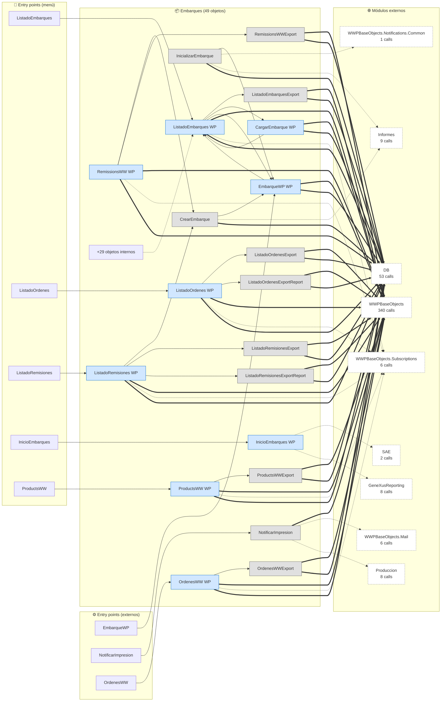
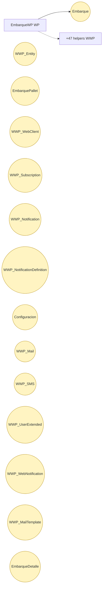
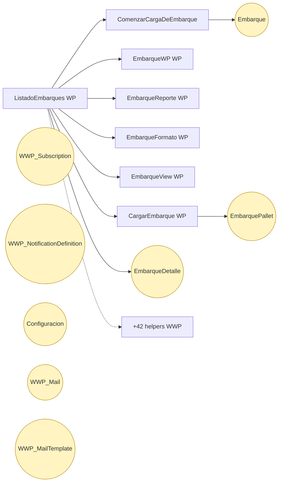
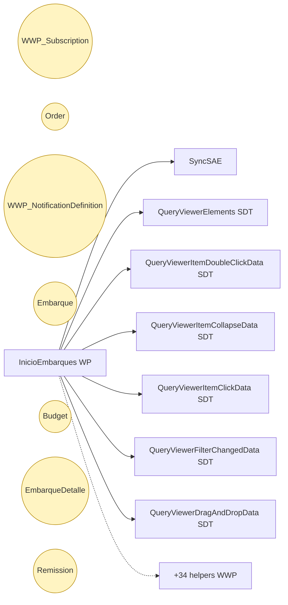
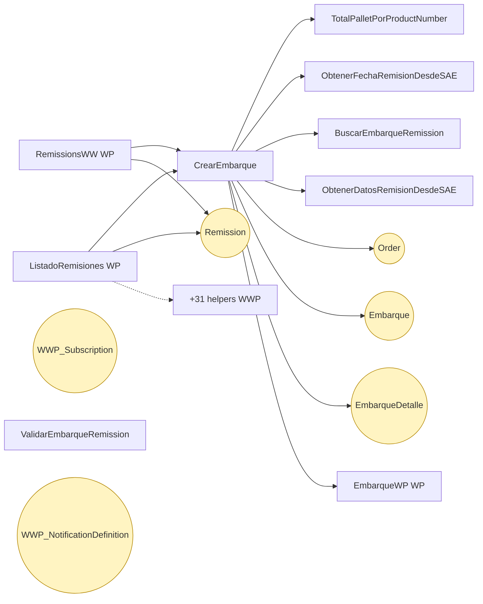
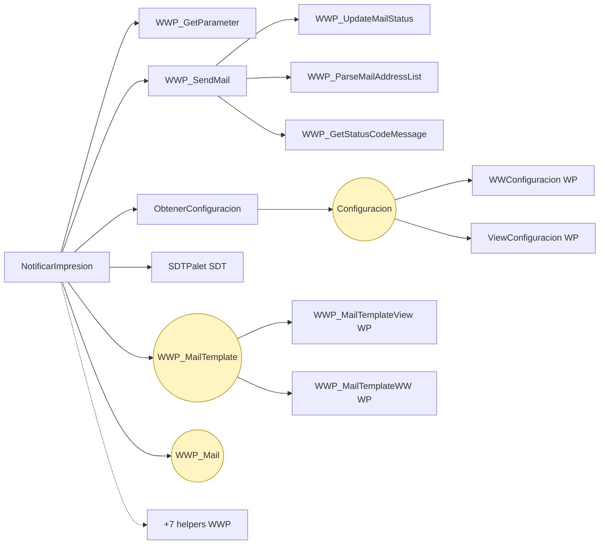
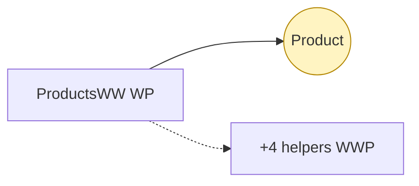
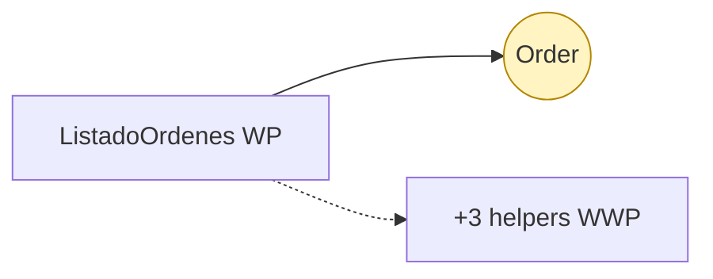
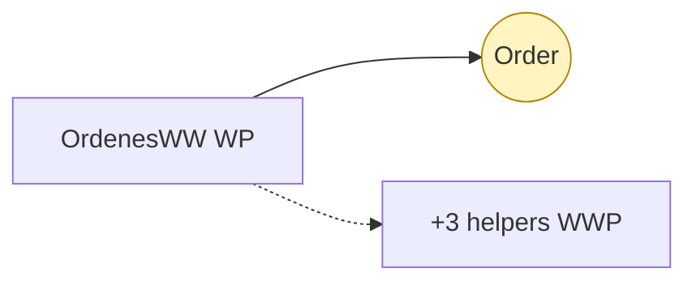

# Flujo del módulo: Embarques

> Generado por `Scripts/generate-module-flows.ps1` a partir de `_index.json` + `_menu.json` + `_processes.json` + `Modules/Embarques.md`.
> Renderización: Mermaid (VS Code Mermaid Preview, GitHub, GitLab).

---

## 📊 Resumen

| Métrica | Valor |
|---|---|
| Objetos totales | 49 |
| Transactions | 0 |
| WebPanels | 11 |
| Procedures | 35 |
| DataProviders | 2 |
| SDTs | 1 |
| Módulos que LLAMA | 9 (433 calls) |
| Módulos que LO LLAMAN | 5 (19 calls) |
| Procesos canónicos | 8 |

---

## 🚪 Entry points

| Entry | Tipo | Ruta / quién invoca |
|---|---|---|
| `EmbarqueWP` | externo | DB.Embarque |
| `NotificarImpresion` | externo | Root.ProcedureNotificarReimpresionEtiquetaPalet |
| `OrdenesWW` | externo | WWPBaseObjects.ListWWPPrograms |
| `InicioEmbarques` | menú | Web > Embarques > Inicio |
| `ListadoEmbarques` | menú | Web > Embarques > Embarques |
| `ListadoOrdenes` | menú | Web > Embarques > Pedidos |
| `ListadoRemisiones` | menú | Web > Embarques > Remisiones |
| `ProductsWW` | menú | Web > Reportes > Product |

---

## 🔀 Diagrama general del módulo

**Leyenda:**
- 🟡 círculo = Transaction (entidad de negocio)
- 🔵 caja = WebPanel (pantalla)
- ⬜ caja gris = Procedure / DataProvider / SDT
- ➡️ sólida = navegación/invocación principal
- ➡️ punteada = llamada secundaria (audit, cross-module)
- ➡️ gruesa `==>` = dependencia pesada (>30 calls al mismo peer)

---

## 📦 Procesos del módulo

### Proceso 1 -- `proc_embarques_embarque_wp` (EmbarqueWP)

**62 objetos · 10 módulos tocados.**

### Proceso 2 -- `proc_embarques_listado_embarques` (Embarques)

**57 objetos · 9 módulos tocados.**

### Proceso 3 -- `proc_embarques_inicio_embarques` (Inicio)

**49 objetos · 8 módulos tocados.**

### Proceso 4 -- `proc_embarques_listado_remisiones` (Remisiones)

**46 objetos · 6 módulos tocados.**

### Proceso 5 -- `proc_embarques_notificar_impresion` (NotificarImpresion)

**22 objetos · 7 módulos tocados.**

### Proceso 6 -- `proc_embarques_products_ww` (Product)

**6 objetos · 2 módulos tocados.**

### Proceso 7 -- `proc_embarques_listado_ordenes` (Pedidos)

**5 objetos · 2 módulos tocados.**

### Proceso 8 -- `proc_embarques_ordenes_ww` (OrdenesWW)

**5 objetos · 2 módulos tocados.**

---

## 🔗 Llamadas cross-module detalladas

### → Llama a otros módulos

| Módulo destino | Llamadas | Top 3 objetos invocados |
|---|---:|---|
| `WWPBaseObjects` | 340 | `LoadWWPContext`, `LoadGridState`, `WWPContext` |
| `DB` | 53 | `Remission`, `Order`, `Embarque` |
| `Informes` | 9 | `TotalPalletPorProductNumber`, `InformesTelerik`, `SDTTelerik` |
| `Produccion` | 8 | `ObtenerConfiguracion`, `SDTPalet` |
| `GeneXusReporting` | 8 | `QueryViewerParameters`, `QueryViewerDragAndDropData`, `QueryViewerElements` |
| `WWPBaseObjects.Mail` | 6 | `WWP_Mail`, `WWP_SendMail`, `WWP_MailTemplate` |
| `WWPBaseObjects.Subscriptions` | 6 | `WWP_HasSubscriptionsToDisplay` |
| `SAE` | 2 | `NotificarFechaEmbarque` |
| `WWPBaseObjects.Notifications.Common` | 1 | `WWP_SendNotification` |

### ← Lo llaman desde

| Módulo origen | Llamadas | Top 3 callers |
|---|---:|---|
| `Web` | 7 | `MenuEmbarques`, `MenuModuleCatalogosSAE`, `Modules` |
| `WWPBaseObjects` | 6 | `ListWWPPrograms` |
| `SAE` | 2 | `NotificarFechaEmbarque` |
| `Root` | 2 | `ProcedureNotificarReimpresionEtiquetaPalet` |
| `DB` | 2 | `Embarque` |

---

## 🗃️ Datos tocados (extraído de la matrix)

| Entidad | Operación | Procesos del módulo que la tocan |
|---|---|---|
| `Budget` | **W** | `proc_embarques_inicio_embarques` |
| `Configuracion` | **W** | `proc_embarques_embarque_wp`, `proc_embarques_notificar_impresion`, `proc_embarques_listado_embarques` |
| `Embarque` | **W** | `proc_embarques_embarque_wp`, `proc_embarques_listado_remisiones`, `proc_embarques_listado_embarques` _(+1)_ |
| `EmbarqueDetalle` | **W** | `proc_embarques_embarque_wp`, `proc_embarques_listado_remisiones`, `proc_embarques_listado_embarques` _(+1)_ |
| `EmbarquePallet` | **W** | `proc_embarques_embarque_wp`, `proc_embarques_listado_embarques` |
| `Order` | **W** | `proc_embarques_ordenes_ww`, `proc_embarques_listado_remisiones`, `proc_embarques_listado_ordenes` _(+1)_ |
| `Product` | **W** | `proc_embarques_products_ww` |
| `Remission` | **W** | `proc_embarques_listado_remisiones`, `proc_embarques_inicio_embarques` |
| `WWP_Entity` | **W** | `proc_embarques_embarque_wp`, `proc_embarques_listado_remisiones`, `proc_embarques_listado_embarques` _(+1)_ |
| `WWP_Mail` | **RW** | `proc_embarques_embarque_wp`, `proc_embarques_notificar_impresion`, `proc_embarques_listado_remisiones` _(+2)_ |
| `WWP_MailTemplate` | **W** | `proc_embarques_embarque_wp`, `proc_embarques_notificar_impresion`, `proc_embarques_listado_embarques` |
| `WWP_Notification` | **W** | `proc_embarques_embarque_wp`, `proc_embarques_listado_remisiones`, `proc_embarques_listado_embarques` _(+1)_ |
| `WWP_NotificationDefinition` | **W** | `proc_embarques_embarque_wp`, `proc_embarques_listado_remisiones`, `proc_embarques_listado_embarques` _(+1)_ |
| `WWP_SMS` | **RW** | `proc_embarques_embarque_wp`, `proc_embarques_listado_remisiones`, `proc_embarques_listado_embarques` _(+1)_ |
| `WWP_Subscription` | **W** | `proc_embarques_embarque_wp`, `proc_embarques_listado_remisiones`, `proc_embarques_listado_embarques` _(+1)_ |
| `WWP_UserExtended` | **RW** | `proc_embarques_embarque_wp`, `proc_embarques_listado_remisiones`, `proc_embarques_listado_embarques` _(+1)_ |
| `WWP_WebClient` | **W** | `proc_embarques_embarque_wp` |
| `WWP_WebNotification` | **RW** | `proc_embarques_embarque_wp`, `proc_embarques_listado_remisiones`, `proc_embarques_listado_embarques` _(+1)_ |

---

## 🧭 Lectura rápida del módulo

- **Propósito:** Módulo con 49 objetos parseados. Entry points desde el menú: `ListadoEmbarques`, `ListadoOrdenes`, `ListadoRemisiones`.
- **Patrón dominante:** módulo funcional / dashboard sin entidades propias; consume Trns de `DB`.
- **Valor diferencial:** cluster más grande es `proc_embarques_embarque_wp` (62 objetos).
- **Acoplamiento externo:** 9 peers, 433 calls totales. Top: `WWPBaseObjects` (340), `DB` (53), `Informes` (9).
- **Riesgo de migración:** alto — dependencia intensa de WWPBaseObjects (340 calls); requiere reimplementar el pattern WWP en el target o tolerar pérdida de audit/filter/export.

