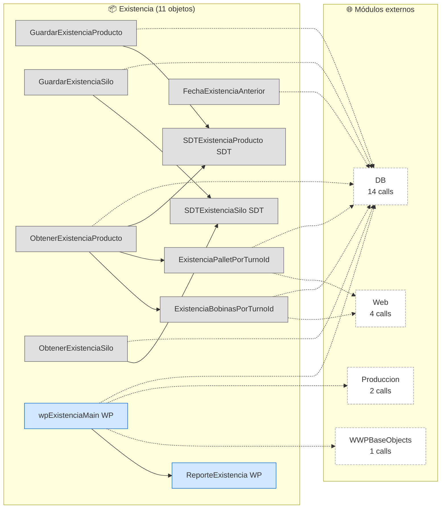

# Flujo del módulo: Existencia

> Generado por `Scripts/generate-module-flows.ps1` a partir de `_index.json` + `_menu.json` + `_processes.json` + `Modules/Existencia.md`.
> Renderización: Mermaid (VS Code Mermaid Preview, GitHub, GitLab).

---

## 📊 Resumen

| Métrica | Valor |
|---|---|
| Objetos totales | 11 |
| Transactions | 0 |
| WebPanels | 2 |
| Procedures | 7 |
| DataProviders | 0 |
| SDTs | 2 |
| Módulos que LLAMA | 4 (21 calls) |
| Módulos que LO LLAMAN | 1 (1 calls) |
| Procesos canónicos | 0 |

---

## 🚪 Entry points

_Módulo no navegable directamente desde el menú y sin caller cross-module identificado._

---

## 🔀 Diagrama general del módulo

**Leyenda:**
- 🟡 círculo = Transaction (entidad de negocio)
- 🔵 caja = WebPanel (pantalla)
- ⬜ caja gris = Procedure / DataProvider / SDT
- ➡️ sólida = navegación/invocación principal
- ➡️ punteada = llamada secundaria (audit, cross-module)
- ➡️ gruesa `==>` = dependencia pesada (>30 calls al mismo peer)

---

## 📦 Procesos del módulo

_Este módulo no tiene procesos canónicos cuyo entry-point le pertenezca. Sus objetos son invocados desde procesos de otros módulos (ver sección cross-module)._

---

## 🔗 Llamadas cross-module detalladas

### → Llama a otros módulos

| Módulo destino | Llamadas | Top 3 objetos invocados |
|---|---:|---|
| `DB` | 14 | `Existencia`, `ExistenciaProducto`, `ExistenciaSilo` |
| `Web` | 4 | `Debugger` |
| `Produccion` | 2 | `ObtenerConfiguracion` |
| `WWPBaseObjects` | 1 | `SecGAMIsAuthByFunctionalityKey` |

### ← Lo llaman desde

| Módulo origen | Llamadas | Top 3 callers |
|---|---:|---|
| `DB` | 1 | `ExistenciaWW` |

---

## 🗃️ Datos tocados (extraído de la matrix)

_(ningún proceso de este módulo toca entidades en la matrix)_

---

## 🧭 Lectura rápida del módulo

- **Propósito:** Módulo con 11 objetos parseados. Sin entry points en `_menu.json` -- accedido indirectamente desde: DB.
- **Patrón dominante:** módulo funcional / dashboard sin entidades propias; consume Trns de `DB`.
- **Valor diferencial:** ninguno — el módulo no ancla procesos propios, se mueve por invocación externa.
- **Acoplamiento externo:** 4 peers, 21 calls totales. Top: `DB` (14), `Web` (4), `Produccion` (2).
- **Riesgo de migración:** medio-alto — fuerte acoplamiento a `DB` (14 calls). DB se migra primero o junto.

