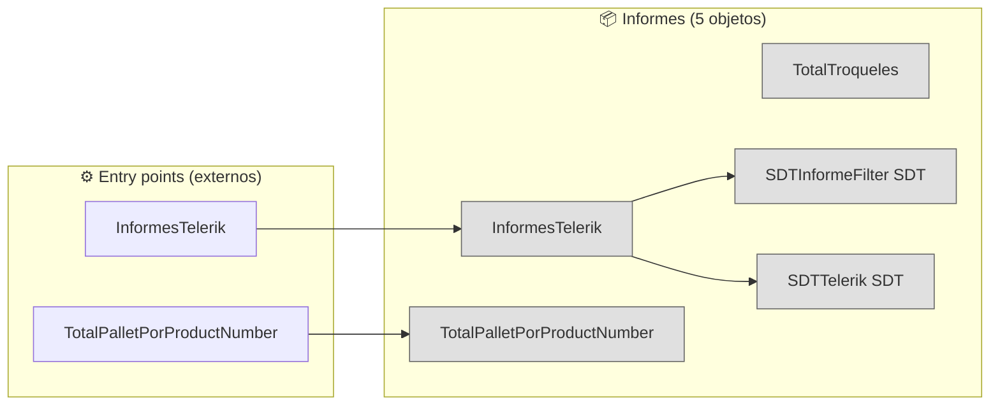
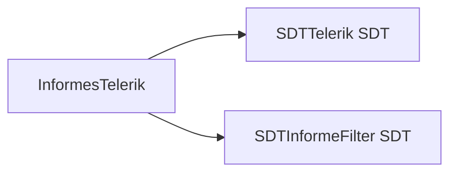

# Flujo del módulo: Informes

> Generado por `Scripts/generate-module-flows.ps1` a partir de `_index.json` + `_menu.json` + `_processes.json` + `Modules/Informes.md`.
> Renderización: Mermaid (VS Code Mermaid Preview, GitHub, GitLab).

---

## 📊 Resumen

| Métrica | Valor |
|---|---|
| Objetos totales | 5 |
| Transactions | 0 |
| WebPanels | 0 |
| Procedures | 3 |
| DataProviders | 0 |
| SDTs | 2 |
| Módulos que LLAMA | 0 (0 calls) |
| Módulos que LO LLAMAN | 2 (29 calls) |
| Procesos canónicos | 2 |

---

## 🚪 Entry points

| Entry | Tipo | Ruta / quién invoca |
|---|---|---|
| `InformesTelerik` | externo | Embarques.EmbarqueFormato, SAE.FTBYTD |
| `TotalPalletPorProductNumber` | externo | Embarques.CrearEmbarque, Embarques.InicializarEmbarque |

---

## 🔀 Diagrama general del módulo

**Leyenda:**
- 🟡 círculo = Transaction (entidad de negocio)
- 🔵 caja = WebPanel (pantalla)
- ⬜ caja gris = Procedure / DataProvider / SDT
- ➡️ sólida = navegación/invocación principal
- ➡️ punteada = llamada secundaria (audit, cross-module)
- ➡️ gruesa `==>` = dependencia pesada (>30 calls al mismo peer)

---

## 📦 Procesos del módulo

### Proceso 1 -- `proc_informes_informes_telerik` (InformesTelerik)

**3 objetos · 1 módulos tocados.**

### Proceso 2 -- `proc_informes_total_pallet_por_product_number` (TotalPalletPorProductNumber)

**1 objetos · 1 módulos tocados.**

---

## 🔗 Llamadas cross-module detalladas

### → Llama a otros módulos

_(sin llamadas salientes)_

### ← Lo llaman desde

| Módulo origen | Llamadas | Top 3 callers |
|---|---:|---|
| `SAE` | 20 | `RealtimeInventory`, `OrdersMoney`, `Orders` |
| `Embarques` | 9 | `EmbarqueFormato`, `InicializarEmbarque`, `CrearEmbarque` |

---

## 🗃️ Datos tocados (extraído de la matrix)

_(ningún proceso de este módulo toca entidades en la matrix)_

---

## 🧭 Lectura rápida del módulo

- **Propósito:** Módulo con 5 objetos parseados. Sin entry points en `_menu.json` -- accedido indirectamente desde: Embarques, SAE.
- **Patrón dominante:** módulo de procesos / utilities sin UI directa.
- **Valor diferencial:** cluster más grande es `proc_informes_informes_telerik` (3 objetos).
- **Acoplamiento externo:** ninguno (módulo self-contained).
- **Riesgo de migración:** bajo — módulo aislado, se migra sin arrastrar otros módulos.

