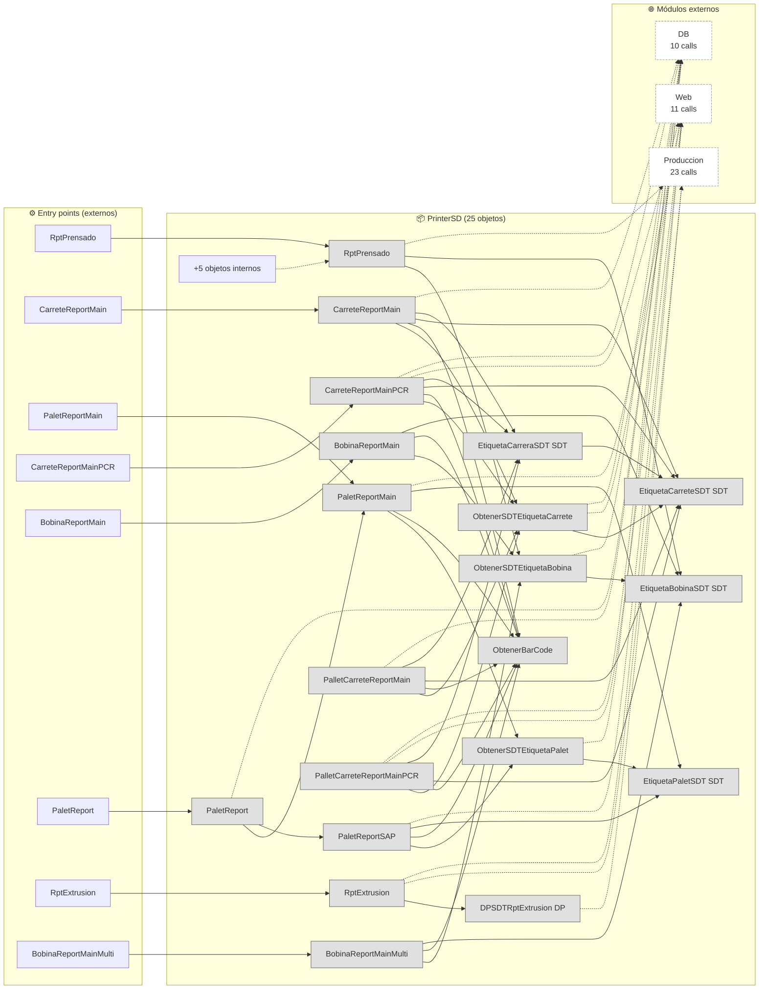
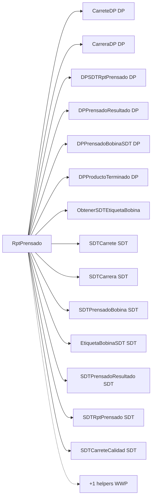
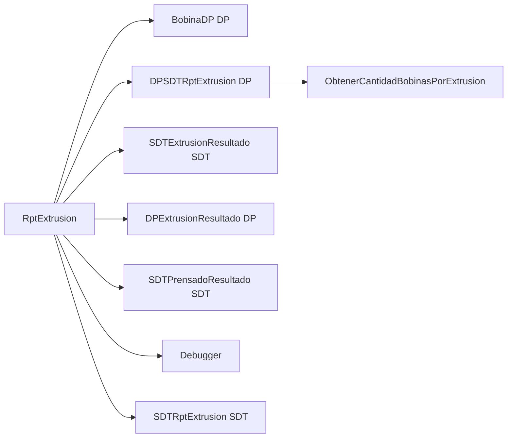
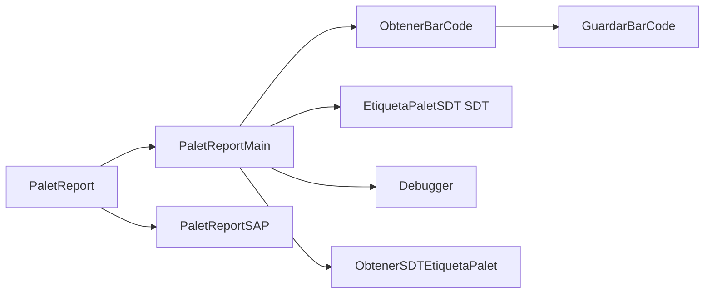
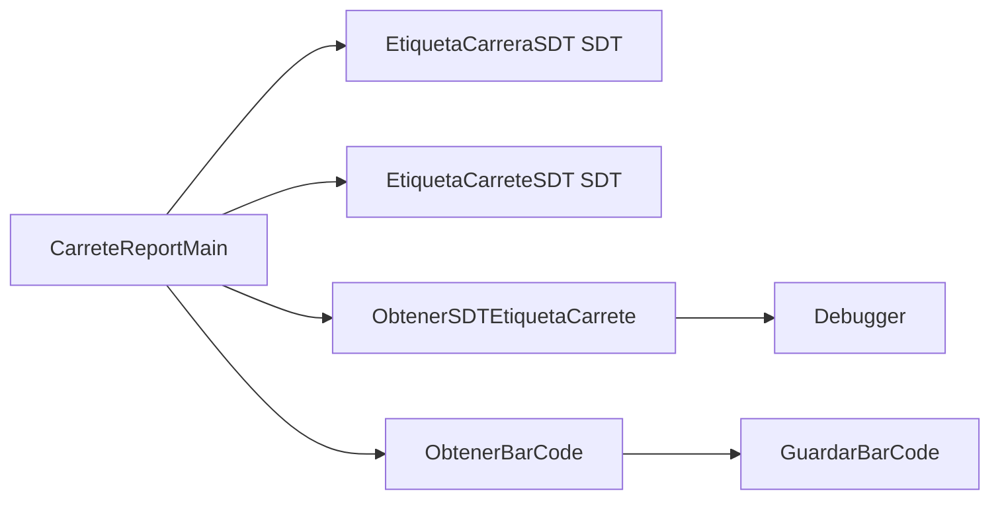
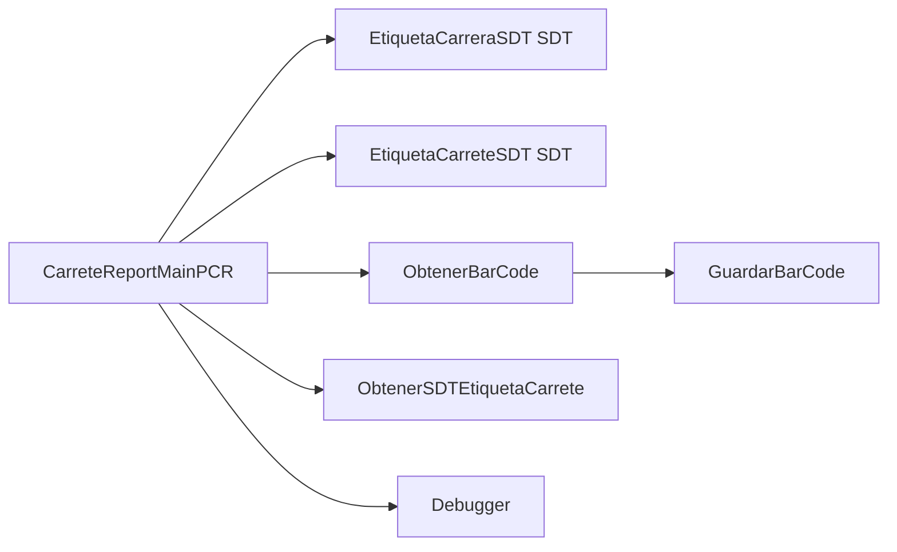
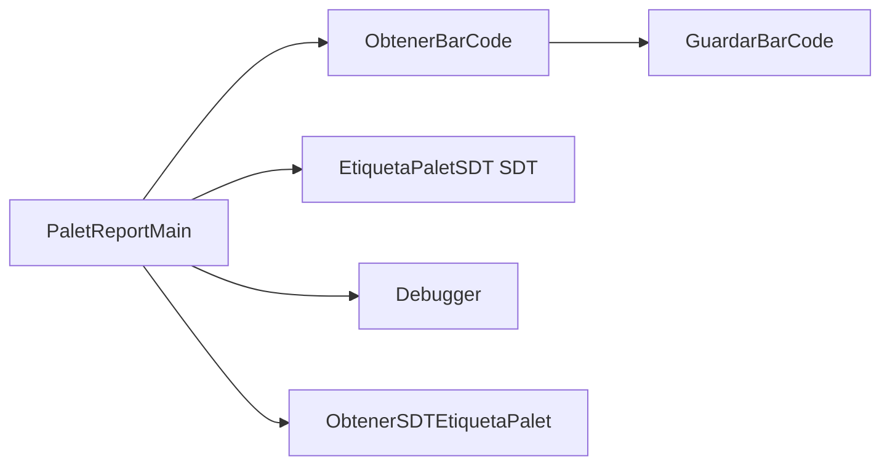
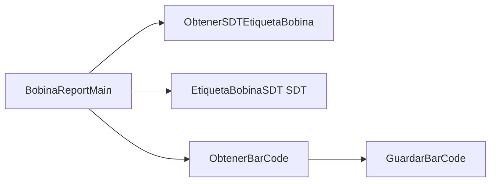
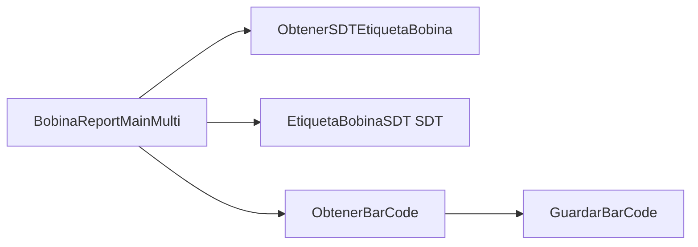

# Flujo del módulo: PrinterSD

> Generado por `Scripts/generate-module-flows.ps1` a partir de `_index.json` + `_menu.json` + `_processes.json` + `Modules/PrinterSD.md`.
> Renderización: Mermaid (VS Code Mermaid Preview, GitHub, GitLab).

---

## 📊 Resumen

| Métrica | Valor |
|---|---|
| Objetos totales | 25 |
| Transactions | 0 |
| WebPanels | 0 |
| Procedures | 16 |
| DataProviders | 2 |
| SDTs | 7 |
| Módulos que LLAMA | 3 (44 calls) |
| Módulos que LO LLAMAN | 3 (27 calls) |
| Procesos canónicos | 8 |

---

## 🚪 Entry points

| Entry | Tipo | Ruta / quién invoca |
|---|---|---|
| `BobinaReportMain` | externo | DB.BobinaWW, Produccion.vwAnaliticaBobina |
| `BobinaReportMainMulti` | externo | admin.ImprimirBobinas |
| `CarreteReportMain` | externo | DB.CarreraWW, DB.CarreteWW |
| `CarreteReportMainPCR` | externo | DB.CarreraWW, DB.CarreteWW |
| `PaletReport` | externo | DB.PaletWW |
| `PaletReportMain` | externo | DB.PaletWW |
| `RptExtrusion` | externo | DB.ExtrusionWW |
| `RptPrensado` | externo | DB.PrensadoWW, Produccion.vwAnaliticaPrensado |

---

## 🔀 Diagrama general del módulo

**Leyenda:**
- 🟡 círculo = Transaction (entidad de negocio)
- 🔵 caja = WebPanel (pantalla)
- ⬜ caja gris = Procedure / DataProvider / SDT
- ➡️ sólida = navegación/invocación principal
- ➡️ punteada = llamada secundaria (audit, cross-module)
- ➡️ gruesa `==>` = dependencia pesada (>30 calls al mismo peer)

---

## 📦 Procesos del módulo

### Proceso 1 -- `proc_printer_sd_rpt_prensado` (RptPrensado)

**16 objetos · 2 módulos tocados.**

### Proceso 2 -- `proc_printer_sd_rpt_extrusion` (RptExtrusion)

**9 objetos · 3 módulos tocados.**

### Proceso 3 -- `proc_printer_sd_palet_report` (PaletReport)

**8 objetos · 2 módulos tocados.**

### Proceso 4 -- `proc_printer_sd_carrete_report_main` (CarreteReportMain)

**7 objetos · 2 módulos tocados.**

### Proceso 5 -- `proc_printer_sd_carrete_report_main_pcr` (CarreteReportMainPCR)

**7 objetos · 2 módulos tocados.**

### Proceso 6 -- `proc_printer_sd_palet_report_main` (PaletReportMain)

**6 objetos · 2 módulos tocados.**

### Proceso 7 -- `proc_printer_sd_bobina_report_main` (BobinaReportMain)

**5 objetos · 1 módulos tocados.**

### Proceso 8 -- `proc_printer_sd_bobina_report_main_multi` (BobinaReportMainMulti)

**5 objetos · 1 módulos tocados.**

---

## 🔗 Llamadas cross-module detalladas

### → Llama a otros módulos

| Módulo destino | Llamadas | Top 3 objetos invocados |
|---|---:|---|
| `Produccion` | 23 | `BobinaDP`, `CarreteDP`, `DPPrensadoBobinaSDT` |
| `Web` | 11 | `Debugger` |
| `DB` | 10 | `Carrete`, `PaletCarrete`, `Palet` |

### ← Lo llaman desde

| Módulo origen | Llamadas | Top 3 callers |
|---|---:|---|
| `DB` | 18 | `CarreraWW`, `CarreteWW`, `PaletWW` |
| `Produccion` | 7 | `vwAnaliticaCarrete`, `vwAnaliticaPrensado`, `vwAnaliticaBobina` |
| `admin` | 2 | `ImprimirBobinas` |

---

## 🗃️ Datos tocados (extraído de la matrix)

| Entidad | Operación | Procesos del módulo que la tocan |
|---|---|---|
| `Palet` | **R** | `proc_printer_sd_palet_report` |

---

## 🧭 Lectura rápida del módulo

- **Propósito:** Módulo con 25 objetos parseados. Sin entry points en `_menu.json` -- accedido indirectamente desde: admin, DB, Produccion.
- **Patrón dominante:** módulo de procesos / utilities sin UI directa.
- **Valor diferencial:** cluster más grande es `proc_printer_sd_rpt_prensado` (16 objetos).
- **Acoplamiento externo:** 3 peers, 44 calls totales. Top: `Produccion` (23), `Web` (11), `DB` (10).
- **Riesgo de migración:** medio — revisar las aristas cross-module individualmente en Phase 3.3.

