# Flujo del módulo: Produccion

> Generado por `Scripts/generate-module-flows.ps1` a partir de `_index.json` + `_menu.json` + `_processes.json` + `Modules/Produccion.md`.
> Renderización: Mermaid (VS Code Mermaid Preview, GitHub, GitLab).

---

## 📊 Resumen

| Métrica | Valor |
|---|---|
| Objetos totales | 392 |
| Transactions | 0 |
| WebPanels | 54 |
| Procedures | 248 |
| DataProviders | 58 |
| SDTs | 32 |
| Módulos que LLAMA | 11 (1659 calls) |
| Módulos que LO LLAMAN | 11 (141 calls) |
| Procesos canónicos | 47 |

---

## 🚪 Entry points

| Entry | Tipo | Ruta / quién invoca |
|---|---|---|
| `BobinaDP` | externo | PrinterSD.RptExtrusion |
| `CarreraDP` | externo | PrinterSD.RptPrensado |
| `CarreteDP` | externo | PrinterSD.RptPrensado |
| `DPExtrusionResultado` | externo | PrinterSD.RptExtrusion |
| `DPPrensadoBobinaSDT` | externo | PrinterSD.RptPrensado |
| `DPPrensadoResultado` | externo | PrinterSD.RptPrensado |
| `DPProductoTerminado` | externo | PrinterSD.RptPrensado |
| `ExtrusoraDP` | externo | Reportes.ExtrusoraObservacion |
| `GenerarBobinaNo` | externo | admin.InsertarManualenteBobinas |
| `GuardarBobina` | externo | admin.InsertarManualenteBobinas |
| `JornadaLaboral` | externo | Reportes.ExtrusionesDelDiaWCGetFilterData, Reportes.PrensadosDelDiaWCGetFilterData |
| `listarExtrusion` | externo | WWPBaseObjects.ListWWPPrograms |
| `ObtenerCantidadBobinasPorExtrusion` | externo | PrinterSD.DPSDTRptExtrusion, Reportes.ExtrusorasEnOperacionWCGetFilterData |
| `ObtenerInterrupcionCarrera` | externo | DB.LlenadoCarreraInterrupcion |
| `ObtenerTipoMaterialPorCarrete` | externo | DB.CarreraWW, DB.CarreteWW |
| `PrensaDP` | externo | Reportes.PrensaObservacion |
| `ReposoTranscurrido` | externo | DB.BobinaWW |
| `SDPausarBobinas` | externo | DB.BobinaWW |
| `TipoCarreteDP` | externo | DB.ProductoTerminado, DB.Troquel |
| `TotalPaletPrensado` | externo | DB.LoadAuditPrensado |
| `TurnoDP` | externo | DB.Existencia, Reportes.ExtrusoraObservacion |
| `vwCarreteCarrera` | externo | WWPBaseObjects.ListWWPPrograms |
| `vwTrazabilidad` | externo | WWPBaseObjects.ListWWPPrograms |
| `ExclusionDelDia` | menú | Web > Producción > Extrusión > Extrusión del Día |
| `InicioExtrusion` | menú | Web > Extrusión > Inicio |
| `InicioInventario` | menú | Web > Inventarios > Inicio |
| `InicioPrensado` | menú | Web > Prensado > Inicio |
| `InicioProduccion` | menú | Web > Producción > Inicio |
| `listarExtrusora` | menú | Web > Producción > Catálogos > Extrusoras |
| `ListarExtrusoraMezcladora` | menú | Web > Producción > Referencias > Extrusora Mezcladora |
| `listarExtrusoraProducto` | menú | Web > Producción > Referencias > Extrusora Producto |
| `listarInventario` | menú | Web > Inventarios > Cierre de Mes |
| `listarLotes` | menú | Web > Inventarios > Lotes |
| `listarOperador` | menú | Web > Producción > Operadores |
| `listarPrensaProducto` | menú | Web > Producción > Referencias > Prensa Producto |
| `listarPrensas` | menú | Web > Producción > Catálogos > Prensas |
| `listarProductoCategoria` | menú | Web > Producción > Catálogos > Categorías |
| `listarProductos` | menú | Web > Producción > Productos |
| `listarProductoTerminado` | menú | Web > Producción > Referencias > Producto Terminado |
| `listarSilos` | menú | Web > Producción > Catálogos > Silos |
| `listarTroquel` | menú | Web > Producción > Catálogos > Troqueles |
| `listarTurnos` | menú | Web > Producción > Catálogos > Turnos |
| `PrensadoDelDia` | menú | Web > Producción > Prensado > Prensado del día |
| `TurnosPorSemana` | menú | Web > Producción > Turnos Por Semana |
| `TurnosPorSemanaExtrusoras` | menú | Web > Extrusión > Turnos Por Semana |
| `TurnosPorSemanaPrensas` | menú | Web > Prensado > Turnos Por Semana |
| `vwAnaliticaBobina` | menú | Web > Extrusión > Operación > Bobinas |
| `vwAnaliticaCarrete` | menú | Web > Prensado > Operación > Carretes |
| `vwAnaliticaPrensado` | menú | Web > Prensado > Operación > Prensados |

---

## 🔀 Diagrama general del módulo

```mermaid
flowchart LR
    subgraph MENU["🚪 Entry points (menú)"]
        M1[listarLotes]
        M2[listarOperador]
        M3[vwAnaliticaBobina]
        M4[listarPrensaProducto]
        M5[TurnosPorSemanaExtrusoras]
        M6[TurnosPorSemana]
        M7[listarPrensas]
        M8[listarProductoCategoria]
        M9[vwAnaliticaCarrete]
        M10[ListarExtrusoraMezcladora]
        M11[listarExtrusoraProducto]
        M12[listarInventario]
        M13[PrensadoDelDia]
        M14[listarTurnos]
        M15[InicioPrensado]
        M16[InicioProduccion]
        M17[listarProductos]
        M18[listarSilos]
        M19[InicioInventario]
        M20[vwAnaliticaPrensado]
        M21[listarTroquel]
        M22[listarProductoTerminado]
        M23[listarExtrusora]
        M24[ExclusionDelDia]
        M25[InicioExtrusion]
        M26[TurnosPorSemanaPrensas]
    end

    subgraph XEN["⚙️ Entry points (externos)"]
        X1[listarExtrusion]
        X2[DPPrensadoBobinaSDT]
        X3[TipoCarreteDP]
        X4[DPProductoTerminado]
        X5[GuardarBobina]
        X6[vwCarreteCarrera]
        X7[CarreraDP]
        X8[PrensaDP]
        X9[GenerarBobinaNo]
        X10[ObtenerInterrupcionCarrera]
        X11[SDPausarBobinas]
        X12[ObtenerCantidadBobinasPorExtrusion]
        X13[ObtenerTipoMaterialPorCarrete]
        X14[TurnoDP]
        X15[BobinaDP]
        X16[ReposoTranscurrido]
        X17[DPExtrusionResultado]
        X18[TotalPaletPrensado]
        X19[CarreteDP]
        X20[DPPrensadoResultado]
        X21[vwTrazabilidad]
        X22[JornadaLaboral]
        X23[ExtrusoraDP]
    end

    subgraph MOD["📦 Produccion (392 objetos)"]
        subgraph AREA_Extrusion["🔥 Extrusión (48)"]
            DP_ExtrusoraDP[ExtrusoraDP DP]
            WP_InicioExtrusion[InicioExtrusion WP]
            WP_listarExtrusion[listarExtrusion WP]
            WP_listarExtrusora[listarExtrusora WP]
            WP_ListarExtrusoraMezcladora[ListarExtrusoraMezcladora WP]
            WP_listarExtrusoraProducto[listarExtrusoraProducto WP]
            WP_TurnosPorSemanaExtrusoras[TurnosPorSemanaExtrusoras WP]
            WP_vwAnaliticaBobina[vwAnaliticaBobina WP]
            AREA_Extrusion_OTROS[+40 objetos]
        end
        subgraph AREA_Prensado["⚙️ Prensado (66)"]
            WP_InicioPrensado[InicioPrensado WP]
            WP_listarPrensaProducto[listarPrensaProducto WP]
            WP_listarPrensas[listarPrensas WP]
            WP_PrensadoDelDia[PrensadoDelDia WP]
            WP_TurnosPorSemanaPrensas[TurnosPorSemanaPrensas WP]
            WP_vwAnaliticaCarrete[vwAnaliticaCarrete WP]
            WP_vwAnaliticaPrensado[vwAnaliticaPrensado WP]
            WP_vwCarreteCarrera[vwCarreteCarrera WP]
            AREA_Prensado_OTROS[+58 objetos]
        end
        subgraph AREA_Inventario["📦 Inventario (18)"]
            P_listarInventarioExport[listarInventarioExport]
            P_listarLotesExport[listarLotesExport]
            P_listarSilosExport[listarSilosExport]
            P_listarSilosExportReport[listarSilosExportReport]
            WP_InicioInventario[InicioInventario WP]
            WP_listarInventario[listarInventario WP]
            WP_listarLotes[listarLotes WP]
            WP_listarSilos[listarSilos WP]
            AREA_Inventario_OTROS[+10 objetos]
        end
        subgraph AREA_Catalogos["📚 Catálogos (24)"]
            P_listarOperadorExport[listarOperadorExport]
            P_listarProductosExport[listarProductosExport]
            WP_listarOperador[listarOperador WP]
            WP_listarProductoCategoria[listarProductoCategoria WP]
            WP_listarProductos[listarProductos WP]
            WP_listarProductoTerminado[listarProductoTerminado WP]
            WP_listarTroquel[listarTroquel WP]
            WP_listarTurnos[listarTurnos WP]
            AREA_Catalogos_OTROS[+16 objetos]
        end
        subgraph AREA_Dashboards["📊 Dashboards (2)"]
            WP_InicioProduccion[InicioProduccion WP]
            WP_TurnosPorSemana[TurnosPorSemana WP]
        end
        subgraph AREA_Helpers["🔧 Helpers (104)"]
            DP_CarreteDP[CarreteDP DP]
            DP_TipoCarreteDP[TipoCarreteDP DP]
            DP_TurnoDP[TurnoDP DP]
            P_GenerarBobinaNo[GenerarBobinaNo]
            P_GuardarBobina[GuardarBobina]
            P_ReposoTranscurrido[ReposoTranscurrido]
            WP_ExclusionDelDia[ExclusionDelDia WP]
            WP_vwTrazabilidad[vwTrazabilidad WP]
            AREA_Helpers_OTROS[+96 objetos]
        end
        subgraph AREA_Mobile["📱 Mobile handlers (130)"]
            P_SDFinalizarPrensado[SDFinalizarPrensado]
            P_SDPausarBobinas[SDPausarBobinas]
            P_SDPrensadoTemporal[SDPrensadoTemporal]
            P_SDTerminarCarreraDB[SDTerminarCarreraDB]
            P_SDVincularCarrete[SDVincularCarrete]
            S_SDTBobina[SDTBobina SDT]
            S_SDTExtrusion[SDTExtrusion SDT]
            S_SDTProducto[SDTProducto SDT]
            AREA_Mobile_OTROS[+122 objetos]
        end
    end

    subgraph EXT["🌐 Módulos externos"]
        E_WWPBaseObjects[WWPBaseObjects<br/>1155 calls]
        E_DB[DB<br/>378 calls]
        E_GeneXusReporting[GeneXusReporting<br/>64 calls]
        E_GeneXus_Common[GeneXus.Common<br/>28 calls]
        E_Root[Root<br/>10 calls]
        E_Web[Web<br/>9 calls]
        E_PrinterSD[PrinterSD<br/>7 calls]
        E_Seguridad[Seguridad<br/>3 calls]
        E_WWPBaseObjects_Subscriptions[WWPBaseObjects.Subscriptions<br/>3 calls]
        E_admin[admin<br/>1 calls]
        E_SAE[SAE<br/>1 calls]
    end

    M1 --> WP_listarLotes
    M2 --> WP_listarOperador
    M3 --> WP_vwAnaliticaBobina
    M4 --> WP_listarPrensaProducto
    M5 --> WP_TurnosPorSemanaExtrusoras
    M6 --> WP_TurnosPorSemana
    M7 --> WP_listarPrensas
    M8 --> WP_listarProductoCategoria
    M9 --> WP_vwAnaliticaCarrete
    M10 --> WP_ListarExtrusoraMezcladora
    M11 --> WP_listarExtrusoraProducto
    M12 --> WP_listarInventario
    M13 --> WP_PrensadoDelDia
    M14 --> WP_listarTurnos
    M15 --> WP_InicioPrensado
    M16 --> WP_InicioProduccion
    M17 --> WP_listarProductos
    M18 --> WP_listarSilos
    M19 --> WP_InicioInventario
    M20 --> WP_vwAnaliticaPrensado
    M21 --> WP_listarTroquel
    M22 --> WP_listarProductoTerminado
    M23 --> WP_listarExtrusora
    M24 --> WP_ExclusionDelDia
    M25 --> WP_InicioExtrusion
    M26 --> WP_TurnosPorSemanaPrensas
    X1 --> WP_listarExtrusion
    X3 --> DP_TipoCarreteDP
    X5 --> P_GuardarBobina
    X6 --> WP_vwCarreteCarrera
    X9 --> P_GenerarBobinaNo
    X11 --> P_SDPausarBobinas
    X14 --> DP_TurnoDP
    X16 --> P_ReposoTranscurrido
    X19 --> DP_CarreteDP
    X21 --> WP_vwTrazabilidad
    X23 --> DP_ExtrusoraDP
    WP_vwAnaliticaBobina --> P_ReposoTranscurrido
    WP_vwAnaliticaBobina --> P_SDPausarBobinas
    WP_PrensadoDelDia --> DP_TurnoDP
    WP_PrensadoDelDia --> DP_TipoCarreteDP
    WP_PrensadoDelDia --> S_SDTExtrusion
    WP_listarSilos --> P_listarSilosExport
    WP_listarSilos --> P_listarSilosExportReport
    WP_listarLotes --> P_listarLotesExport
    WP_listarInventario --> P_listarInventarioExport
    WP_listarOperador --> P_listarOperadorExport
    WP_listarProductos --> P_listarProductosExport
    WP_ExclusionDelDia --> DP_TurnoDP
    WP_ExclusionDelDia --> DP_ExtrusoraDP
    WP_ExclusionDelDia --> S_SDTExtrusion
    P_GuardarBobina --> S_SDTBobina
    DP_TipoCarreteDP --> S_SDTProducto
    P_SDFinalizarPrensado --> S_SDTBobina
    P_SDVincularCarrete --> P_SDVincularCarrete
    P_SDPrensadoTemporal --> S_SDTBobina
    OTROS -.-> WP_vwAnaliticaBobina
    WP_vwAnaliticaBobina ==> E_WWPBaseObjects
    WP_vwAnaliticaBobina -.-> E_WWPBaseObjects_Subscriptions
    WP_vwAnaliticaBobina -.-> E_PrinterSD
    WP_vwAnaliticaBobina ==> E_DB
    WP_vwAnaliticaBobina -.-> E_admin
    WP_listarExtrusoraProducto ==> E_WWPBaseObjects
    WP_listarExtrusoraProducto ==> E_DB
    WP_ListarExtrusoraMezcladora ==> E_WWPBaseObjects
    WP_ListarExtrusoraMezcladora ==> E_DB
    WP_listarExtrusora ==> E_WWPBaseObjects
    WP_listarExtrusora ==> E_DB
    WP_listarExtrusion ==> E_WWPBaseObjects
    WP_listarExtrusion ==> E_DB
    WP_InicioExtrusion ==> E_WWPBaseObjects
    WP_InicioExtrusion ==> E_GeneXusReporting
    WP_TurnosPorSemanaExtrusoras ==> E_WWPBaseObjects
    WP_TurnosPorSemanaExtrusoras ==> E_GeneXusReporting
    WP_vwAnaliticaCarrete ==> E_WWPBaseObjects
    WP_vwAnaliticaCarrete -.-> E_WWPBaseObjects_Subscriptions
    WP_vwAnaliticaCarrete -.-> E_PrinterSD
    WP_vwAnaliticaCarrete -.-> E_Web
    WP_vwAnaliticaCarrete ==> E_DB
    WP_vwAnaliticaPrensado ==> E_WWPBaseObjects
    WP_vwAnaliticaPrensado -.-> E_WWPBaseObjects_Subscriptions
    WP_vwAnaliticaPrensado -.-> E_PrinterSD
    WP_vwAnaliticaPrensado ==> E_DB
    WP_listarPrensaProducto ==> E_WWPBaseObjects
    WP_listarPrensaProducto ==> E_DB
    WP_listarPrensas ==> E_WWPBaseObjects
    WP_listarPrensas ==> E_DB
    WP_vwCarreteCarrera ==> E_WWPBaseObjects
    WP_InicioPrensado ==> E_WWPBaseObjects
    WP_InicioPrensado ==> E_GeneXusReporting
    WP_TurnosPorSemanaPrensas ==> E_WWPBaseObjects
    WP_TurnosPorSemanaPrensas ==> E_GeneXusReporting
    WP_listarSilos ==> E_WWPBaseObjects
    WP_listarSilos ==> E_DB
    WP_listarLotes ==> E_WWPBaseObjects
    WP_listarLotes ==> E_DB
    WP_listarInventario ==> E_WWPBaseObjects
    WP_listarInventario ==> E_DB
    WP_InicioInventario ==> E_GeneXusReporting
    P_listarInventarioExport ==> E_WWPBaseObjects
    P_listarInventarioExport ==> E_DB
    P_listarSilosExport ==> E_WWPBaseObjects
    P_listarSilosExport ==> E_DB
    P_listarLotesExport ==> E_WWPBaseObjects
    P_listarLotesExport ==> E_DB
    P_listarSilosExportReport ==> E_WWPBaseObjects
    P_listarSilosExportReport ==> E_DB
    WP_listarTroquel ==> E_WWPBaseObjects
    WP_listarTroquel ==> E_DB
    WP_listarProductoTerminado ==> E_WWPBaseObjects
    WP_listarProductoTerminado ==> E_DB
    WP_listarOperador ==> E_WWPBaseObjects
    WP_listarOperador -.-> E_Seguridad
    WP_listarOperador ==> E_DB
    WP_listarProductos ==> E_WWPBaseObjects
    WP_listarProductos ==> E_DB
    WP_listarProductoCategoria ==> E_WWPBaseObjects
    WP_listarProductoCategoria ==> E_DB
    WP_listarTurnos ==> E_WWPBaseObjects
    WP_listarTurnos ==> E_DB
    P_listarOperadorExport ==> E_WWPBaseObjects
    P_listarOperadorExport ==> E_DB
    P_listarProductosExport ==> E_WWPBaseObjects
    P_listarProductosExport ==> E_DB
    WP_InicioProduccion ==> E_GeneXusReporting
    WP_TurnosPorSemana ==> E_WWPBaseObjects
    WP_TurnosPorSemana ==> E_GeneXusReporting
    WP_vwTrazabilidad ==> E_WWPBaseObjects
    WP_vwTrazabilidad ==> E_DB
    WP_ExclusionDelDia ==> E_DB
    P_GuardarBobina ==> E_DB
    P_GenerarBobinaNo ==> E_DB
    P_ReposoTranscurrido ==> E_DB
    P_SDPausarBobinas ==> E_DB
    P_SDFinalizarPrensado ==> E_DB
    P_SDVincularCarrete ==> E_DB
    P_SDPrensadoTemporal ==> E_DB
    P_SDTerminarCarreraDB -.-> E_Root
    P_SDTerminarCarreraDB ==> E_DB

    classDef trn fill:#fff4c2,stroke:#b38600
    classDef wp fill:#d1e7ff,stroke:#0066cc
    classDef proc fill:#e0e0e0,stroke:#666
    classDef ext fill:#fff,stroke:#999,stroke-dasharray: 4 2
    class WP_vwAnaliticaBobina,WP_listarExtrusoraProducto,WP_ListarExtrusoraMezcladora,WP_listarExtrusora,WP_listarExtrusion,WP_InicioExtrusion,WP_TurnosPorSemanaExtrusoras,WP_vwAnaliticaCarrete,WP_vwAnaliticaPrensado,WP_listarPrensaProducto,WP_listarPrensas,WP_vwCarreteCarrera,WP_InicioPrensado,WP_PrensadoDelDia,WP_TurnosPorSemanaPrensas,WP_listarSilos,WP_listarLotes,WP_listarInventario,WP_InicioInventario,WP_listarTroquel,WP_listarProductoTerminado,WP_listarOperador,WP_listarProductos,WP_listarProductoCategoria,WP_listarTurnos,WP_InicioProduccion,WP_TurnosPorSemana,WP_vwTrazabilidad,WP_ExclusionDelDia wp
    class DP_ExtrusoraDP,P_listarInventarioExport,P_listarSilosExport,P_listarLotesExport,P_listarSilosExportReport,P_listarOperadorExport,P_listarProductosExport,P_GuardarBobina,P_GenerarBobinaNo,P_ReposoTranscurrido,DP_TipoCarreteDP,DP_TurnoDP,DP_CarreteDP,P_SDPausarBobinas,S_SDTBobina,P_SDFinalizarPrensado,P_SDVincularCarrete,S_SDTProducto,P_SDPrensadoTemporal,S_SDTExtrusion,P_SDTerminarCarreraDB proc
    class E_PrinterSD,E_WWPBaseObjects,E_WWPBaseObjects_Subscriptions,E_DB,E_Root,E_admin,E_GeneXus_Common,E_Web,E_SAE,E_Seguridad,E_GeneXusReporting ext
```

**Leyenda:**
- 🟡 círculo = Transaction (entidad de negocio)
- 🔵 caja = WebPanel (pantalla)
- ⬜ caja gris = Procedure / DataProvider / SDT
- ➡️ sólida = navegación/invocación principal
- ➡️ punteada = llamada secundaria (audit, cross-module)
- ➡️ gruesa `==>` = dependencia pesada (>30 calls al mismo peer)

---

## 📦 Procesos del módulo

### Proceso 1 -- `proc_produccion_vw_trazabilidad` (vwTrazabilidad)

**68 objetos · 5 módulos tocados.**

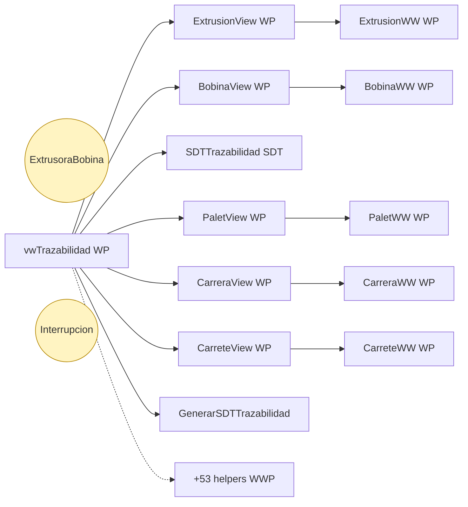
```mermaid
flowchart LR
    WP_BobinaWW[BobinaWW WP]
    WP_ExtrusionView[ExtrusionView WP]
    WP_CarreraWW[CarreraWW WP]
    WP_BobinaView[BobinaView WP]
    S_SDTTrazabilidad[SDTTrazabilidad SDT]
    WP_ExtrusionWW[ExtrusionWW WP]
    WP_PaletView[PaletView WP]
    T_ExtrusoraBobina((ExtrusoraBobina))
    WP_CarreteWW[CarreteWW WP]
    WP_vwTrazabilidad[vwTrazabilidad WP]
    T_Interrupcion((Interrupcion))
    WP_CarreraView[CarreraView WP]
    WP_PaletWW[PaletWW WP]
    WP_CarreteView[CarreteView WP]
    P_GenerarSDTTrazabilidad[GenerarSDTTrazabilidad]
    INFRA[+53 helpers WWP]
    WP_vwTrazabilidad --> P_GenerarSDTTrazabilidad
    WP_vwTrazabilidad --> S_SDTTrazabilidad
    WP_vwTrazabilidad --> WP_ExtrusionView
    WP_vwTrazabilidad --> WP_BobinaView
    WP_vwTrazabilidad --> WP_PaletView
    WP_vwTrazabilidad --> WP_CarreraView
    WP_vwTrazabilidad --> WP_CarreteView
    WP_ExtrusionView --> WP_ExtrusionWW
    WP_BobinaView --> WP_BobinaWW
    WP_PaletView --> WP_PaletWW
    WP_CarreraView --> WP_CarreraWW
    WP_CarreteView --> WP_CarreteWW
    WP_vwTrazabilidad -.-> INFRA

    classDef trn fill:#fff4c2,stroke:#b38600
    classDef wp fill:#d1e7ff,stroke:#0066cc
    classDef proc fill:#e0e0e0,stroke:#666
    class T_ExtrusoraBobina,T_Interrupcion trn
```

### Proceso 2 -- `proc_produccion_vw_analitica_carrete` (Carretes)

**64 objetos · 5 módulos tocados.**

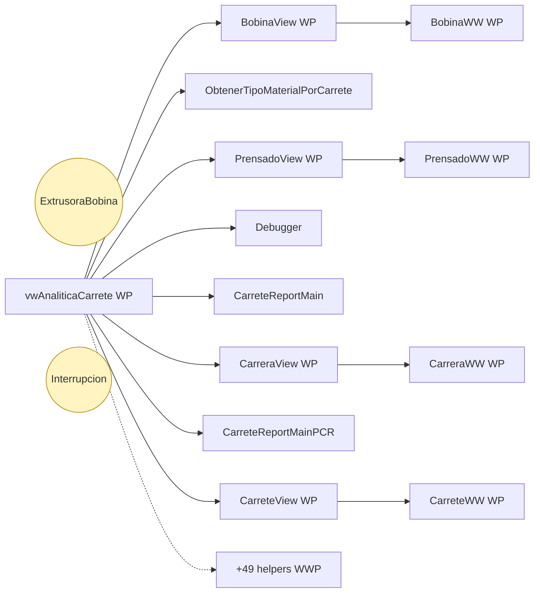
```mermaid
flowchart LR
    WP_BobinaWW[BobinaWW WP]
    WP_PrensadoView[PrensadoView WP]
    P_ObtenerTipoMaterialPorCarrete[ObtenerTipoMaterialPorCarrete]
    WP_CarreraWW[CarreraWW WP]
    WP_PrensadoWW[PrensadoWW WP]
    WP_BobinaView[BobinaView WP]
    T_ExtrusoraBobina((ExtrusoraBobina))
    P_Debugger[Debugger]
    WP_vwAnaliticaCarrete[vwAnaliticaCarrete WP]
    P_CarreteReportMain[CarreteReportMain]
    T_Interrupcion((Interrupcion))
    WP_CarreraView[CarreraView WP]
    P_CarreteReportMainPCR[CarreteReportMainPCR]
    WP_CarreteView[CarreteView WP]
    WP_CarreteWW[CarreteWW WP]
    INFRA[+49 helpers WWP]
    WP_vwAnaliticaCarrete --> P_CarreteReportMain
    WP_vwAnaliticaCarrete --> P_Debugger
    WP_vwAnaliticaCarrete --> P_CarreteReportMainPCR
    WP_vwAnaliticaCarrete --> P_ObtenerTipoMaterialPorCarrete
    WP_vwAnaliticaCarrete --> WP_BobinaView
    WP_vwAnaliticaCarrete --> WP_PrensadoView
    WP_vwAnaliticaCarrete --> WP_CarreraView
    WP_vwAnaliticaCarrete --> WP_CarreteView
    WP_BobinaView --> WP_BobinaWW
    WP_PrensadoView --> WP_PrensadoWW
    WP_CarreraView --> WP_CarreraWW
    WP_CarreteView --> WP_CarreteWW
    WP_vwAnaliticaCarrete -.-> INFRA

    classDef trn fill:#fff4c2,stroke:#b38600
    classDef wp fill:#d1e7ff,stroke:#0066cc
    classDef proc fill:#e0e0e0,stroke:#666
    class T_ExtrusoraBobina,T_Interrupcion trn
```

### Proceso 3 -- `proc_produccion_vw_analitica_bobina` (Bobinas)

**56 objetos · 6 módulos tocados.**

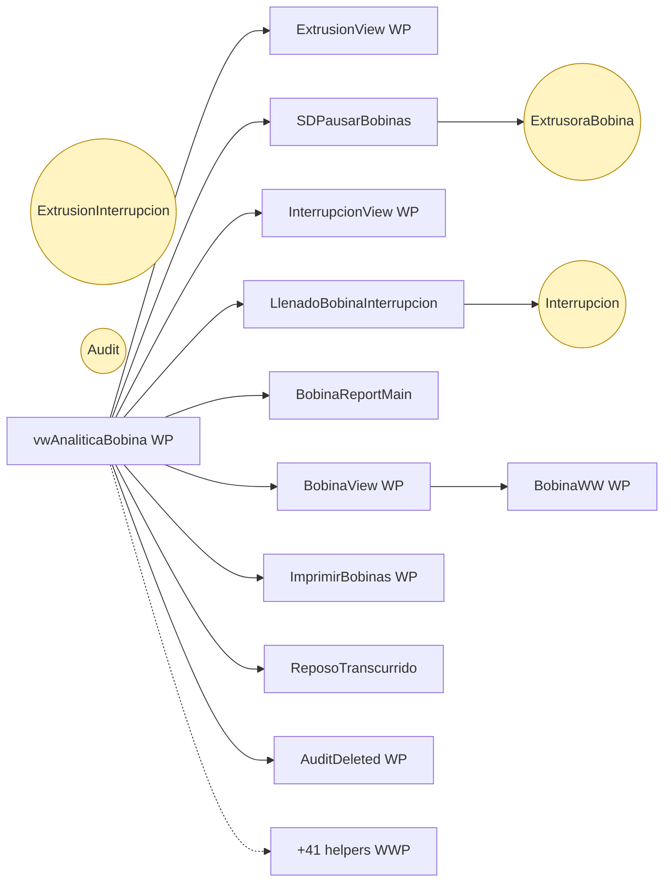
```mermaid
flowchart LR
    T_Interrupcion((Interrupcion))
    WP_ExtrusionView[ExtrusionView WP]
    P_SDPausarBobinas[SDPausarBobinas]
    WP_InterrupcionView[InterrupcionView WP]
    WP_BobinaView[BobinaView WP]
    P_BobinaReportMain[BobinaReportMain]
    T_ExtrusionInterrupcion((ExtrusionInterrupcion))
    P_LlenadoBobinaInterrupcion[LlenadoBobinaInterrupcion]
    T_ExtrusoraBobina((ExtrusoraBobina))
    T_Audit((Audit))
    WP_BobinaWW[BobinaWW WP]
    WP_vwAnaliticaBobina[vwAnaliticaBobina WP]
    WP_ImprimirBobinas[ImprimirBobinas WP]
    P_ReposoTranscurrido[ReposoTranscurrido]
    WP_AuditDeleted[AuditDeleted WP]
    INFRA[+41 helpers WWP]
    WP_vwAnaliticaBobina --> P_ReposoTranscurrido
    WP_vwAnaliticaBobina --> P_BobinaReportMain
    WP_vwAnaliticaBobina --> P_SDPausarBobinas
    WP_vwAnaliticaBobina --> P_LlenadoBobinaInterrupcion
    WP_vwAnaliticaBobina --> WP_ExtrusionView
    WP_vwAnaliticaBobina --> WP_BobinaView
    WP_vwAnaliticaBobina --> WP_InterrupcionView
    WP_vwAnaliticaBobina --> WP_AuditDeleted
    WP_vwAnaliticaBobina --> WP_ImprimirBobinas
    P_SDPausarBobinas --> T_ExtrusoraBobina
    P_LlenadoBobinaInterrupcion --> T_Interrupcion
    WP_BobinaView --> WP_BobinaWW
    WP_vwAnaliticaBobina -.-> INFRA

    classDef trn fill:#fff4c2,stroke:#b38600
    classDef wp fill:#d1e7ff,stroke:#0066cc
    classDef proc fill:#e0e0e0,stroke:#666
    class T_Interrupcion,T_ExtrusionInterrupcion,T_ExtrusoraBobina,T_Audit trn
```

### Proceso 4 -- `proc_produccion_exclusion_del_dia` (Extrusión del Día)

**53 objetos · 5 módulos tocados.**

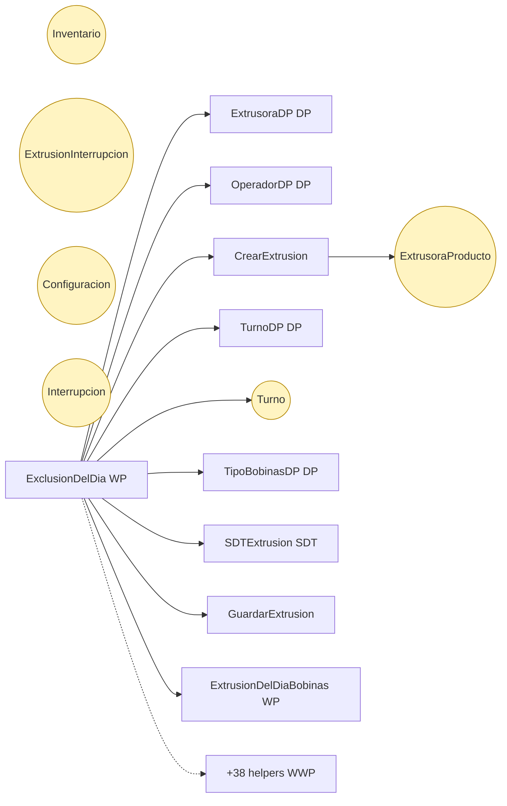
```mermaid
flowchart LR
    DP_ExtrusoraDP[ExtrusoraDP DP]
    DP_OperadorDP[OperadorDP DP]
    T_ExtrusoraProducto((ExtrusoraProducto))
    P_CrearExtrusion[CrearExtrusion]
    T_Inventario((Inventario))
    T_ExtrusionInterrupcion((ExtrusionInterrupcion))
    T_Configuracion((Configuracion))
    DP_TurnoDP[TurnoDP DP]
    T_Turno((Turno))
    DP_TipoBobinasDP[TipoBobinasDP DP]
    S_SDTExtrusion[SDTExtrusion SDT]
    T_Interrupcion((Interrupcion))
    P_GuardarExtrusion[GuardarExtrusion]
    WP_ExtrusionDelDiaBobinas[ExtrusionDelDiaBobinas WP]
    WP_ExclusionDelDia[ExclusionDelDia WP]
    INFRA[+38 helpers WWP]
    WP_ExclusionDelDia --> DP_TurnoDP
    WP_ExclusionDelDia --> DP_TipoBobinasDP
    WP_ExclusionDelDia --> DP_ExtrusoraDP
    WP_ExclusionDelDia --> DP_OperadorDP
    WP_ExclusionDelDia --> P_CrearExtrusion
    WP_ExclusionDelDia --> P_GuardarExtrusion
    WP_ExclusionDelDia --> S_SDTExtrusion
    WP_ExclusionDelDia --> T_Turno
    WP_ExclusionDelDia --> WP_ExtrusionDelDiaBobinas
    P_CrearExtrusion --> T_ExtrusoraProducto
    WP_ExclusionDelDia -.-> INFRA

    classDef trn fill:#fff4c2,stroke:#b38600
    classDef wp fill:#d1e7ff,stroke:#0066cc
    classDef proc fill:#e0e0e0,stroke:#666
    class T_ExtrusoraProducto,T_Inventario,T_ExtrusionInterrupcion,T_Configuracion,T_Turno,T_Interrupcion trn
```

### Proceso 5 -- `proc_produccion_vw_analitica_prensado` (Prensados)

**38 objetos · 4 módulos tocados.**

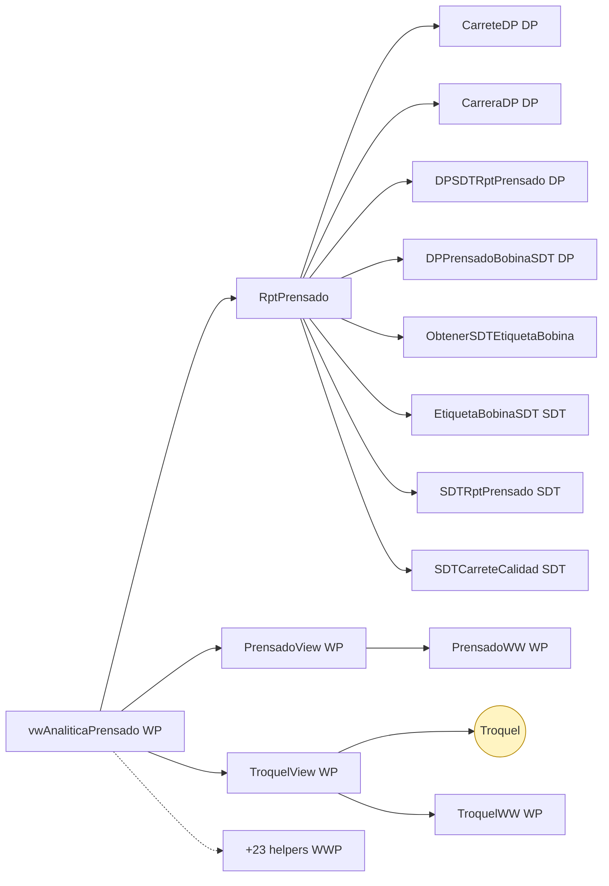
```mermaid
flowchart LR
    WP_PrensadoView[PrensadoView WP]
    S_SDTCarreteCalidad[SDTCarreteCalidad SDT]
    DP_DPSDTRptPrensado[DPSDTRptPrensado DP]
    WP_TroquelWW[TroquelWW WP]
    S_SDTRptPrensado[SDTRptPrensado SDT]
    WP_TroquelView[TroquelView WP]
    S_EtiquetaBobinaSDT[EtiquetaBobinaSDT SDT]
    DP_CarreteDP[CarreteDP DP]
    P_RptPrensado[RptPrensado]
    T_Troquel((Troquel))
    P_ObtenerSDTEtiquetaBobina[ObtenerSDTEtiquetaBobina]
    DP_DPPrensadoBobinaSDT[DPPrensadoBobinaSDT DP]
    WP_PrensadoWW[PrensadoWW WP]
    DP_CarreraDP[CarreraDP DP]
    WP_vwAnaliticaPrensado[vwAnaliticaPrensado WP]
    INFRA[+23 helpers WWP]
    WP_vwAnaliticaPrensado --> P_RptPrensado
    WP_vwAnaliticaPrensado --> WP_PrensadoView
    WP_vwAnaliticaPrensado --> WP_TroquelView
    P_RptPrensado --> DP_CarreteDP
    P_RptPrensado --> DP_CarreraDP
    P_RptPrensado --> DP_DPSDTRptPrensado
    P_RptPrensado --> DP_DPPrensadoBobinaSDT
    P_RptPrensado --> P_ObtenerSDTEtiquetaBobina
    P_RptPrensado --> S_EtiquetaBobinaSDT
    P_RptPrensado --> S_SDTRptPrensado
    P_RptPrensado --> S_SDTCarreteCalidad
    WP_PrensadoView --> WP_PrensadoWW
    WP_TroquelView --> T_Troquel
    WP_TroquelView --> WP_TroquelWW
    WP_vwAnaliticaPrensado -.-> INFRA

    classDef trn fill:#fff4c2,stroke:#b38600
    classDef wp fill:#d1e7ff,stroke:#0066cc
    classDef proc fill:#e0e0e0,stroke:#666
    class T_Troquel trn
```

### Proceso 6 -- `proc_produccion_prensado_del_dia` (Prensado del día)

**29 objetos · 3 módulos tocados.**

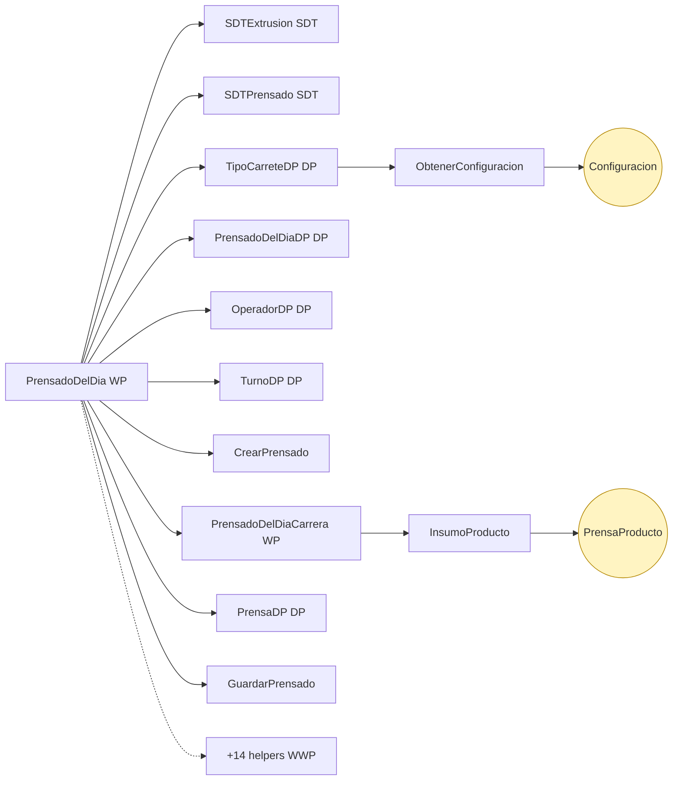
```mermaid
flowchart LR
    S_SDTExtrusion[SDTExtrusion SDT]
    S_SDTPrensado[SDTPrensado SDT]
    WP_PrensadoDelDiaCarrera[PrensadoDelDiaCarrera WP]
    P_ObtenerConfiguracion[ObtenerConfiguracion]
    WP_PrensadoDelDia[PrensadoDelDia WP]
    DP_PrensadoDelDiaDP[PrensadoDelDiaDP DP]
    P_InsumoProducto[InsumoProducto]
    T_Configuracion((Configuracion))
    DP_OperadorDP[OperadorDP DP]
    DP_TurnoDP[TurnoDP DP]
    P_CrearPrensado[CrearPrensado]
    DP_TipoCarreteDP[TipoCarreteDP DP]
    DP_PrensaDP[PrensaDP DP]
    T_PrensaProducto((PrensaProducto))
    P_GuardarPrensado[GuardarPrensado]
    INFRA[+14 helpers WWP]
    WP_PrensadoDelDia --> DP_TurnoDP
    WP_PrensadoDelDia --> DP_OperadorDP
    WP_PrensadoDelDia --> DP_TipoCarreteDP
    WP_PrensadoDelDia --> DP_PrensaDP
    WP_PrensadoDelDia --> DP_PrensadoDelDiaDP
    WP_PrensadoDelDia --> P_CrearPrensado
    WP_PrensadoDelDia --> S_SDTExtrusion
    WP_PrensadoDelDia --> S_SDTPrensado
    WP_PrensadoDelDia --> WP_PrensadoDelDiaCarrera
    WP_PrensadoDelDia --> P_GuardarPrensado
    DP_TipoCarreteDP --> P_ObtenerConfiguracion
    WP_PrensadoDelDiaCarrera --> P_InsumoProducto
    P_ObtenerConfiguracion --> T_Configuracion
    P_InsumoProducto --> T_PrensaProducto
    WP_PrensadoDelDia -.-> INFRA

    classDef trn fill:#fff4c2,stroke:#b38600
    classDef wp fill:#d1e7ff,stroke:#0066cc
    classDef proc fill:#e0e0e0,stroke:#666
    class T_Configuracion,T_PrensaProducto trn
```

### Proceso 7 -- `proc_produccion_listar_troquel` (Troqueles)

**28 objetos · 4 módulos tocados.**

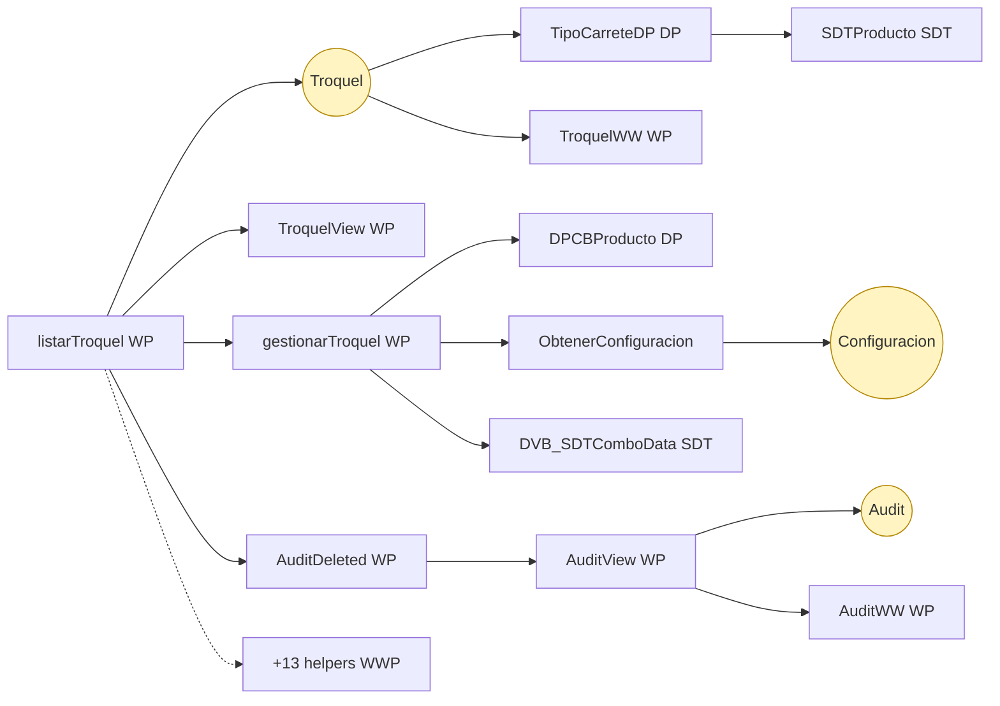
```mermaid
flowchart LR
    WP_TroquelWW[TroquelWW WP]
    WP_gestionarTroquel[gestionarTroquel WP]
    P_ObtenerConfiguracion[ObtenerConfiguracion]
    WP_AuditView[AuditView WP]
    WP_TroquelView[TroquelView WP]
    T_Configuracion((Configuracion))
    WP_AuditWW[AuditWW WP]
    T_Audit((Audit))
    T_Troquel((Troquel))
    DP_TipoCarreteDP[TipoCarreteDP DP]
    DP_DPCBProducto[DPCBProducto DP]
    S_SDTProducto[SDTProducto SDT]
    WP_listarTroquel[listarTroquel WP]
    S_DVB_SDTComboData[DVB_SDTComboData SDT]
    WP_AuditDeleted[AuditDeleted WP]
    INFRA[+13 helpers WWP]
    WP_listarTroquel --> T_Troquel
    WP_listarTroquel --> WP_TroquelView
    WP_listarTroquel --> WP_gestionarTroquel
    WP_listarTroquel --> WP_AuditDeleted
    T_Troquel --> DP_TipoCarreteDP
    T_Troquel --> WP_TroquelWW
    WP_gestionarTroquel --> DP_DPCBProducto
    WP_gestionarTroquel --> P_ObtenerConfiguracion
    WP_gestionarTroquel --> S_DVB_SDTComboData
    WP_AuditDeleted --> WP_AuditView
    DP_TipoCarreteDP --> S_SDTProducto
    P_ObtenerConfiguracion --> T_Configuracion
    WP_AuditView --> T_Audit
    WP_AuditView --> WP_AuditWW
    WP_listarTroquel -.-> INFRA

    classDef trn fill:#fff4c2,stroke:#b38600
    classDef wp fill:#d1e7ff,stroke:#0066cc
    classDef proc fill:#e0e0e0,stroke:#666
    class T_Configuracion,T_Audit,T_Troquel trn
```

### Proceso 8 -- `proc_produccion_listar_extrusora_producto` (Extrusora Producto)

**21 objetos · 5 módulos tocados.**

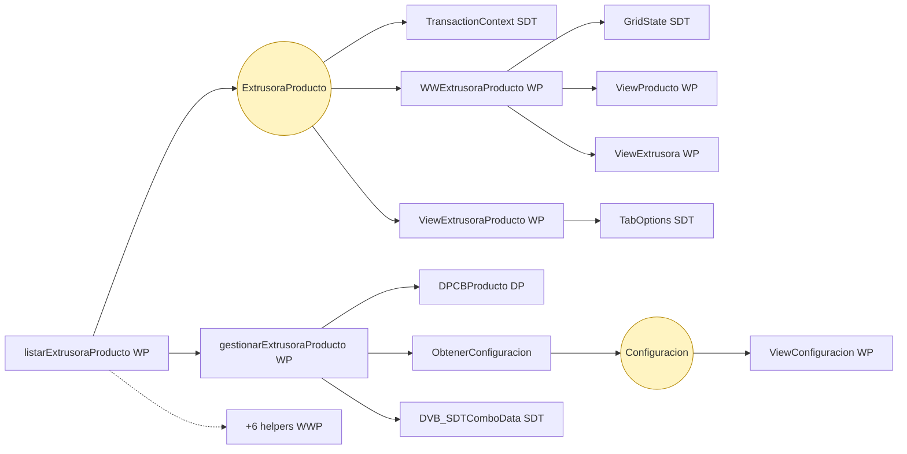
```mermaid
flowchart LR
    T_ExtrusoraProducto((ExtrusoraProducto))
    P_ObtenerConfiguracion[ObtenerConfiguracion]
    WP_ViewExtrusoraProducto[ViewExtrusoraProducto WP]
    S_GridState[GridState SDT]
    WP_ViewExtrusora[ViewExtrusora WP]
    WP_gestionarExtrusoraProducto[gestionarExtrusoraProducto WP]
    WP_WWExtrusoraProducto[WWExtrusoraProducto WP]
    T_Configuracion((Configuracion))
    WP_ViewConfiguracion[ViewConfiguracion WP]
    S_TabOptions[TabOptions SDT]
    WP_listarExtrusoraProducto[listarExtrusoraProducto WP]
    WP_ViewProducto[ViewProducto WP]
    S_TransactionContext[TransactionContext SDT]
    DP_DPCBProducto[DPCBProducto DP]
    S_DVB_SDTComboData[DVB_SDTComboData SDT]
    INFRA[+6 helpers WWP]
    WP_listarExtrusoraProducto --> T_ExtrusoraProducto
    WP_listarExtrusoraProducto --> WP_gestionarExtrusoraProducto
    T_ExtrusoraProducto --> S_TransactionContext
    T_ExtrusoraProducto --> WP_WWExtrusoraProducto
    T_ExtrusoraProducto --> WP_ViewExtrusoraProducto
    WP_gestionarExtrusoraProducto --> DP_DPCBProducto
    WP_gestionarExtrusoraProducto --> P_ObtenerConfiguracion
    WP_gestionarExtrusoraProducto --> S_DVB_SDTComboData
    WP_WWExtrusoraProducto --> S_GridState
    WP_WWExtrusoraProducto --> WP_ViewProducto
    WP_WWExtrusoraProducto --> WP_ViewExtrusora
    WP_ViewExtrusoraProducto --> S_TabOptions
    P_ObtenerConfiguracion --> T_Configuracion
    T_Configuracion --> WP_ViewConfiguracion
    WP_listarExtrusoraProducto -.-> INFRA

    classDef trn fill:#fff4c2,stroke:#b38600
    classDef wp fill:#d1e7ff,stroke:#0066cc
    classDef proc fill:#e0e0e0,stroke:#666
    class T_ExtrusoraProducto,T_Configuracion trn
```

### Proceso 9 -- `proc_produccion_listar_prensa_producto` (Prensa Producto)

**21 objetos · 5 módulos tocados.**

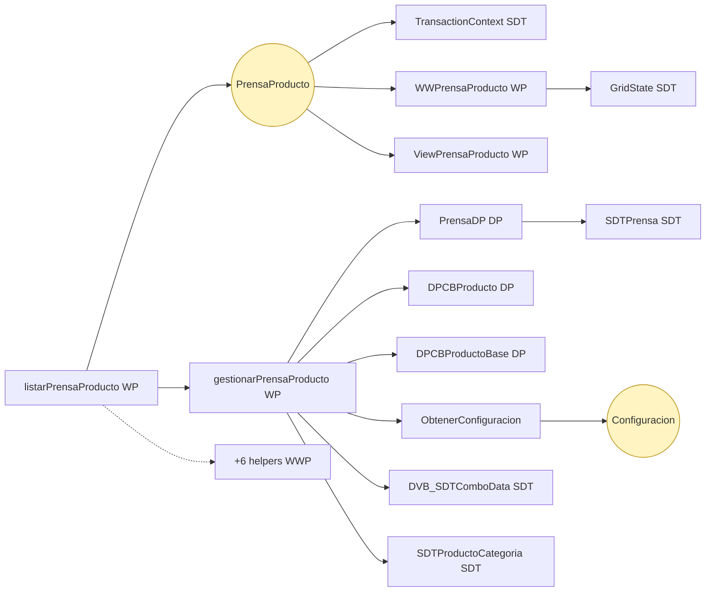
```mermaid
flowchart LR
    WP_WWPrensaProducto[WWPrensaProducto WP]
    DP_PrensaDP[PrensaDP DP]
    P_ObtenerConfiguracion[ObtenerConfiguracion]
    S_GridState[GridState SDT]
    S_DVB_SDTComboData[DVB_SDTComboData SDT]
    S_SDTProductoCategoria[SDTProductoCategoria SDT]
    WP_listarPrensaProducto[listarPrensaProducto WP]
    T_Configuracion((Configuracion))
    WP_gestionarPrensaProducto[gestionarPrensaProducto WP]
    S_TransactionContext[TransactionContext SDT]
    DP_DPCBProducto[DPCBProducto DP]
    DP_DPCBProductoBase[DPCBProductoBase DP]
    T_PrensaProducto((PrensaProducto))
    WP_ViewPrensaProducto[ViewPrensaProducto WP]
    S_SDTPrensa[SDTPrensa SDT]
    INFRA[+6 helpers WWP]
    WP_listarPrensaProducto --> T_PrensaProducto
    WP_listarPrensaProducto --> WP_gestionarPrensaProducto
    T_PrensaProducto --> S_TransactionContext
    T_PrensaProducto --> WP_WWPrensaProducto
    T_PrensaProducto --> WP_ViewPrensaProducto
    WP_gestionarPrensaProducto --> DP_PrensaDP
    WP_gestionarPrensaProducto --> DP_DPCBProducto
    WP_gestionarPrensaProducto --> DP_DPCBProductoBase
    WP_gestionarPrensaProducto --> P_ObtenerConfiguracion
    WP_gestionarPrensaProducto --> S_DVB_SDTComboData
    WP_gestionarPrensaProducto --> S_SDTProductoCategoria
    WP_WWPrensaProducto --> S_GridState
    DP_PrensaDP --> S_SDTPrensa
    P_ObtenerConfiguracion --> T_Configuracion
    WP_listarPrensaProducto -.-> INFRA

    classDef trn fill:#fff4c2,stroke:#b38600
    classDef wp fill:#d1e7ff,stroke:#0066cc
    classDef proc fill:#e0e0e0,stroke:#666
    class T_Configuracion,T_PrensaProducto trn
```

### Proceso 10 -- `proc_produccion_listar_productos` (Productos)

**19 objetos · 6 módulos tocados.**

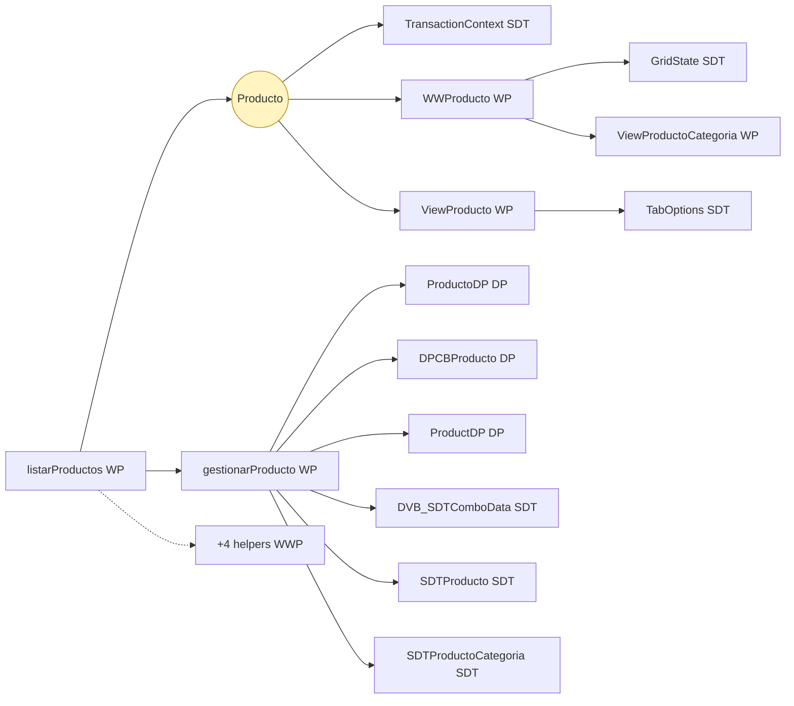
```mermaid
flowchart LR
    WP_ViewProductoCategoria[ViewProductoCategoria WP]
    WP_WWProducto[WWProducto WP]
    DP_DPCBProducto[DPCBProducto DP]
    S_SDTProductoCategoria[SDTProductoCategoria SDT]
    S_TransactionContext[TransactionContext SDT]
    S_TabOptions[TabOptions SDT]
    S_GridState[GridState SDT]
    WP_ViewProducto[ViewProducto WP]
    DP_ProductDP[ProductDP DP]
    WP_gestionarProducto[gestionarProducto WP]
    S_SDTProducto[SDTProducto SDT]
    T_Producto((Producto))
    S_DVB_SDTComboData[DVB_SDTComboData SDT]
    WP_listarProductos[listarProductos WP]
    DP_ProductoDP[ProductoDP DP]
    INFRA[+4 helpers WWP]
    WP_listarProductos --> T_Producto
    WP_listarProductos --> WP_gestionarProducto
    T_Producto --> S_TransactionContext
    T_Producto --> WP_WWProducto
    T_Producto --> WP_ViewProducto
    WP_gestionarProducto --> DP_ProductoDP
    WP_gestionarProducto --> DP_DPCBProducto
    WP_gestionarProducto --> DP_ProductDP
    WP_gestionarProducto --> S_DVB_SDTComboData
    WP_gestionarProducto --> S_SDTProducto
    WP_gestionarProducto --> S_SDTProductoCategoria
    WP_WWProducto --> S_GridState
    WP_WWProducto --> WP_ViewProductoCategoria
    WP_ViewProducto --> S_TabOptions
    WP_listarProductos -.-> INFRA

    classDef trn fill:#fff4c2,stroke:#b38600
    classDef wp fill:#d1e7ff,stroke:#0066cc
    classDef proc fill:#e0e0e0,stroke:#666
    class T_Producto trn
```

### Proceso 11 -- `proc_produccion_inicio_extrusion` (Inicio)

**18 objetos · 4 módulos tocados.**

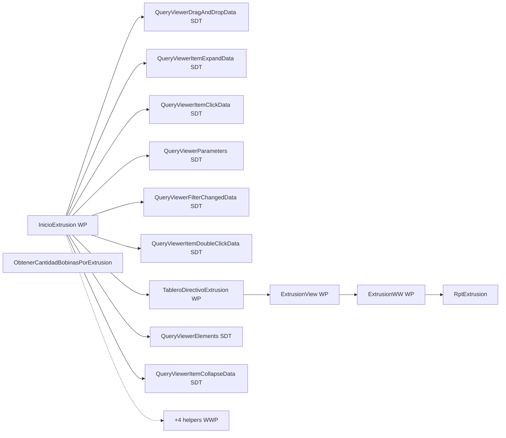
```mermaid
flowchart LR
    WP_ExtrusionView[ExtrusionView WP]
    S_QueryViewerDragAndDropData[QueryViewerDragAndDropData SDT]
    S_QueryViewerItemExpandData[QueryViewerItemExpandData SDT]
    WP_InicioExtrusion[InicioExtrusion WP]
    S_QueryViewerItemClickData[QueryViewerItemClickData SDT]
    WP_ExtrusionWW[ExtrusionWW WP]
    S_QueryViewerParameters[QueryViewerParameters SDT]
    S_QueryViewerFilterChangedData[QueryViewerFilterChangedData SDT]
    P_ObtenerCantidadBobinasPorExtrusion[ObtenerCantidadBobinasPorExtrusion]
    S_QueryViewerItemDoubleClickData[QueryViewerItemDoubleClickData SDT]
    WP_TableroDirectivoExtrusion[TableroDirectivoExtrusion WP]
    S_QueryViewerElements[QueryViewerElements SDT]
    P_RptExtrusion[RptExtrusion]
    S_QueryViewerItemCollapseData[QueryViewerItemCollapseData SDT]
    INFRA[+4 helpers WWP]
    WP_InicioExtrusion --> S_QueryViewerElements
    WP_InicioExtrusion --> S_QueryViewerParameters
    WP_InicioExtrusion --> S_QueryViewerItemExpandData
    WP_InicioExtrusion --> S_QueryViewerItemDoubleClickData
    WP_InicioExtrusion --> S_QueryViewerItemCollapseData
    WP_InicioExtrusion --> S_QueryViewerItemClickData
    WP_InicioExtrusion --> S_QueryViewerFilterChangedData
    WP_InicioExtrusion --> S_QueryViewerDragAndDropData
    WP_InicioExtrusion --> WP_TableroDirectivoExtrusion
    WP_TableroDirectivoExtrusion --> WP_ExtrusionView
    WP_ExtrusionView --> WP_ExtrusionWW
    WP_ExtrusionWW --> P_RptExtrusion
    WP_InicioExtrusion -.-> INFRA

    classDef trn fill:#fff4c2,stroke:#b38600
    classDef wp fill:#d1e7ff,stroke:#0066cc
    classDef proc fill:#e0e0e0,stroke:#666
```

### Proceso 12 -- `proc_produccion_inicio_prensado` (Inicio)

**18 objetos · 4 módulos tocados.**

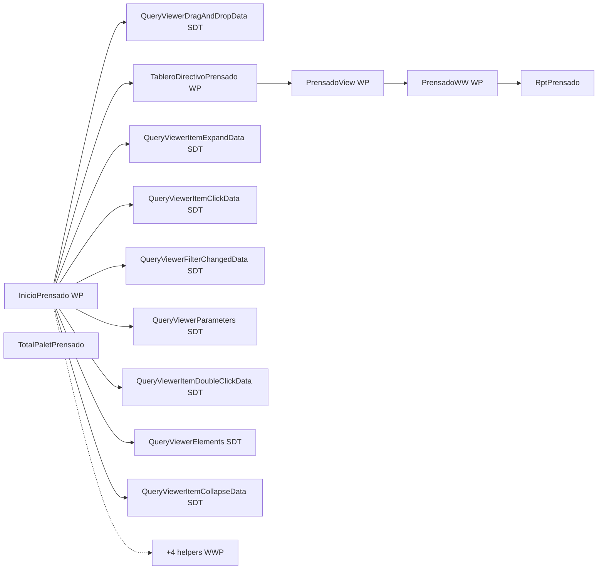
```mermaid
flowchart LR
    WP_PrensadoView[PrensadoView WP]
    S_QueryViewerDragAndDropData[QueryViewerDragAndDropData SDT]
    WP_TableroDirectivoPrensado[TableroDirectivoPrensado WP]
    S_QueryViewerItemExpandData[QueryViewerItemExpandData SDT]
    S_QueryViewerItemClickData[QueryViewerItemClickData SDT]
    S_QueryViewerFilterChangedData[QueryViewerFilterChangedData SDT]
    S_QueryViewerParameters[QueryViewerParameters SDT]
    WP_InicioPrensado[InicioPrensado WP]
    P_RptPrensado[RptPrensado]
    S_QueryViewerItemDoubleClickData[QueryViewerItemDoubleClickData SDT]
    P_TotalPaletPrensado[TotalPaletPrensado]
    S_QueryViewerElements[QueryViewerElements SDT]
    WP_PrensadoWW[PrensadoWW WP]
    S_QueryViewerItemCollapseData[QueryViewerItemCollapseData SDT]
    INFRA[+4 helpers WWP]
    WP_InicioPrensado --> S_QueryViewerElements
    WP_InicioPrensado --> S_QueryViewerParameters
    WP_InicioPrensado --> S_QueryViewerItemExpandData
    WP_InicioPrensado --> S_QueryViewerItemDoubleClickData
    WP_InicioPrensado --> S_QueryViewerItemCollapseData
    WP_InicioPrensado --> S_QueryViewerItemClickData
    WP_InicioPrensado --> S_QueryViewerFilterChangedData
    WP_InicioPrensado --> S_QueryViewerDragAndDropData
    WP_InicioPrensado --> WP_TableroDirectivoPrensado
    WP_TableroDirectivoPrensado --> WP_PrensadoView
    WP_PrensadoView --> WP_PrensadoWW
    WP_PrensadoWW --> P_RptPrensado
    WP_InicioPrensado -.-> INFRA

    classDef trn fill:#fff4c2,stroke:#b38600
    classDef wp fill:#d1e7ff,stroke:#0066cc
    classDef proc fill:#e0e0e0,stroke:#666
```

### Proceso 13 -- `proc_produccion_listar_extrusion` (listarExtrusion)

**17 objetos · 4 módulos tocados.**

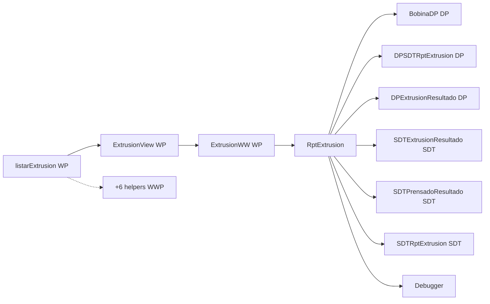
```mermaid
flowchart LR
    DP_BobinaDP[BobinaDP DP]
    DP_DPExtrusionResultado[DPExtrusionResultado DP]
    S_SDTPrensadoResultado[SDTPrensadoResultado SDT]
    DP_DPSDTRptExtrusion[DPSDTRptExtrusion DP]
    S_SDTExtrusionResultado[SDTExtrusionResultado SDT]
    P_RptExtrusion[RptExtrusion]
    P_Debugger[Debugger]
    WP_listarExtrusion[listarExtrusion WP]
    WP_ExtrusionWW[ExtrusionWW WP]
    WP_ExtrusionView[ExtrusionView WP]
    S_SDTRptExtrusion[SDTRptExtrusion SDT]
    INFRA[+6 helpers WWP]
    WP_listarExtrusion --> WP_ExtrusionView
    WP_ExtrusionView --> WP_ExtrusionWW
    WP_ExtrusionWW --> P_RptExtrusion
    P_RptExtrusion --> DP_BobinaDP
    P_RptExtrusion --> DP_DPSDTRptExtrusion
    P_RptExtrusion --> DP_DPExtrusionResultado
    P_RptExtrusion --> S_SDTExtrusionResultado
    P_RptExtrusion --> S_SDTPrensadoResultado
    P_RptExtrusion --> S_SDTRptExtrusion
    P_RptExtrusion --> P_Debugger
    WP_listarExtrusion -.-> INFRA

    classDef trn fill:#fff4c2,stroke:#b38600
    classDef wp fill:#d1e7ff,stroke:#0066cc
    classDef proc fill:#e0e0e0,stroke:#666
```

### Proceso 14 -- `proc_produccion_listar_operador` (Operadores)

**15 objetos · 6 módulos tocados.**

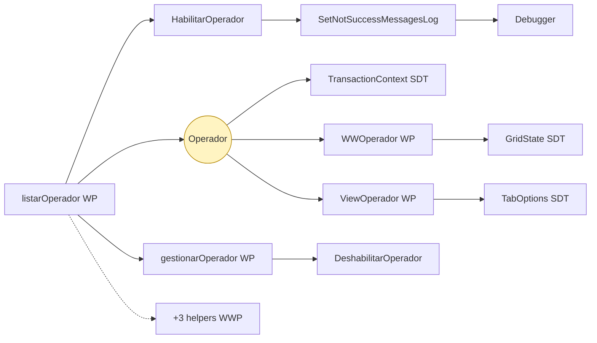
```mermaid
flowchart LR
    WP_ViewOperador[ViewOperador WP]
    S_GridState[GridState SDT]
    S_TransactionContext[TransactionContext SDT]
    WP_WWOperador[WWOperador WP]
    P_HabilitarOperador[HabilitarOperador]
    T_Operador((Operador))
    S_TabOptions[TabOptions SDT]
    P_Debugger[Debugger]
    P_DeshabilitarOperador[DeshabilitarOperador]
    WP_listarOperador[listarOperador WP]
    P_SetNotSuccessMessagesLog[SetNotSuccessMessagesLog]
    WP_gestionarOperador[gestionarOperador WP]
    INFRA[+3 helpers WWP]
    WP_listarOperador --> P_HabilitarOperador
    WP_listarOperador --> T_Operador
    WP_listarOperador --> WP_gestionarOperador
    P_HabilitarOperador --> P_SetNotSuccessMessagesLog
    T_Operador --> S_TransactionContext
    T_Operador --> WP_WWOperador
    T_Operador --> WP_ViewOperador
    WP_gestionarOperador --> P_DeshabilitarOperador
    P_SetNotSuccessMessagesLog --> P_Debugger
    WP_WWOperador --> S_GridState
    WP_ViewOperador --> S_TabOptions
    WP_listarOperador -.-> INFRA

    classDef trn fill:#fff4c2,stroke:#b38600
    classDef wp fill:#d1e7ff,stroke:#0066cc
    classDef proc fill:#e0e0e0,stroke:#666
    class T_Operador trn
```

### Proceso 15 -- `proc_produccion_listar_extrusora` (Extrusoras)

**14 objetos · 5 módulos tocados.**

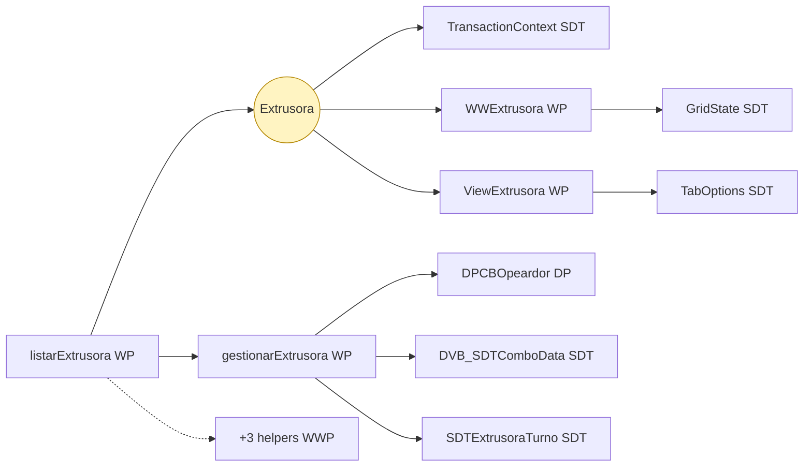
```mermaid
flowchart LR
    T_Extrusora((Extrusora))
    WP_ViewExtrusora[ViewExtrusora WP]
    S_DVB_SDTComboData[DVB_SDTComboData SDT]
    DP_DPCBOpeardor[DPCBOpeardor DP]
    S_TransactionContext[TransactionContext SDT]
    S_SDTExtrusoraTurno[SDTExtrusoraTurno SDT]
    WP_listarExtrusora[listarExtrusora WP]
    S_TabOptions[TabOptions SDT]
    WP_WWExtrusora[WWExtrusora WP]
    S_GridState[GridState SDT]
    WP_gestionarExtrusora[gestionarExtrusora WP]
    INFRA[+3 helpers WWP]
    WP_listarExtrusora --> T_Extrusora
    WP_listarExtrusora --> WP_gestionarExtrusora
    T_Extrusora --> S_TransactionContext
    T_Extrusora --> WP_WWExtrusora
    T_Extrusora --> WP_ViewExtrusora
    WP_gestionarExtrusora --> DP_DPCBOpeardor
    WP_gestionarExtrusora --> S_DVB_SDTComboData
    WP_gestionarExtrusora --> S_SDTExtrusoraTurno
    WP_WWExtrusora --> S_GridState
    WP_ViewExtrusora --> S_TabOptions
    WP_listarExtrusora -.-> INFRA

    classDef trn fill:#fff4c2,stroke:#b38600
    classDef wp fill:#d1e7ff,stroke:#0066cc
    classDef proc fill:#e0e0e0,stroke:#666
    class T_Extrusora trn
```

### Proceso 16 -- `proc_produccion_turnos_por_semana_prensas` (Turnos Por Semana)

**14 objetos · 3 módulos tocados.**

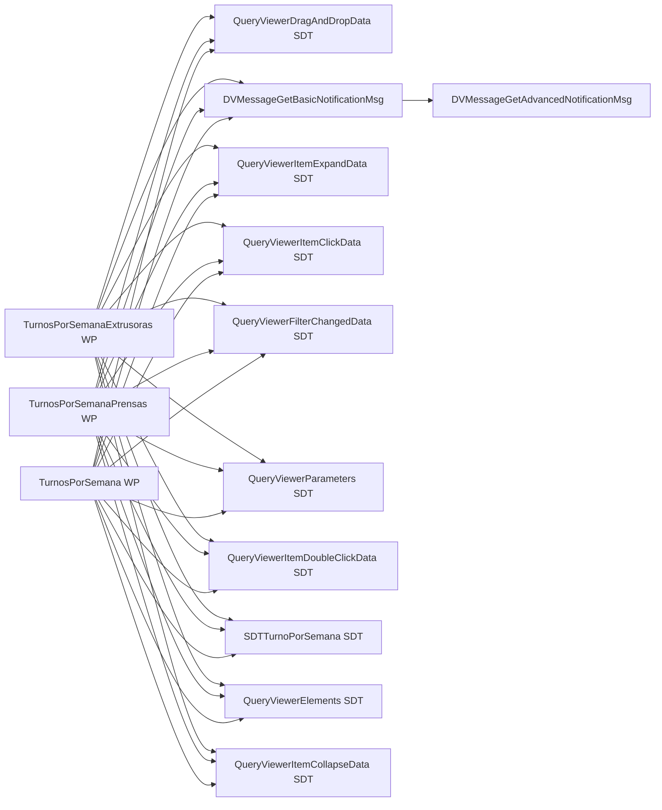
```mermaid
flowchart LR
    S_QueryViewerDragAndDropData[QueryViewerDragAndDropData SDT]
    P_DVMessageGetBasicNotificationMsg[DVMessageGetBasicNotificationMsg]
    S_QueryViewerItemExpandData[QueryViewerItemExpandData SDT]
    S_QueryViewerItemClickData[QueryViewerItemClickData SDT]
    S_QueryViewerFilterChangedData[QueryViewerFilterChangedData SDT]
    S_QueryViewerParameters[QueryViewerParameters SDT]
    WP_TurnosPorSemanaExtrusoras[TurnosPorSemanaExtrusoras WP]
    WP_TurnosPorSemana[TurnosPorSemana WP]
    S_QueryViewerItemDoubleClickData[QueryViewerItemDoubleClickData SDT]
    S_SDTTurnoPorSemana[SDTTurnoPorSemana SDT]
    P_DVMessageGetAdvancedNotificationMsg[DVMessageGetAdvancedNotificationMsg]
    S_QueryViewerElements[QueryViewerElements SDT]
    S_QueryViewerItemCollapseData[QueryViewerItemCollapseData SDT]
    WP_TurnosPorSemanaPrensas[TurnosPorSemanaPrensas WP]
    WP_TurnosPorSemanaExtrusoras --> P_DVMessageGetBasicNotificationMsg
    WP_TurnosPorSemanaExtrusoras --> S_QueryViewerElements
    WP_TurnosPorSemanaExtrusoras --> S_QueryViewerParameters
    WP_TurnosPorSemanaExtrusoras --> S_QueryViewerItemExpandData
    WP_TurnosPorSemanaExtrusoras --> S_QueryViewerItemDoubleClickData
    WP_TurnosPorSemanaExtrusoras --> S_QueryViewerItemCollapseData
    WP_TurnosPorSemanaExtrusoras --> S_QueryViewerItemClickData
    WP_TurnosPorSemanaExtrusoras --> S_QueryViewerFilterChangedData
    WP_TurnosPorSemanaExtrusoras --> S_QueryViewerDragAndDropData
    WP_TurnosPorSemanaExtrusoras --> S_SDTTurnoPorSemana
    P_DVMessageGetBasicNotificationMsg --> P_DVMessageGetAdvancedNotificationMsg
    WP_TurnosPorSemanaPrensas --> P_DVMessageGetBasicNotificationMsg
    WP_TurnosPorSemanaPrensas --> S_QueryViewerElements
    WP_TurnosPorSemanaPrensas --> S_QueryViewerParameters
    WP_TurnosPorSemanaPrensas --> S_QueryViewerItemExpandData
    WP_TurnosPorSemanaPrensas --> S_QueryViewerItemDoubleClickData
    WP_TurnosPorSemanaPrensas --> S_QueryViewerItemCollapseData
    WP_TurnosPorSemanaPrensas --> S_QueryViewerItemClickData
    WP_TurnosPorSemanaPrensas --> S_QueryViewerFilterChangedData
    WP_TurnosPorSemanaPrensas --> S_QueryViewerDragAndDropData
    WP_TurnosPorSemanaPrensas --> S_SDTTurnoPorSemana
    WP_TurnosPorSemana --> P_DVMessageGetBasicNotificationMsg
    WP_TurnosPorSemana --> S_QueryViewerElements
    WP_TurnosPorSemana --> S_QueryViewerParameters
    WP_TurnosPorSemana --> S_QueryViewerItemExpandData
    WP_TurnosPorSemana --> S_QueryViewerItemDoubleClickData
    WP_TurnosPorSemana --> S_QueryViewerItemCollapseData
    WP_TurnosPorSemana --> S_QueryViewerItemClickData
    WP_TurnosPorSemana --> S_QueryViewerFilterChangedData
    WP_TurnosPorSemana --> S_QueryViewerDragAndDropData
    WP_TurnosPorSemana --> S_SDTTurnoPorSemana

    classDef trn fill:#fff4c2,stroke:#b38600
    classDef wp fill:#d1e7ff,stroke:#0066cc
    classDef proc fill:#e0e0e0,stroke:#666
```

### Proceso 17 -- `proc_produccion_listar_inventario` (Cierre de Mes)

**13 objetos · 5 módulos tocados.**

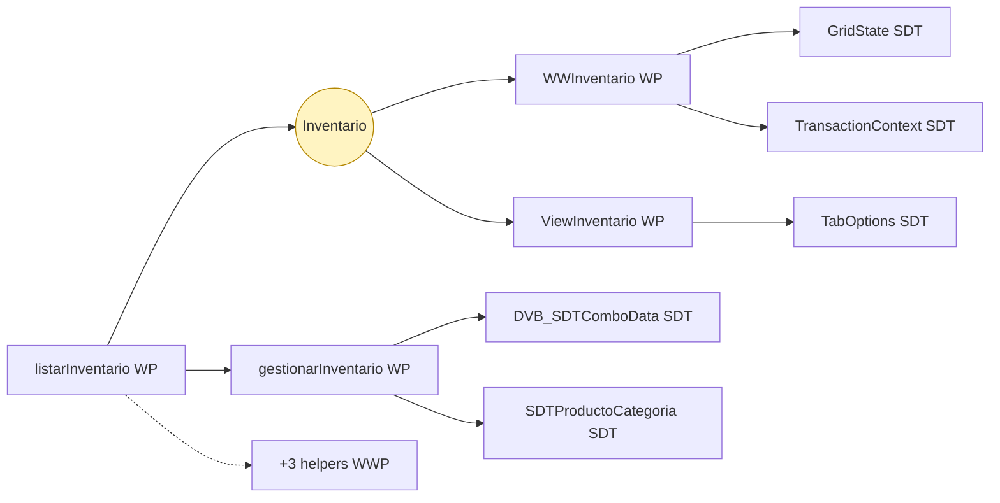
```mermaid
flowchart LR
    S_DVB_SDTComboData[DVB_SDTComboData SDT]
    S_GridState[GridState SDT]
    S_TransactionContext[TransactionContext SDT]
    WP_listarInventario[listarInventario WP]
    WP_WWInventario[WWInventario WP]
    WP_ViewInventario[ViewInventario WP]
    WP_gestionarInventario[gestionarInventario WP]
    S_TabOptions[TabOptions SDT]
    T_Inventario((Inventario))
    S_SDTProductoCategoria[SDTProductoCategoria SDT]
    INFRA[+3 helpers WWP]
    WP_listarInventario --> T_Inventario
    WP_listarInventario --> WP_gestionarInventario
    T_Inventario --> WP_WWInventario
    T_Inventario --> WP_ViewInventario
    WP_gestionarInventario --> S_DVB_SDTComboData
    WP_gestionarInventario --> S_SDTProductoCategoria
    WP_WWInventario --> S_GridState
    WP_WWInventario --> S_TransactionContext
    WP_ViewInventario --> S_TabOptions
    WP_listarInventario -.-> INFRA

    classDef trn fill:#fff4c2,stroke:#b38600
    classDef wp fill:#d1e7ff,stroke:#0066cc
    classDef proc fill:#e0e0e0,stroke:#666
    class T_Inventario trn
```

### Proceso 18 -- `proc_produccion_listar_extrusora_mezcladora` (Extrusora Mezcladora)

**12 objetos · 2 módulos tocados.**

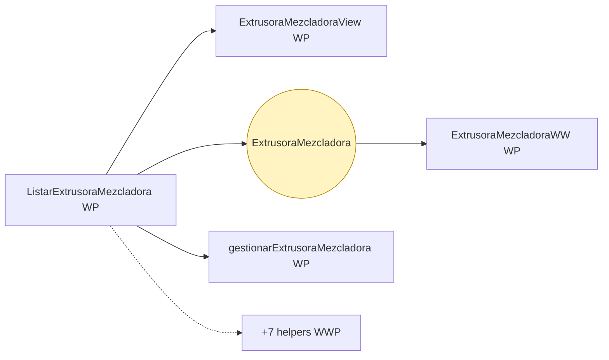
```mermaid
flowchart LR
    WP_ListarExtrusoraMezcladora[ListarExtrusoraMezcladora WP]
    WP_ExtrusoraMezcladoraView[ExtrusoraMezcladoraView WP]
    T_ExtrusoraMezcladora((ExtrusoraMezcladora))
    WP_ExtrusoraMezcladoraWW[ExtrusoraMezcladoraWW WP]
    WP_gestionarExtrusoraMezcladora[gestionarExtrusoraMezcladora WP]
    INFRA[+7 helpers WWP]
    WP_ListarExtrusoraMezcladora --> T_ExtrusoraMezcladora
    WP_ListarExtrusoraMezcladora --> WP_ExtrusoraMezcladoraView
    WP_ListarExtrusoraMezcladora --> WP_gestionarExtrusoraMezcladora
    T_ExtrusoraMezcladora --> WP_ExtrusoraMezcladoraWW
    WP_ListarExtrusoraMezcladora -.-> INFRA

    classDef trn fill:#fff4c2,stroke:#b38600
    classDef wp fill:#d1e7ff,stroke:#0066cc
    classDef proc fill:#e0e0e0,stroke:#666
    class T_ExtrusoraMezcladora trn
```

### Proceso 19 -- `proc_produccion_listar_lotes` (Lotes)

**11 objetos · 3 módulos tocados.**

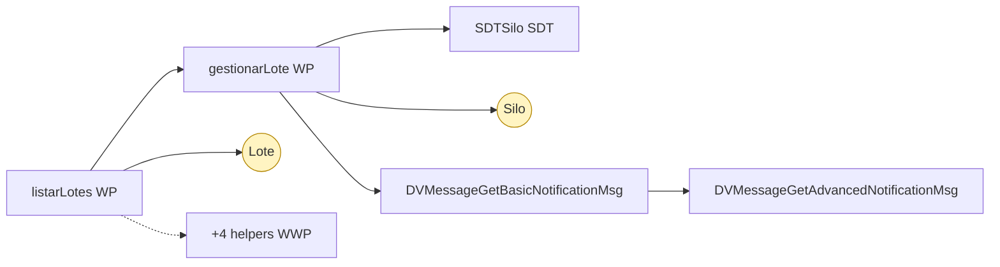
```mermaid
flowchart LR
    WP_gestionarLote[gestionarLote WP]
    T_Lote((Lote))
    P_DVMessageGetAdvancedNotificationMsg[DVMessageGetAdvancedNotificationMsg]
    S_SDTSilo[SDTSilo SDT]
    WP_listarLotes[listarLotes WP]
    T_Silo((Silo))
    P_DVMessageGetBasicNotificationMsg[DVMessageGetBasicNotificationMsg]
    INFRA[+4 helpers WWP]
    WP_listarLotes --> T_Lote
    WP_listarLotes --> WP_gestionarLote
    WP_gestionarLote --> P_DVMessageGetBasicNotificationMsg
    WP_gestionarLote --> S_SDTSilo
    WP_gestionarLote --> T_Silo
    P_DVMessageGetBasicNotificationMsg --> P_DVMessageGetAdvancedNotificationMsg
    WP_listarLotes -.-> INFRA

    classDef trn fill:#fff4c2,stroke:#b38600
    classDef wp fill:#d1e7ff,stroke:#0066cc
    classDef proc fill:#e0e0e0,stroke:#666
    class T_Lote,T_Silo trn
```

### Proceso 20 -- `proc_produccion_listar_producto_categoria` (Categorías)

**11 objetos · 4 módulos tocados.**

```mermaid
flowchart LR
    S_GridState[GridState SDT]
    S_TransactionContext[TransactionContext SDT]
    T_ProductoCategoria((ProductoCategoria))
    WP_gestionarProductoCategoria[gestionarProductoCategoria WP]
    WP_ViewProductoCategoria[ViewProductoCategoria WP]
    S_TabOptions[TabOptions SDT]
    WP_WWProductoCategoria[WWProductoCategoria WP]
    WP_listarProductoCategoria[listarProductoCategoria WP]
    INFRA[+3 helpers WWP]
    WP_listarProductoCategoria --> T_ProductoCategoria
    WP_listarProductoCategoria --> WP_gestionarProductoCategoria
    T_ProductoCategoria --> S_TransactionContext
    T_ProductoCategoria --> WP_WWProductoCategoria
    T_ProductoCategoria --> WP_ViewProductoCategoria
    WP_WWProductoCategoria --> S_GridState
    WP_ViewProductoCategoria --> S_TabOptions
    WP_listarProductoCategoria -.-> INFRA

    classDef trn fill:#fff4c2,stroke:#b38600
    classDef wp fill:#d1e7ff,stroke:#0066cc
    classDef proc fill:#e0e0e0,stroke:#666
    class T_ProductoCategoria trn
```

### Proceso 21 -- `proc_produccion_generar_bobina_no` (GenerarBobinaNo)

**10 objetos · 4 módulos tocados.**

```mermaid
flowchart LR
    WP_ViewInventario[ViewInventario WP]
    S_GridState[GridState SDT]
    S_TransactionContext[TransactionContext SDT]
    S_SDTInventario[SDTInventario SDT]
    WP_WWInventario[WWInventario WP]
    P_SDInventarioItem[SDInventarioItem]
    S_TabOptions[TabOptions SDT]
    T_Inventario((Inventario))
    P_GenerarBobinaNo[GenerarBobinaNo]
    INFRA[+1 helpers WWP]
    P_GenerarBobinaNo --> P_SDInventarioItem
    P_GenerarBobinaNo --> S_SDTInventario
    P_GenerarBobinaNo --> T_Inventario
    T_Inventario --> WP_WWInventario
    T_Inventario --> WP_ViewInventario
    WP_WWInventario --> S_GridState
    WP_WWInventario --> S_TransactionContext
    WP_ViewInventario --> S_TabOptions
    P_GenerarBobinaNo -.-> INFRA

    classDef trn fill:#fff4c2,stroke:#b38600
    classDef wp fill:#d1e7ff,stroke:#0066cc
    classDef proc fill:#e0e0e0,stroke:#666
    class T_Inventario trn
```

### Proceso 22 -- `proc_produccion_inicio_inventario` (Inicio)

**9 objetos · 2 módulos tocados.**

```mermaid
flowchart LR
    WP_InicioInventario[InicioInventario WP]
    S_QueryViewerFilterChangedData[QueryViewerFilterChangedData SDT]
    S_QueryViewerItemExpandData[QueryViewerItemExpandData SDT]
    S_QueryViewerItemClickData[QueryViewerItemClickData SDT]
    S_QueryViewerDragAndDropData[QueryViewerDragAndDropData SDT]
    S_QueryViewerParameters[QueryViewerParameters SDT]
    S_QueryViewerItemDoubleClickData[QueryViewerItemDoubleClickData SDT]
    S_QueryViewerElements[QueryViewerElements SDT]
    S_QueryViewerItemCollapseData[QueryViewerItemCollapseData SDT]
    WP_InicioInventario --> S_QueryViewerElements
    WP_InicioInventario --> S_QueryViewerParameters
    WP_InicioInventario --> S_QueryViewerItemExpandData
    WP_InicioInventario --> S_QueryViewerItemDoubleClickData
    WP_InicioInventario --> S_QueryViewerItemCollapseData
    WP_InicioInventario --> S_QueryViewerItemClickData
    WP_InicioInventario --> S_QueryViewerFilterChangedData
    WP_InicioInventario --> S_QueryViewerDragAndDropData

    classDef trn fill:#fff4c2,stroke:#b38600
    classDef wp fill:#d1e7ff,stroke:#0066cc
    classDef proc fill:#e0e0e0,stroke:#666
```

### Proceso 23 -- `proc_produccion_inicio_produccion` (Inicio)

**9 objetos · 2 módulos tocados.**

```mermaid
flowchart LR
    S_QueryViewerItemExpandData[QueryViewerItemExpandData SDT]
    S_QueryViewerFilterChangedData[QueryViewerFilterChangedData SDT]
    S_QueryViewerItemClickData[QueryViewerItemClickData SDT]
    S_QueryViewerDragAndDropData[QueryViewerDragAndDropData SDT]
    WP_InicioProduccion[InicioProduccion WP]
    S_QueryViewerItemDoubleClickData[QueryViewerItemDoubleClickData SDT]
    S_QueryViewerParameters[QueryViewerParameters SDT]
    S_QueryViewerElements[QueryViewerElements SDT]
    S_QueryViewerItemCollapseData[QueryViewerItemCollapseData SDT]
    WP_InicioProduccion --> S_QueryViewerElements
    WP_InicioProduccion --> S_QueryViewerParameters
    WP_InicioProduccion --> S_QueryViewerItemExpandData
    WP_InicioProduccion --> S_QueryViewerItemDoubleClickData
    WP_InicioProduccion --> S_QueryViewerItemCollapseData
    WP_InicioProduccion --> S_QueryViewerItemClickData
    WP_InicioProduccion --> S_QueryViewerFilterChangedData
    WP_InicioProduccion --> S_QueryViewerDragAndDropData

    classDef trn fill:#fff4c2,stroke:#b38600
    classDef wp fill:#d1e7ff,stroke:#0066cc
    classDef proc fill:#e0e0e0,stroke:#666
```

### Proceso 24 -- `proc_produccion_tipo_carrete_dp` (TipoCarreteDP)

**9 objetos · 4 módulos tocados.**

```mermaid
flowchart LR
    WP_WWConfiguracion[WWConfiguracion WP]
    S_GridState[GridState SDT]
    S_TransactionContext[TransactionContext SDT]
    S_TabOptions[TabOptions SDT]
    T_Configuracion((Configuracion))
    WP_ViewConfiguracion[ViewConfiguracion WP]
    S_SDTProducto[SDTProducto SDT]
    P_ObtenerConfiguracion[ObtenerConfiguracion]
    DP_TipoCarreteDP[TipoCarreteDP DP]
    DP_TipoCarreteDP --> P_ObtenerConfiguracion
    DP_TipoCarreteDP --> S_SDTProducto
    P_ObtenerConfiguracion --> T_Configuracion
    T_Configuracion --> S_TransactionContext
    T_Configuracion --> WP_WWConfiguracion
    T_Configuracion --> WP_ViewConfiguracion
    WP_WWConfiguracion --> S_GridState
    WP_ViewConfiguracion --> S_TabOptions

    classDef trn fill:#fff4c2,stroke:#b38600
    classDef wp fill:#d1e7ff,stroke:#0066cc
    classDef proc fill:#e0e0e0,stroke:#666
    class T_Configuracion trn
```

### Proceso 25 -- `proc_produccion_listar_silos` (Silos)

**7 objetos · 2 módulos tocados.**

```mermaid
flowchart LR
    WP_gestionarSilo[gestionarSilo WP]
    WP_listarSilos[listarSilos WP]
    T_Silo((Silo))
    P_ArchivarSilos[ArchivarSilos]
    INFRA[+3 helpers WWP]
    WP_listarSilos --> P_ArchivarSilos
    WP_listarSilos --> T_Silo
    WP_listarSilos --> WP_gestionarSilo
    WP_listarSilos -.-> INFRA

    classDef trn fill:#fff4c2,stroke:#b38600
    classDef wp fill:#d1e7ff,stroke:#0066cc
    classDef proc fill:#e0e0e0,stroke:#666
    class T_Silo trn
```

### Proceso 26 -- `proc_produccion_obtener_interrupcion_carrera` (ObtenerInterrupcionCarrera)

**7 objetos · 2 módulos tocados.**

```mermaid
flowchart LR
    T_PrensadoInterrupcion((PrensadoInterrupcion))
    WP_PrensadoInterrupcionView[PrensadoInterrupcionView WP]
    WP_PrensadoInterrupcionWW[PrensadoInterrupcionWW WP]
    P_ObtenerInterrupcionCarrera[ObtenerInterrupcionCarrera]
    INFRA[+3 helpers WWP]
    P_ObtenerInterrupcionCarrera --> T_PrensadoInterrupcion
    T_PrensadoInterrupcion --> WP_PrensadoInterrupcionView
    T_PrensadoInterrupcion --> WP_PrensadoInterrupcionWW
    P_ObtenerInterrupcionCarrera -.-> INFRA

    classDef trn fill:#fff4c2,stroke:#b38600
    classDef wp fill:#d1e7ff,stroke:#0066cc
    classDef proc fill:#e0e0e0,stroke:#666
    class T_PrensadoInterrupcion trn
```

### Proceso 27 -- `proc_produccion_listar_prensas` (Prensas)

**6 objetos · 2 módulos tocados.**

```mermaid
flowchart LR
    WP_listarPrensas[listarPrensas WP]
    T_Prensa((Prensa))
    WP_gestionarPrensa[gestionarPrensa WP]
    INFRA[+3 helpers WWP]
    WP_listarPrensas --> T_Prensa
    WP_listarPrensas --> WP_gestionarPrensa
    WP_listarPrensas -.-> INFRA

    classDef trn fill:#fff4c2,stroke:#b38600
    classDef wp fill:#d1e7ff,stroke:#0066cc
    classDef proc fill:#e0e0e0,stroke:#666
    class T_Prensa trn
```

### Proceso 28 -- `proc_produccion_listar_turnos` (Turnos)

**6 objetos · 2 módulos tocados.**

```mermaid
flowchart LR
    T_Turno((Turno))
    WP_listarTurnos[listarTurnos WP]
    WP_gestionarTurno[gestionarTurno WP]
    INFRA[+3 helpers WWP]
    WP_listarTurnos --> T_Turno
    WP_listarTurnos --> WP_gestionarTurno
    WP_listarTurnos -.-> INFRA

    classDef trn fill:#fff4c2,stroke:#b38600
    classDef wp fill:#d1e7ff,stroke:#0066cc
    classDef proc fill:#e0e0e0,stroke:#666
    class T_Turno trn
```

### Proceso 29 -- `proc_produccion_vw_carrete_carrera` (vwCarreteCarrera)

**6 objetos · 1 módulos tocados.**

```mermaid
flowchart LR
    S_SDTCarreteCarrera[SDTCarreteCarrera SDT]
    WP_vwCarreteCarrera[vwCarreteCarrera WP]
    DP_DPCarreteCarrera[DPCarreteCarrera DP]
    S_CarreteCarrera[CarreteCarrera SDT]
    INFRA[+2 helpers WWP]
    WP_vwCarreteCarrera --> DP_DPCarreteCarrera
    WP_vwCarreteCarrera --> S_CarreteCarrera
    WP_vwCarreteCarrera --> S_SDTCarreteCarrera
    WP_vwCarreteCarrera -.-> INFRA

    classDef trn fill:#fff4c2,stroke:#b38600
    classDef wp fill:#d1e7ff,stroke:#0066cc
    classDef proc fill:#e0e0e0,stroke:#666
```

### Proceso 30 -- `proc_produccion_listar_producto_terminado` (Producto Terminado)

**5 objetos · 1 módulos tocados.**

```mermaid
flowchart LR
    WP_listarProductoTerminado[listarProductoTerminado WP]
    WP_gestionarProductoTerminado[gestionarProductoTerminado WP]
    INFRA[+3 helpers WWP]
    WP_listarProductoTerminado --> WP_gestionarProductoTerminado
    WP_listarProductoTerminado -.-> INFRA

    classDef trn fill:#fff4c2,stroke:#b38600
    classDef wp fill:#d1e7ff,stroke:#0066cc
    classDef proc fill:#e0e0e0,stroke:#666
```

### Proceso 31 -- `proc_produccion_guardar_bobina` (GuardarBobina)

**3 objetos · 2 módulos tocados.**

```mermaid
flowchart LR
    P_Debugger[Debugger]
    P_BobinaNoSerie[BobinaNoSerie]
    P_GuardarBobina[GuardarBobina]
    P_GuardarBobina --> P_BobinaNoSerie
    P_BobinaNoSerie --> P_Debugger

    classDef trn fill:#fff4c2,stroke:#b38600
    classDef wp fill:#d1e7ff,stroke:#0066cc
    classDef proc fill:#e0e0e0,stroke:#666
```

### Proceso 32 -- `proc_produccion_reposo_transcurrido` (ReposoTranscurrido)

**3 objetos · 1 módulos tocados.**

```mermaid
flowchart LR
    P_BobinaTiempoReposo[BobinaTiempoReposo]
    P_ReposoTranscurrido[ReposoTranscurrido]
    P_ObtenerTiempoReposo[ObtenerTiempoReposo]
    P_ReposoTranscurrido --> P_BobinaTiempoReposo
    P_ReposoTranscurrido --> P_ObtenerTiempoReposo

    classDef trn fill:#fff4c2,stroke:#b38600
    classDef wp fill:#d1e7ff,stroke:#0066cc
    classDef proc fill:#e0e0e0,stroke:#666
```

### Proceso 33 -- `proc_produccion_sdpausar_bobinas` (SDPausarBobinas)

**3 objetos · 2 módulos tocados.**

```mermaid
flowchart LR
    P_SDPausarBobinas[SDPausarBobinas]
    P_SetEstadoBobina[SetEstadoBobina]
    T_ExtrusoraBobina((ExtrusoraBobina))
    P_SDPausarBobinas --> P_SetEstadoBobina
    P_SDPausarBobinas --> T_ExtrusoraBobina

    classDef trn fill:#fff4c2,stroke:#b38600
    classDef wp fill:#d1e7ff,stroke:#0066cc
    classDef proc fill:#e0e0e0,stroke:#666
    class T_ExtrusoraBobina trn
```

### Proceso 34 -- `proc_produccion_carrera_dp` (CarreraDP)

**2 objetos · 1 módulos tocados.**

```mermaid
flowchart LR
    S_SDTCarrera[SDTCarrera SDT]
    DP_CarreraDP[CarreraDP DP]
    DP_CarreraDP --> S_SDTCarrera

    classDef trn fill:#fff4c2,stroke:#b38600
    classDef wp fill:#d1e7ff,stroke:#0066cc
    classDef proc fill:#e0e0e0,stroke:#666
```

### Proceso 35 -- `proc_produccion_carrete_dp` (CarreteDP)

**2 objetos · 1 módulos tocados.**

```mermaid
flowchart LR
    S_SDTCarrete[SDTCarrete SDT]
    DP_CarreteDP[CarreteDP DP]
    DP_CarreteDP --> S_SDTCarrete

    classDef trn fill:#fff4c2,stroke:#b38600
    classDef wp fill:#d1e7ff,stroke:#0066cc
    classDef proc fill:#e0e0e0,stroke:#666
```

### Proceso 36 -- `proc_produccion_dpextrusion_resultado` (DPExtrusionResultado)

**2 objetos · 1 módulos tocados.**

```mermaid
flowchart LR
    DP_DPExtrusionResultado[DPExtrusionResultado DP]
    S_SDTExtrusionResultado[SDTExtrusionResultado SDT]
    DP_DPExtrusionResultado --> S_SDTExtrusionResultado

    classDef trn fill:#fff4c2,stroke:#b38600
    classDef wp fill:#d1e7ff,stroke:#0066cc
    classDef proc fill:#e0e0e0,stroke:#666
```

### Proceso 37 -- `proc_produccion_dpprensado_bobina_sdt` (DPPrensadoBobinaSDT)

**2 objetos · 1 módulos tocados.**

```mermaid
flowchart LR
    S_SDTPrensadoBobina[SDTPrensadoBobina SDT]
    DP_DPPrensadoBobinaSDT[DPPrensadoBobinaSDT DP]
    DP_DPPrensadoBobinaSDT --> S_SDTPrensadoBobina

    classDef trn fill:#fff4c2,stroke:#b38600
    classDef wp fill:#d1e7ff,stroke:#0066cc
    classDef proc fill:#e0e0e0,stroke:#666
```

### Proceso 38 -- `proc_produccion_dpprensado_resultado` (DPPrensadoResultado)

**2 objetos · 1 módulos tocados.**

```mermaid
flowchart LR
    DP_DPPrensadoResultado[DPPrensadoResultado DP]
    S_SDTPrensadoResultado[SDTPrensadoResultado SDT]
    DP_DPPrensadoResultado --> S_SDTPrensadoResultado

    classDef trn fill:#fff4c2,stroke:#b38600
    classDef wp fill:#d1e7ff,stroke:#0066cc
    classDef proc fill:#e0e0e0,stroke:#666
```

### Proceso 39 -- `proc_produccion_dpproducto_terminado` (DPProductoTerminado)

**2 objetos · 1 módulos tocados.**

```mermaid
flowchart LR
    S_SDTProductoTerminado[SDTProductoTerminado SDT]
    DP_DPProductoTerminado[DPProductoTerminado DP]
    DP_DPProductoTerminado --> S_SDTProductoTerminado

    classDef trn fill:#fff4c2,stroke:#b38600
    classDef wp fill:#d1e7ff,stroke:#0066cc
    classDef proc fill:#e0e0e0,stroke:#666
```

### Proceso 40 -- `proc_produccion_extrusora_dp` (ExtrusoraDP)

**2 objetos · 1 módulos tocados.**

```mermaid
flowchart LR
    DP_ExtrusoraDP[ExtrusoraDP DP]
    S_SDTExtrusora[SDTExtrusora SDT]
    DP_ExtrusoraDP --> S_SDTExtrusora

    classDef trn fill:#fff4c2,stroke:#b38600
    classDef wp fill:#d1e7ff,stroke:#0066cc
    classDef proc fill:#e0e0e0,stroke:#666
```

### Proceso 41 -- `proc_produccion_prensa_dp` (PrensaDP)

**2 objetos · 1 módulos tocados.**

```mermaid
flowchart LR
    DP_PrensaDP[PrensaDP DP]
    S_SDTPrensa[SDTPrensa SDT]
    DP_PrensaDP --> S_SDTPrensa

    classDef trn fill:#fff4c2,stroke:#b38600
    classDef wp fill:#d1e7ff,stroke:#0066cc
    classDef proc fill:#e0e0e0,stroke:#666
```

### Proceso 42 -- `proc_produccion_turno_dp` (TurnoDP)

**2 objetos · 1 módulos tocados.**

```mermaid
flowchart LR
    DP_TurnoDP[TurnoDP DP]
    S_SDTTurno[SDTTurno SDT]
    DP_TurnoDP --> S_SDTTurno

    classDef trn fill:#fff4c2,stroke:#b38600
    classDef wp fill:#d1e7ff,stroke:#0066cc
    classDef proc fill:#e0e0e0,stroke:#666
```

### Proceso 43 -- `proc_produccion_bobina_dp` (BobinaDP)

**1 objetos · 1 módulos tocados.**

```mermaid
flowchart LR
    DP_BobinaDP[BobinaDP DP]

    classDef trn fill:#fff4c2,stroke:#b38600
    classDef wp fill:#d1e7ff,stroke:#0066cc
    classDef proc fill:#e0e0e0,stroke:#666
```

### Proceso 44 -- `proc_produccion_jornada_laboral` (JornadaLaboral)

**1 objetos · 1 módulos tocados.**

```mermaid
flowchart LR
    P_JornadaLaboral[JornadaLaboral]

    classDef trn fill:#fff4c2,stroke:#b38600
    classDef wp fill:#d1e7ff,stroke:#0066cc
    classDef proc fill:#e0e0e0,stroke:#666
```

### Proceso 45 -- `proc_produccion_obtener_cantidad_bobinas_por_extrusion` (ObtenerCantidadBobinasPorExtrusion)

**1 objetos · 1 módulos tocados.**

```mermaid
flowchart LR
    P_ObtenerCantidadBobinasPorExtrusion[ObtenerCantidadBobinasPorExtrusion]

    classDef trn fill:#fff4c2,stroke:#b38600
    classDef wp fill:#d1e7ff,stroke:#0066cc
    classDef proc fill:#e0e0e0,stroke:#666
```

### Proceso 46 -- `proc_produccion_obtener_tipo_material_por_carrete` (ObtenerTipoMaterialPorCarrete)

**1 objetos · 1 módulos tocados.**

```mermaid
flowchart LR
    P_ObtenerTipoMaterialPorCarrete[ObtenerTipoMaterialPorCarrete]

    classDef trn fill:#fff4c2,stroke:#b38600
    classDef wp fill:#d1e7ff,stroke:#0066cc
    classDef proc fill:#e0e0e0,stroke:#666
```

### Proceso 47 -- `proc_produccion_total_palet_prensado` (TotalPaletPrensado)

**1 objetos · 1 módulos tocados.**

```mermaid
flowchart LR
    P_TotalPaletPrensado[TotalPaletPrensado]

    classDef trn fill:#fff4c2,stroke:#b38600
    classDef wp fill:#d1e7ff,stroke:#0066cc
    classDef proc fill:#e0e0e0,stroke:#666
```

---

## 🔗 Llamadas cross-module detalladas

### → Llama a otros módulos

| Módulo destino | Llamadas | Top 3 objetos invocados |
|---|---:|---|
| `WWPBaseObjects` | 1155 | `LoadWWPContext`, `LoadGridState`, `SecGAMIsAuthByFunctionalityKey` |
| `DB` | 378 | `Extrusion`, `Prensado`, `Bobina` |
| `GeneXusReporting` | 64 | `QueryViewerParameters`, `QueryViewerDragAndDropData`, `QueryViewerElements` |
| `GeneXus.Common` | 28 | `Messages`, `GridState` |
| `Root` | 10 | `SDPCartProductsList`, `SDPCartProduct`, `SDPCartProductsRemove` |
| `Web` | 9 | `Debugger`, `SetNotSuccessMessagesLog` |
| `PrinterSD` | 7 | `CarreteReportMain`, `RptPrensado`, `CarreteReportMainPCR` |
| `Seguridad` | 3 | `DeshabilitarOperador`, `HabilitarOperador` |
| `WWPBaseObjects.Subscriptions` | 3 | `WWP_HasSubscriptionsToDisplay` |
| `admin` | 1 | `ImprimirBobinas` |
| `SAE` | 1 | `ProductDP` |

### ← Lo llaman desde

| Módulo origen | Llamadas | Top 3 callers |
|---|---:|---|
| `Web` | 46 | `MenuConfiguracion`, `MenuPrensado`, `MenuProduccion` |
| `PrinterSD` | 23 | `RptPrensado`, `RptExtrusion`, `DPSDTRptExtrusion` |
| `WWPBaseObjects` | 22 | `ListWWPPrograms` |
| `DB` | 17 | `Troquel`, `BobinaWW`, `CarreraWW` |
| `Reportes` | 9 | `ExtrusionesDelDiaWCGetFilterData`, `PrensaObservacion`, `PrensadosDelDiaWCGetFilterData` |
| `Embarques` | 8 | `NotificarSupervisor`, `NotificarImpresion`, `EmbarqueFormato` |
| `admin` | 5 | `InsertarManualenteBobinas` |
| `SAE` | 4 | `ITWOutlook`, `UnitPlan` |
| `Root` | 4 | `GAMUserRoleSelect`, `wpImportarPermisosPorRol` |
| `Existencia` | 2 | `wpExistenciaMain` |
| `Calidad` | 1 | `ReclamoProductoDP` |

---

## 🗃️ Datos tocados (extraído de la matrix)

| Entidad | Operación | Procesos del módulo que la tocan |
|---|---|---|
| `Audit` | **RW** | `proc_produccion_vw_trazabilidad`, `proc_produccion_vw_analitica_carrete`, `proc_produccion_vw_analitica_bobina` _(+1)_ |
| `Bobina` | **W** | `proc_produccion_guardar_bobina`, `proc_produccion_sdpausar_bobinas`, `proc_produccion_reposo_transcurrido` _(+5)_ |
| `Carrera` | **W** | `proc_produccion_vw_trazabilidad`, `proc_produccion_vw_analitica_carrete` |
| `Carrete` | **R** | `proc_produccion_vw_trazabilidad`, `proc_produccion_vw_analitica_carrete` |
| `Configuracion` | **W** | `proc_produccion_tipo_carrete_dp`, `proc_produccion_prensado_del_dia`, `proc_produccion_listar_troquel` _(+3)_ |
| `Extrusion` | **RW** | `proc_produccion_listar_extrusion`, `proc_produccion_guardar_bobina`, `proc_produccion_sdpausar_bobinas` _(+7)_ |
| `ExtrusionInterrupcion` | **W** | `proc_produccion_vw_analitica_bobina`, `proc_produccion_exclusion_del_dia` |
| `Extrusora` | **W** | `proc_produccion_listar_extrusora` |
| `ExtrusoraBobina` | **W** | `proc_produccion_sdpausar_bobinas`, `proc_produccion_vw_trazabilidad`, `proc_produccion_vw_analitica_carrete` _(+1)_ |
| `ExtrusoraMezcladora` | **W** | `proc_produccion_listar_extrusora_mezcladora` |
| `ExtrusoraProducto` | **W** | `proc_produccion_listar_extrusora_producto`, `proc_produccion_exclusion_del_dia` |
| `Interrupcion` | **W** | `proc_produccion_vw_trazabilidad`, `proc_produccion_vw_analitica_carrete`, `proc_produccion_vw_analitica_bobina` _(+1)_ |
| `Inventario` | **W** | `proc_produccion_generar_bobina_no`, `proc_produccion_listar_inventario`, `proc_produccion_exclusion_del_dia` |
| `Lote` | **W** | `proc_produccion_listar_lotes` |
| `Operador` | **W** | `proc_produccion_listar_operador` |
| `Order` | **R** | `proc_produccion_generar_bobina_no`, `proc_produccion_obtener_interrupcion_carrera`, `proc_produccion_vw_trazabilidad` _(+3)_ |
| `Palet` | **R** | `proc_produccion_vw_trazabilidad` |
| `Prensa` | **W** | `proc_produccion_listar_prensas` |
| `Prensado` | **RW** | `proc_produccion_vw_analitica_prensado`, `proc_produccion_vw_analitica_carrete`, `proc_produccion_prensado_del_dia` _(+1)_ |
| `PrensadoInterrupcion` | **W** | `proc_produccion_obtener_interrupcion_carrera` |
| `PrensaProducto` | **W** | `proc_produccion_prensado_del_dia`, `proc_produccion_listar_prensa_producto` |
| `Producto` | **W** | `proc_produccion_listar_productos` |
| `ProductoCategoria` | **W** | `proc_produccion_listar_producto_categoria` |
| `ProductoTerminado` | **W** | `proc_produccion_listar_producto_terminado` |
| `Silo` | **W** | `proc_produccion_listar_silos`, `proc_produccion_listar_lotes` |
| `Troquel` | **W** | `proc_produccion_vw_analitica_prensado`, `proc_produccion_listar_troquel` |
| `Turno` | **W** | `proc_produccion_listar_turnos`, `proc_produccion_listar_extrusora`, `proc_produccion_exclusion_del_dia` |

---

## 🧭 Lectura rápida del módulo

- **Propósito:** Módulo con 392 objetos parseados. Entry points desde el menú: `listarLotes`, `listarOperador`, `vwAnaliticaBobina`.
- **Patrón dominante:** módulo funcional / dashboard sin entidades propias; consume Trns de `DB`.
- **Valor diferencial:** cluster más grande es `proc_produccion_vw_trazabilidad` (68 objetos).
- **Acoplamiento externo:** 11 peers, 1659 calls totales. Top: `WWPBaseObjects` (1155), `DB` (378), `GeneXusReporting` (64).
- **Riesgo de migración:** alto — dependencia intensa de WWPBaseObjects (1155 calls); requiere reimplementar el pattern WWP en el target o tolerar pérdida de audit/filter/export.

