# Flujo del módulo: Reportes

> Generado por `Scripts/generate-module-flows.ps1` a partir de `_index.json` + `_menu.json` + `_processes.json` + `Modules/Reportes.md`.
> Renderización: Mermaid (VS Code Mermaid Preview, GitHub, GitLab).

---

## 📊 Resumen

| Métrica | Valor |
|---|---|
| Objetos totales | 77 |
| Transactions | 3 (CausaInterrupcion, ExtrusoraObservacion, PrensaObservacion) |
| WebPanels | 21 |
| Procedures | 45 |
| DataProviders | 6 |
| SDTs | 2 |
| Módulos que LLAMA | 5 (616 calls) |
| Módulos que LO LLAMAN | 3 (13 calls) |
| Procesos canónicos | 12 |

---

## 🚪 Entry points

| Entry | Tipo | Ruta / quién invoca |
|---|---|---|
| `MenuReportesHC` | externo | Web.MenuByModule |
| `PrensadoInterrupEnCurso` | externo | DB.LoadAuditPrensado |
| `CarreteEnPallet` | menú | Web > Reportes HC > Descargables > Carrete_Pallet |
| `CausaInterrupcionWW` | menú | Web > Reportes HC > Observaciones > Causas Interrupción |
| `ExtrusoraObservacionWW` | menú | Web > Reportes HC > Observaciones > Extrusoras |
| `InicioReportesHC` | menú | Web > Reportes HC > Inicio |
| `PalletEnEmbarque` | menú | Web > Reportes HC > Descargables > Pallet_Embarque |
| `PrensaObservacionWW` | menú | Web > Reportes HC > Observaciones > Prensas |
| `ReporteDRR` | menú | Web > Reportes HC > Descargables > DRR |
| `vwExtrusionResultado` | menú | Web > Reportes HC > Resúmenes > Extrusión |
| `vwOrdenEtiquetado` | menú | Web > Reportes HC > Etiquetado > Órdenes |
| `vwPrensadoResultado` | menú | Web > Reportes HC > Resúmenes > Prensado |

---

## 🔀 Diagrama general del módulo

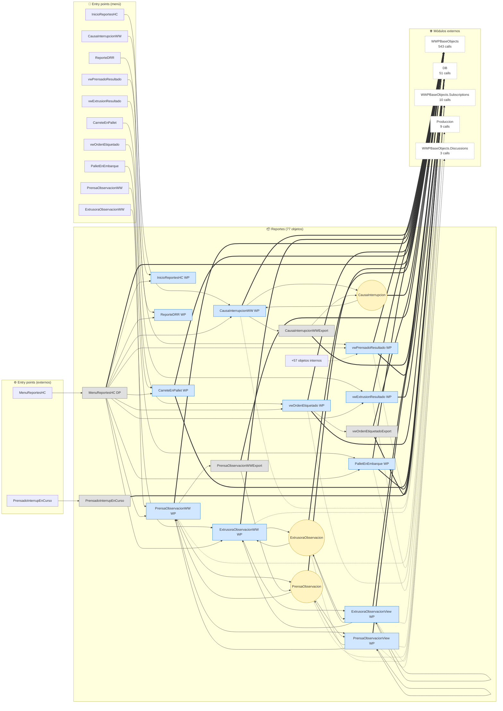

**Leyenda:**
- 🟡 círculo = Transaction (entidad de negocio)
- 🔵 caja = WebPanel (pantalla)
- ⬜ caja gris = Procedure / DataProvider / SDT
- ➡️ sólida = navegación/invocación principal
- ➡️ punteada = llamada secundaria (audit, cross-module)
- ➡️ gruesa `==>` = dependencia pesada (>30 calls al mismo peer)

---

## 📦 Procesos del módulo

### Proceso 1 -- `proc_reportes_menu_reportes_hc` (MenuReportesHC)

**85 objetos · 4 módulos tocados.**

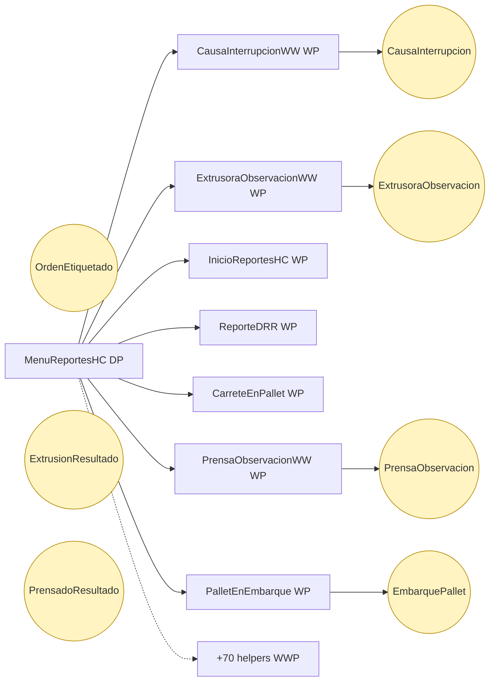

### Proceso 2 -- `proc_reportes_vw_prensado_resultado` (Prensado)

**27 objetos · 4 módulos tocados.**

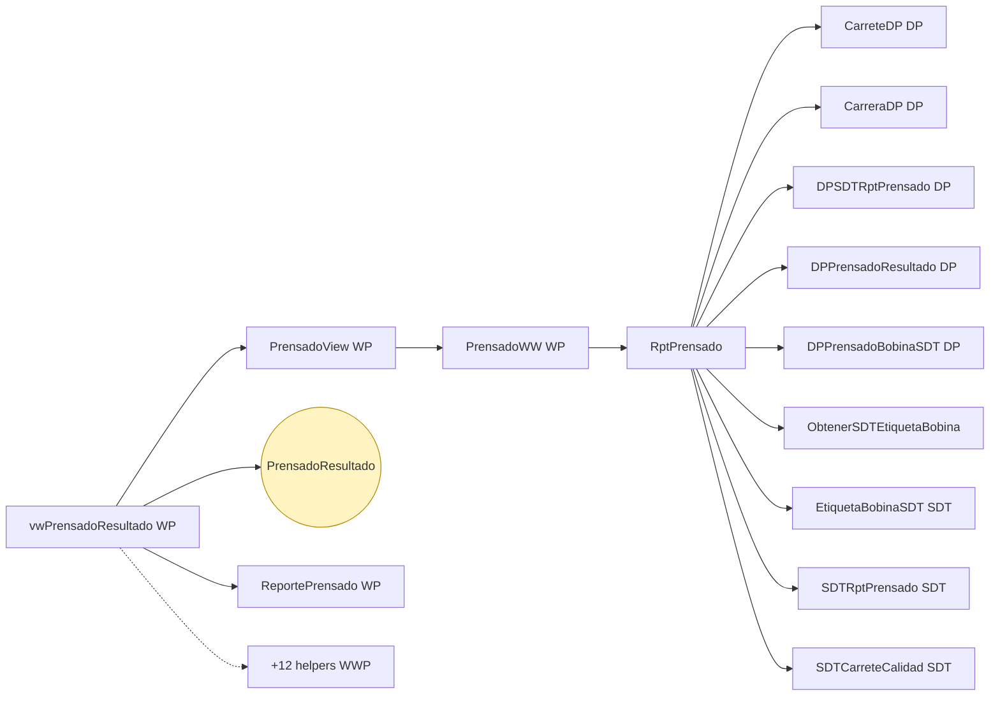

### Proceso 3 -- `proc_reportes_vw_extrusion_resultado` (Extrusión)

**19 objetos · 5 módulos tocados.**

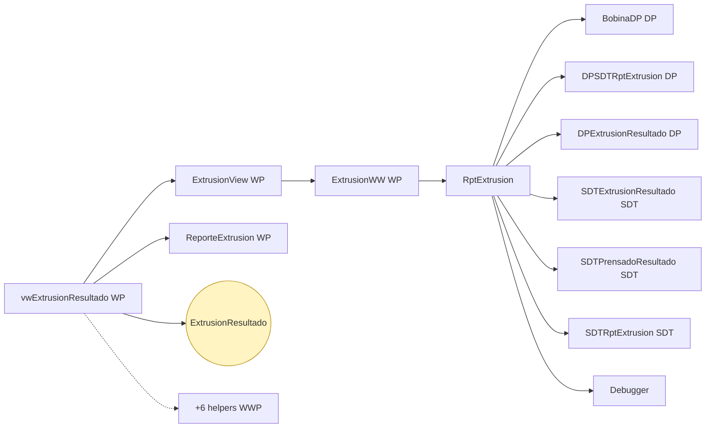

### Proceso 4 -- `proc_reportes_carrete_en_pallet` (Carrete_Pallet)

**16 objetos · 4 módulos tocados.**

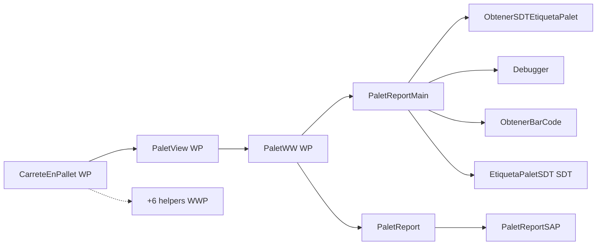

### Proceso 5 -- `proc_reportes_extrusora_observacion_ww` (Extrusoras)

**13 objetos · 2 módulos tocados.**

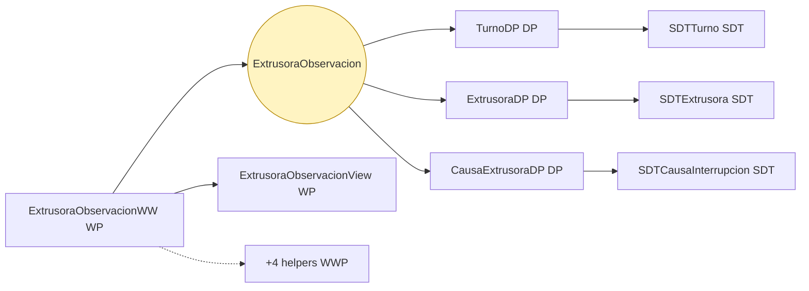

### Proceso 6 -- `proc_reportes_prensa_observacion_ww` (Prensas)

**13 objetos · 2 módulos tocados.**

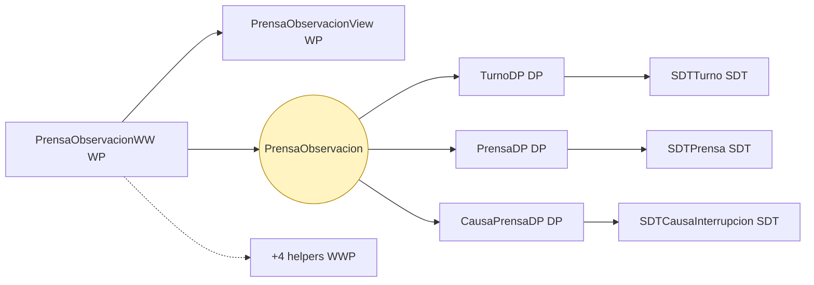

### Proceso 7 -- `proc_reportes_pallet_en_embarque` (Pallet_Embarque)

**11 objetos · 2 módulos tocados.**

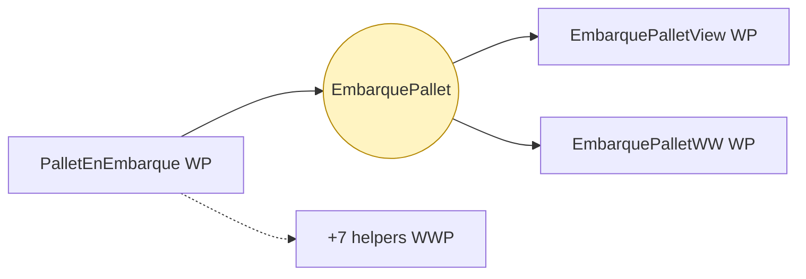

### Proceso 8 -- `proc_reportes_causa_interrupcion_ww` (Causas Interrupción)

**7 objetos · 1 módulos tocados.**

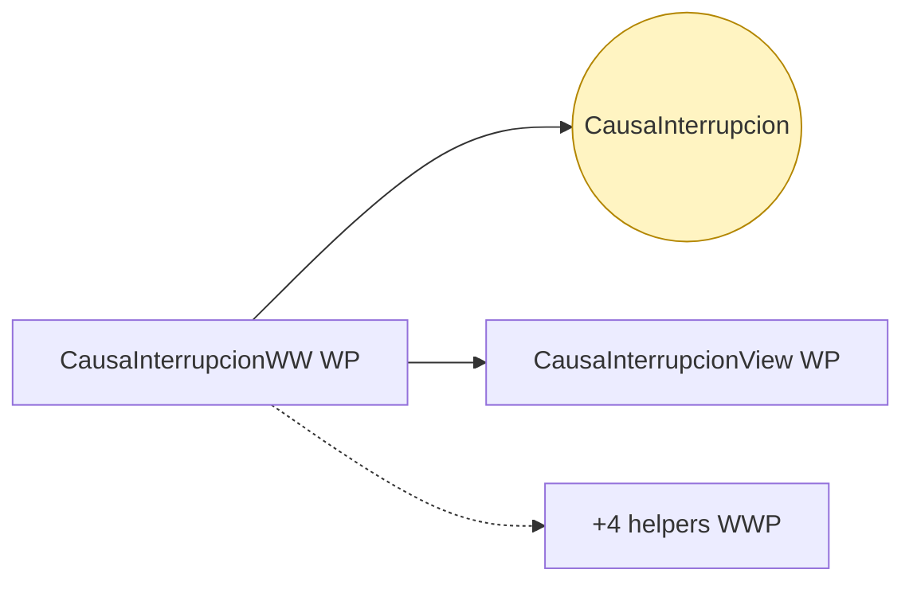

### Proceso 9 -- `proc_reportes_prensado_interrup_en_curso` (PrensadoInterrupEnCurso)

**7 objetos · 2 módulos tocados.**

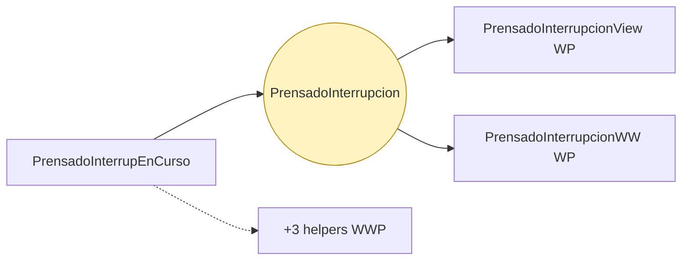

### Proceso 10 -- `proc_reportes_vw_orden_etiquetado` (Órdenes)

**6 objetos · 2 módulos tocados.**

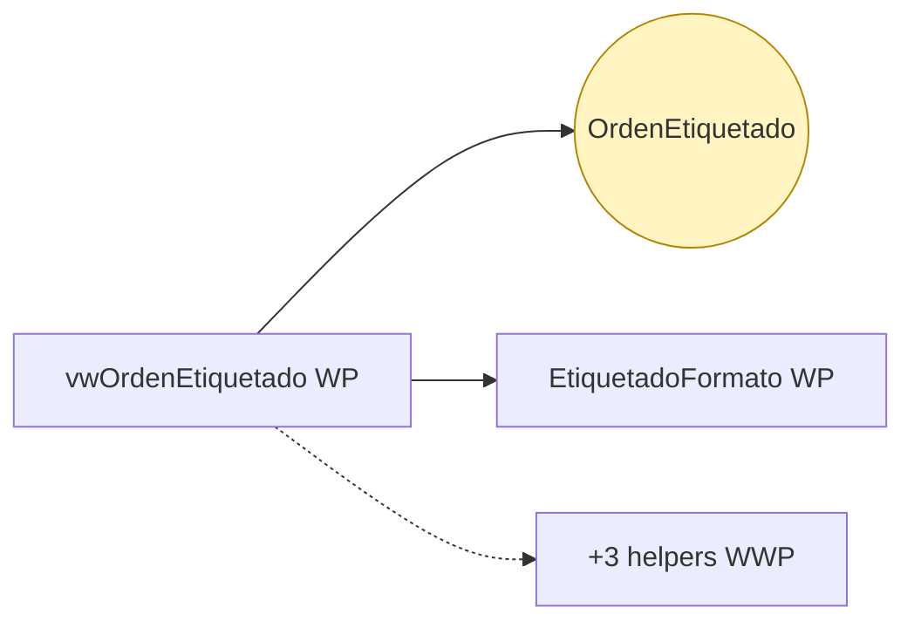

### Proceso 11 -- `proc_reportes_inicio_reportes_hc` (Inicio)

**1 objetos · 1 módulos tocados.**

### Proceso 12 -- `proc_reportes_reporte_drr` (DRR)

**1 objetos · 1 módulos tocados.**

---

## 🔗 Llamadas cross-module detalladas

### → Llama a otros módulos

| Módulo destino | Llamadas | Top 3 objetos invocados |
|---|---:|---|
| `WWPBaseObjects` | 543 | `LoadWWPContext`, `LoadGridState`, `WWPContext` |
| `DB` | 51 | `Extrusion`, `ExtrusionInterrupcion`, `OrdenEtiquetado` |
| `WWPBaseObjects.Subscriptions` | 10 | `WWP_HasSubscriptionsToDisplay` |
| `Produccion` | 9 | `JornadaLaboral`, `TurnoDP`, `ExtrusoraDP` |
| `WWPBaseObjects.Discussions` | 3 | `WWP_HasDiscussionMessages` |

### ← Lo llaman desde

| Módulo origen | Llamadas | Top 3 callers |
|---|---:|---|
| `WWPBaseObjects` | 8 | `ListWWPPrograms` |
| `Web` | 3 | `MenuByModule`, `Modules` |
| `DB` | 2 | `LoadAuditPrensado` |

---

## 🗃️ Datos tocados (extraído de la matrix)

| Entidad | Operación | Procesos del módulo que la tocan |
|---|---|---|
| `CausaInterrupcion` | **W** | `proc_reportes_menu_reportes_hc`, `proc_reportes_causa_interrupcion_ww` |
| `EmbarquePallet` | **W** | `proc_reportes_menu_reportes_hc`, `proc_reportes_pallet_en_embarque` |
| `Extrusion` | **R** | `proc_reportes_menu_reportes_hc`, `proc_reportes_vw_extrusion_resultado` |
| `ExtrusionResultado` | **W** | `proc_reportes_menu_reportes_hc`, `proc_reportes_vw_extrusion_resultado` |
| `ExtrusoraObservacion` | **W** | `proc_reportes_menu_reportes_hc`, `proc_reportes_extrusora_observacion_ww` |
| `OrdenEtiquetado` | **W** | `proc_reportes_menu_reportes_hc`, `proc_reportes_vw_orden_etiquetado` |
| `Palet` | **R** | `proc_reportes_menu_reportes_hc`, `proc_reportes_carrete_en_pallet` |
| `Prensado` | **R** | `proc_reportes_menu_reportes_hc`, `proc_reportes_vw_prensado_resultado` |
| `PrensadoInterrupcion` | **W** | `proc_reportes_prensado_interrup_en_curso` |
| `PrensadoResultado` | **W** | `proc_reportes_menu_reportes_hc`, `proc_reportes_vw_prensado_resultado` |
| `PrensaObservacion` | **W** | `proc_reportes_menu_reportes_hc`, `proc_reportes_prensa_observacion_ww` |

---

## 🧭 Lectura rápida del módulo

- **Propósito:** Módulo con 77 objetos parseados. Entidades centrales por referencias entrantes: `PrensaObservacion`, `ExtrusoraObservacion`, `CausaInterrupcion`. Entry points desde el menú: `PrensaObservacionWW`, `vwExtrusionResultado`, `vwPrensadoResultado`.
- **Patrón dominante:** WWP CRUD standard (Trn + WW/View + audit helpers + export/filter helpers generados por el pattern).
- **Valor diferencial:** cluster más grande es `proc_reportes_menu_reportes_hc` (85 objetos).
- **Acoplamiento externo:** 5 peers, 616 calls totales. Top: `WWPBaseObjects` (543), `DB` (51), `WWPBaseObjects.Subscriptions` (10).
- **Riesgo de migración:** alto — dependencia intensa de WWPBaseObjects (543 calls); requiere reimplementar el pattern WWP en el target o tolerar pérdida de audit/filter/export.

