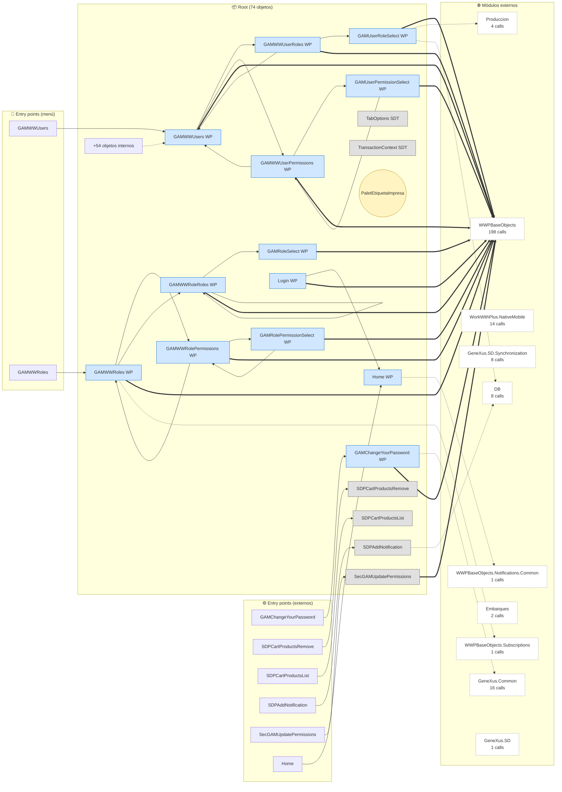
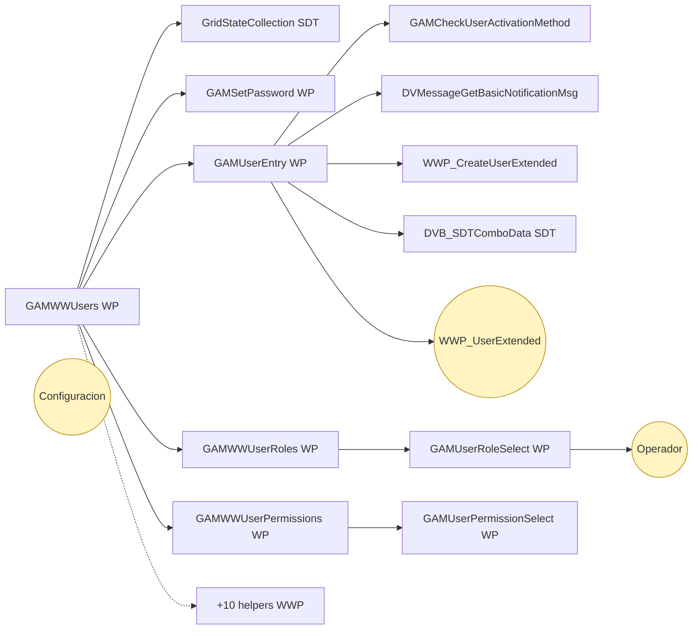
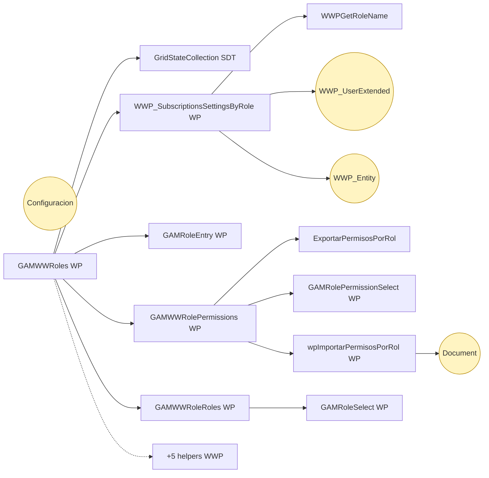
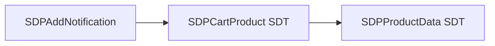
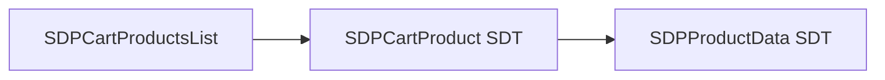
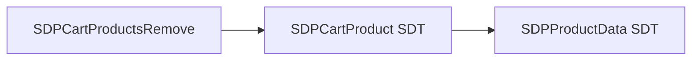
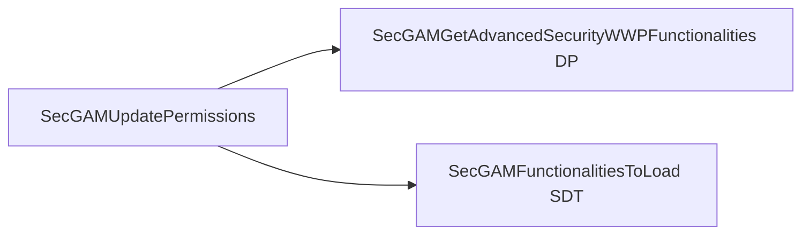
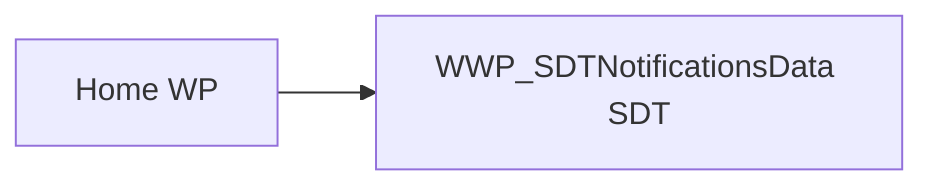
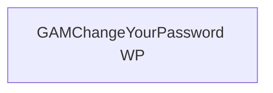

# Flujo del módulo: Root

> Generado por `Scripts/generate-module-flows.ps1` a partir de `_index.json` + `_menu.json` + `_processes.json` + `Modules/Root.md`.
> Renderización: Mermaid (VS Code Mermaid Preview, GitHub, GitLab).

---

## 📊 Resumen

| Métrica | Valor |
|---|---|
| Objetos totales | 74 |
| Transactions | 1 (PaletEtiquetaImpresa) |
| WebPanels | 27 |
| Procedures | 32 |
| DataProviders | 4 |
| SDTs | 10 |
| Módulos que LLAMA | 10 (253 calls) |
| Módulos que LO LLAMAN | 4 (44 calls) |
| Procesos canónicos | 8 |

---

## 🚪 Entry points

| Entry | Tipo | Ruta / quién invoca |
|---|---|---|
| `GAMChangeYourPassword` | externo | WWPBaseObjects.MenuOptionsData |
| `Home` | externo | WWPBaseObjects.MenuOptionsData |
| `SDPAddNotification` | externo | Produccion.MedirBobinas, Produccion.SDTerminarCarreraDB |
| `SDPCartProductsList` | externo | Produccion.SDEliminarNotificacion, Produccion.SDLimpiarNotificaciones |
| `SDPCartProductsRemove` | externo | Produccion.SDEliminarNotificacion, Produccion.SDLimpiarNotificaciones |
| `SecGAMUpdatePermissions` | externo | WWPBaseObjects.WWP_ImpactMetadata |
| `GAMWWRoles` | menú | Web > Seguridad > Roles |
| `GAMWWUsers` | menú | Web > Seguridad > Usuarios |

---

## 🔀 Diagrama general del módulo

**Leyenda:**
- 🟡 círculo = Transaction (entidad de negocio)
- 🔵 caja = WebPanel (pantalla)
- ⬜ caja gris = Procedure / DataProvider / SDT
- ➡️ sólida = navegación/invocación principal
- ➡️ punteada = llamada secundaria (audit, cross-module)
- ➡️ gruesa `==>` = dependencia pesada (>30 calls al mismo peer)

---

## 📦 Procesos del módulo

### Proceso 1 -- `proc_root_gamwwusers` (Usuarios)

**25 objetos · 4 módulos tocados.**

### Proceso 2 -- `proc_root_gamwwroles` (Roles)

**20 objetos · 5 módulos tocados.**

### Proceso 3 -- `proc_root_sdpadd_notification` (SDPAddNotification)

**3 objetos · 2 módulos tocados.**

### Proceso 4 -- `proc_root_sdpcart_products_list` (SDPCartProductsList)

**3 objetos · 2 módulos tocados.**

### Proceso 5 -- `proc_root_sdpcart_products_remove` (SDPCartProductsRemove)

**3 objetos · 2 módulos tocados.**

### Proceso 6 -- `proc_root_sec_gamupdate_permissions` (SecGAMUpdatePermissions)

**3 objetos · 2 módulos tocados.**

### Proceso 7 -- `proc_root_home` (Home)

**2 objetos · 2 módulos tocados.**

### Proceso 8 -- `proc_root_gamchange_your_password` (GAMChangeYourPassword)

**1 objetos · 1 módulos tocados.**

---

## 🔗 Llamadas cross-module detalladas

### → Llama a otros módulos

| Módulo destino | Llamadas | Top 3 objetos invocados |
|---|---:|---|
| `WWPBaseObjects` | 198 | `LoadWWPContext`, `SaveGridState`, `WWPContext` |
| `GeneXus.Common` | 16 | `Messages`, `Route`, `DirectionsRequestParameters` |
| `WorkWithPlus.NativeMobile` | 14 | `SDPMenuOptions`, `SDPWebServerSessionSet`, `SDPWebServerSessionGet` |
| `GeneXus.SD.Synchronization` | 8 | `SynchronizationEventResultList`, `SynchronizationInfo`, `SynchronizationEventList` |
| `DB` | 8 | `PaletCarrete`, `Palet`, `Bobina` |
| `Produccion` | 4 | `ObtenerConfiguracion` |
| `Embarques` | 2 | `NotificarImpresion` |
| `WWPBaseObjects.Notifications.Common` | 1 | `WWP_SDTNotificationsData` |
| `WWPBaseObjects.Subscriptions` | 1 | `WWP_SubscriptionsSettingsByRole` |
| `GeneXus.SD` | 1 | `CardInformation` |

### ← Lo llaman desde

| Módulo origen | Llamadas | Top 3 callers |
|---|---:|---|
| `DB` | 23 | `WWProductoCategoria`, `ViewInventario`, `ViewProductoCategoria` |
| `Produccion` | 10 | `SDEliminarNotificacion`, `SDLimpiarNotificaciones`, `WWPrensa` |
| `WWPBaseObjects` | 9 | `MenuOptionsData`, `ListWWPPrograms`, `WWP_ImpactMetadata` |
| `Web` | 2 | `MenuSeguridad` |

---

## 🗃️ Datos tocados (extraído de la matrix)

| Entidad | Operación | Procesos del módulo que la tocan |
|---|---|---|
| `Bobina` | **R** | `proc_root_sdpadd_notification` |
| `Carrera` | **R** | `proc_root_sdpadd_notification` |
| `Configuracion` | **W** | `proc_root_gamwwusers`, `proc_root_gamwwroles` |
| `Document` | **W** | `proc_root_gamwwroles` |
| `Operador` | **W** | `proc_root_gamwwusers` |
| `WWP_Entity` | **W** | `proc_root_gamwwroles` |
| `WWP_UserExtended` | **W** | `proc_root_gamwwusers`, `proc_root_gamwwroles` |

---

## 🧭 Lectura rápida del módulo

- **Propósito:** Módulo con 74 objetos parseados. Entidades centrales por referencias entrantes: `PaletEtiquetaImpresa`. Entry points desde el menú: `GAMWWUsers`, `GAMWWRoles`.
- **Patrón dominante:** WWP CRUD standard (Trn + WW/View + audit helpers + export/filter helpers generados por el pattern).
- **Valor diferencial:** cluster más grande es `proc_root_gamwwusers` (25 objetos) — ruta `Web > Seguridad > Usuarios`.
- **Acoplamiento externo:** 10 peers, 253 calls totales. Top: `WWPBaseObjects` (198), `GeneXus.Common` (16), `WorkWithPlus.NativeMobile` (14).
- **Riesgo de migración:** alto — dependencia intensa de WWPBaseObjects (198 calls); requiere reimplementar el pattern WWP en el target o tolerar pérdida de audit/filter/export.

