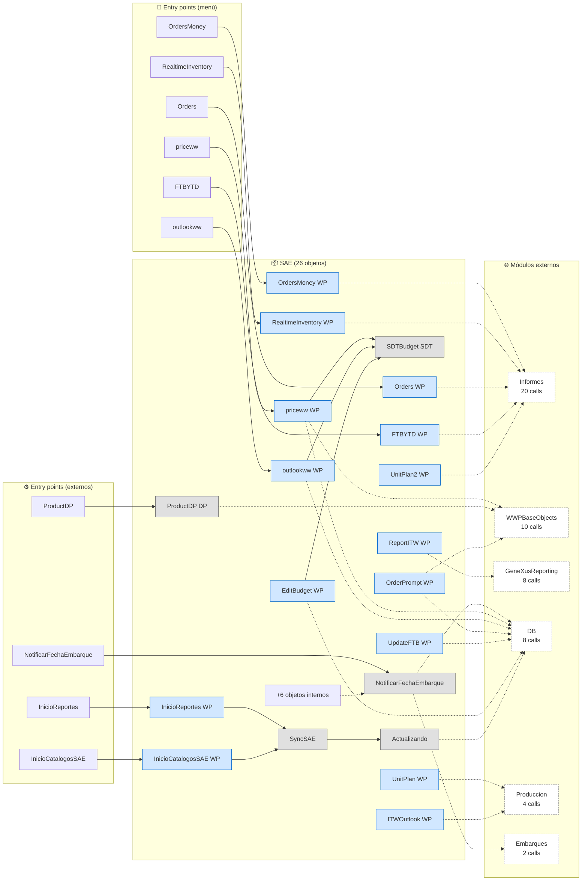
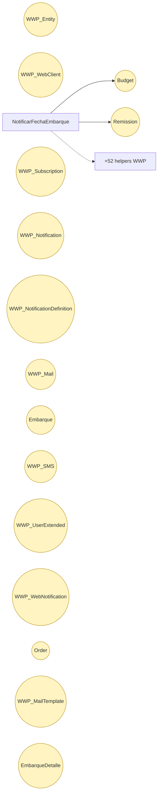
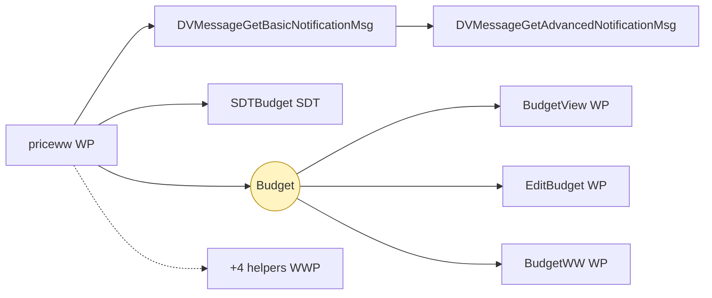
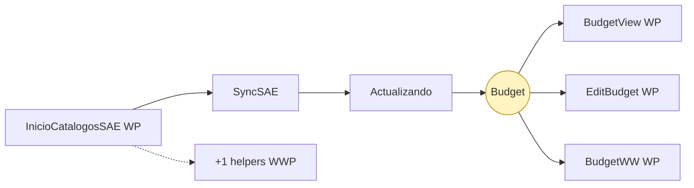
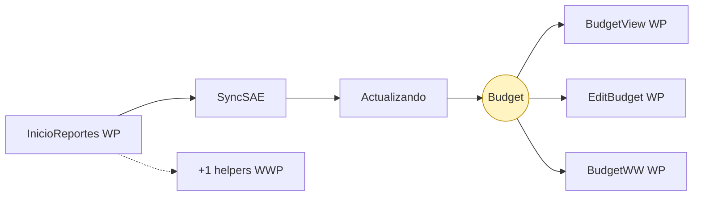
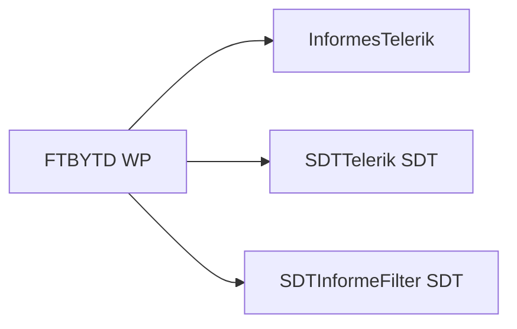
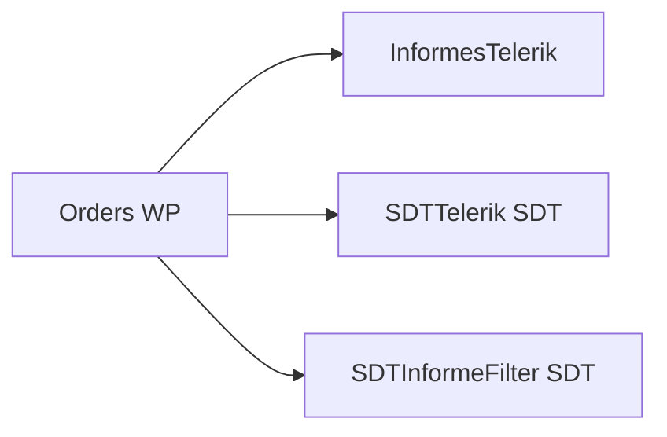
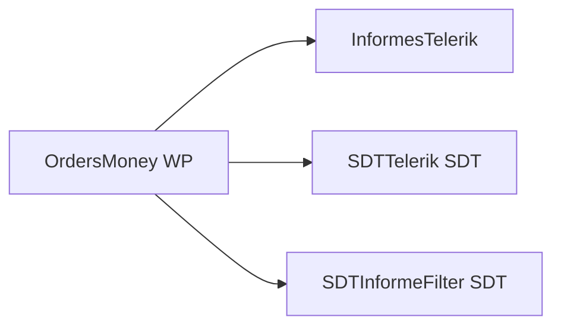
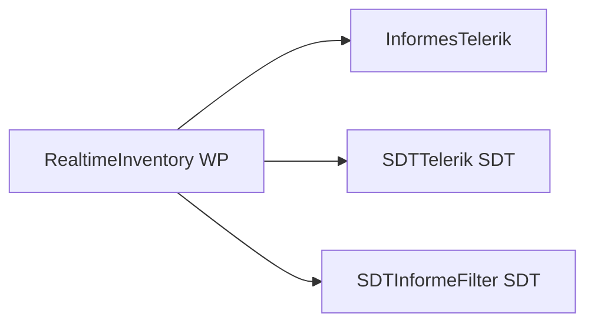
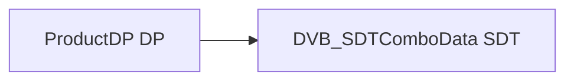

# Flujo del módulo: SAE

> Generado por `Scripts/generate-module-flows.ps1` a partir de `_index.json` + `_menu.json` + `_processes.json` + `Modules/SAE.md`.
> Renderización: Mermaid (VS Code Mermaid Preview, GitHub, GitLab).

---

## 📊 Resumen

| Métrica | Valor |
|---|---|
| Objetos totales | 26 |
| Transactions | 0 |
| WebPanels | 17 |
| Procedures | 6 |
| DataProviders | 1 |
| SDTs | 2 |
| Módulos que LLAMA | 6 (52 calls) |
| Módulos que LO LLAMAN | 4 (15 calls) |
| Procesos canónicos | 9 |

---

## 🚪 Entry points

| Entry | Tipo | Ruta / quién invoca |
|---|---|---|
| `InicioCatalogosSAE` | externo | Web.Modules |
| `InicioReportes` | externo | Web.Modules |
| `NotificarFechaEmbarque` | externo | Embarques.InicioEmbarques |
| `ProductDP` | externo | Produccion.gestionarProducto |
| `FTBYTD` | menú | Web > Reportes > FTB YTD |
| `Orders` | menú | Web > Reportes > Report Orders |
| `OrdersMoney` | menú | Web > Reportes > Report Orders Price |
| `outlookww` | menú | Web > Reportes > Outlook |
| `priceww` | menú | Web > Reportes > Price |
| `RealtimeInventory` | menú | Web > Reportes > Realtime Inventory |

---

## 🔀 Diagrama general del módulo

**Leyenda:**
- 🟡 círculo = Transaction (entidad de negocio)
- 🔵 caja = WebPanel (pantalla)
- ⬜ caja gris = Procedure / DataProvider / SDT
- ➡️ sólida = navegación/invocación principal
- ➡️ punteada = llamada secundaria (audit, cross-module)
- ➡️ gruesa `==>` = dependencia pesada (>30 calls al mismo peer)

---

## 📦 Procesos del módulo

### Proceso 1 -- `proc_sae_notificar_fecha_embarque` (NotificarFechaEmbarque)

**68 objetos · 10 módulos tocados.**

### Proceso 2 -- `proc_sae_priceww` (Price)

**12 objetos · 3 módulos tocados.**

### Proceso 3 -- `proc_sae_inicio_catalogos_sae` (InicioCatalogosSAE)

**8 objetos · 2 módulos tocados.**

### Proceso 4 -- `proc_sae_inicio_reportes` (InicioReportes)

**8 objetos · 2 módulos tocados.**

### Proceso 5 -- `proc_sae_ftbytd` (FTB YTD)

**4 objetos · 2 módulos tocados.**

### Proceso 6 -- `proc_sae_orders` (Report Orders)

**4 objetos · 2 módulos tocados.**

### Proceso 7 -- `proc_sae_orders_money` (Report Orders Price)

**4 objetos · 2 módulos tocados.**

### Proceso 8 -- `proc_sae_realtime_inventory` (Realtime Inventory)

**4 objetos · 2 módulos tocados.**

### Proceso 9 -- `proc_sae_product_dp` (ProductDP)

**2 objetos · 2 módulos tocados.**

---

## 🔗 Llamadas cross-module detalladas

### → Llama a otros módulos

| Módulo destino | Llamadas | Top 3 objetos invocados |
|---|---:|---|
| `Informes` | 20 | `InformesTelerik`, `SDTTelerik`, `SDTInformeFilter` |
| `WWPBaseObjects` | 10 | `LoadWWPContext`, `DVB_SDTDropDownOptionsTitleSettingsIcons`, `DVB_SDTDropDownOptionsData` |
| `GeneXusReporting` | 8 | `QueryViewerParameters`, `QueryViewerDragAndDropData`, `QueryViewerElements` |
| `DB` | 8 | `Budget`, `Order`, `Remission` |
| `Produccion` | 4 | `ObtenerConfiguracion` |
| `Embarques` | 2 | `InicializarEmbarque` |

### ← Lo llaman desde

| Módulo origen | Llamadas | Top 3 callers |
|---|---:|---|
| `Web` | 8 | `MenuModuleInformesSAE`, `MenuModuleCatalogosSAE`, `Modules` |
| `DB` | 4 | `Budget`, `FTB` |
| `Embarques` | 2 | `InicioEmbarques` |
| `Produccion` | 1 | `gestionarProducto` |

---

## 🗃️ Datos tocados (extraído de la matrix)

| Entidad | Operación | Procesos del módulo que la tocan |
|---|---|---|
| `Budget` | **W** | `proc_sae_notificar_fecha_embarque`, `proc_sae_inicio_catalogos_sae`, `proc_sae_inicio_reportes` _(+1)_ |
| `Embarque` | **W** | `proc_sae_notificar_fecha_embarque` |
| `EmbarqueDetalle` | **W** | `proc_sae_notificar_fecha_embarque` |
| `Order` | **W** | `proc_sae_notificar_fecha_embarque` |
| `Remission` | **W** | `proc_sae_notificar_fecha_embarque` |
| `WWP_Entity` | **W** | `proc_sae_notificar_fecha_embarque` |
| `WWP_Mail` | **W** | `proc_sae_notificar_fecha_embarque` |
| `WWP_MailTemplate` | **W** | `proc_sae_notificar_fecha_embarque` |
| `WWP_Notification` | **W** | `proc_sae_notificar_fecha_embarque` |
| `WWP_NotificationDefinition` | **W** | `proc_sae_notificar_fecha_embarque` |
| `WWP_SMS` | **W** | `proc_sae_notificar_fecha_embarque` |
| `WWP_Subscription` | **W** | `proc_sae_notificar_fecha_embarque` |
| `WWP_UserExtended` | **W** | `proc_sae_notificar_fecha_embarque` |
| `WWP_WebClient` | **W** | `proc_sae_notificar_fecha_embarque` |
| `WWP_WebNotification` | **W** | `proc_sae_notificar_fecha_embarque` |

---

## 🧭 Lectura rápida del módulo

- **Propósito:** Módulo con 26 objetos parseados. Entry points desde el menú: `Orders`, `FTBYTD`, `RealtimeInventory`.
- **Patrón dominante:** módulo funcional / dashboard sin entidades propias; consume Trns de `DB`.
- **Valor diferencial:** cluster más grande es `proc_sae_notificar_fecha_embarque` (68 objetos).
- **Acoplamiento externo:** 6 peers, 52 calls totales. Top: `Informes` (20), `WWPBaseObjects` (10), `GeneXusReporting` (8).
- **Riesgo de migración:** medio — revisar las aristas cross-module individualmente en Phase 3.3.

