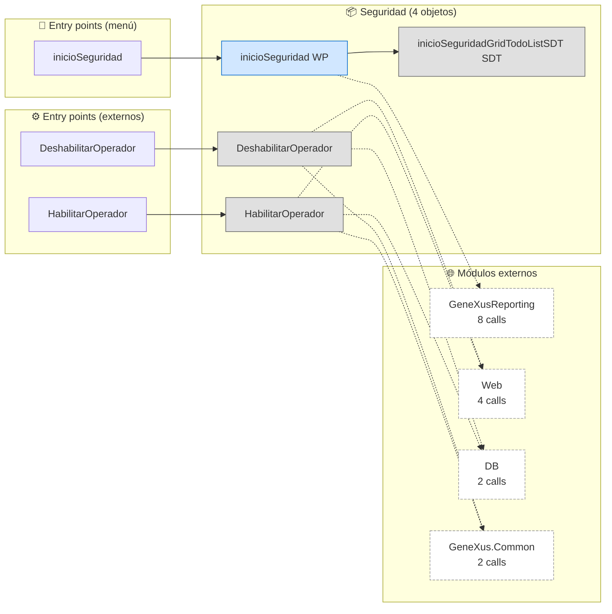
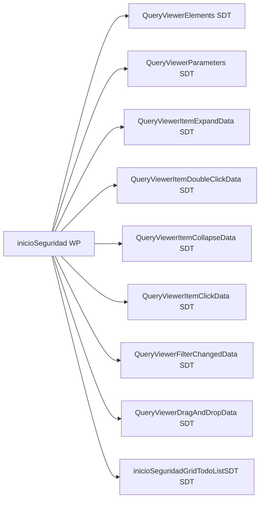
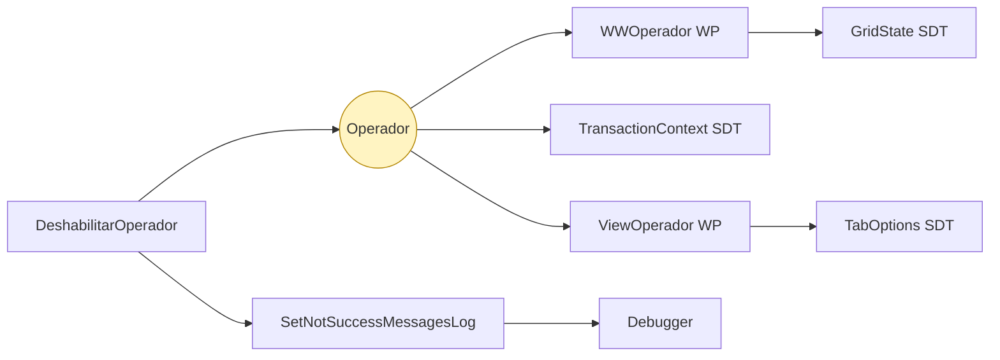
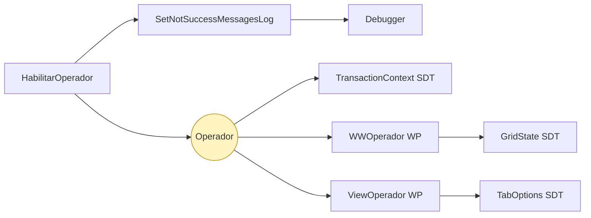

# Flujo del módulo: Seguridad

> Generado por `Scripts/generate-module-flows.ps1` a partir de `_index.json` + `_menu.json` + `_processes.json` + `Modules/Seguridad.md`.
> Renderización: Mermaid (VS Code Mermaid Preview, GitHub, GitLab).

---

## 📊 Resumen

| Métrica | Valor |
|---|---|
| Objetos totales | 4 |
| Transactions | 0 |
| WebPanels | 1 |
| Procedures | 2 |
| DataProviders | 0 |
| SDTs | 1 |
| Módulos que LLAMA | 4 (16 calls) |
| Módulos que LO LLAMAN | 2 (5 calls) |
| Procesos canónicos | 3 |

---

## 🚪 Entry points

| Entry | Tipo | Ruta / quién invoca |
|---|---|---|
| `DeshabilitarOperador` | externo | Produccion.gestionarOperador |
| `HabilitarOperador` | externo | Produccion.listarOperador |
| `inicioSeguridad` | menú | Web > Seguridad > Inicio |

---

## 🔀 Diagrama general del módulo

**Leyenda:**
- 🟡 círculo = Transaction (entidad de negocio)
- 🔵 caja = WebPanel (pantalla)
- ⬜ caja gris = Procedure / DataProvider / SDT
- ➡️ sólida = navegación/invocación principal
- ➡️ punteada = llamada secundaria (audit, cross-module)
- ➡️ gruesa `==>` = dependencia pesada (>30 calls al mismo peer)

---

## 📦 Procesos del módulo

### Proceso 1 -- `proc_seguridad_inicio_seguridad` (Inicio)

**10 objetos · 2 módulos tocados.**

### Proceso 2 -- `proc_seguridad_deshabilitar_operador` (DeshabilitarOperador)

**9 objetos · 5 módulos tocados.**

### Proceso 3 -- `proc_seguridad_habilitar_operador` (HabilitarOperador)

**9 objetos · 5 módulos tocados.**

---

## 🔗 Llamadas cross-module detalladas

### → Llama a otros módulos

| Módulo destino | Llamadas | Top 3 objetos invocados |
|---|---:|---|
| `GeneXusReporting` | 8 | `QueryViewerParameters`, `QueryViewerDragAndDropData`, `QueryViewerElements` |
| `Web` | 4 | `SetNotSuccessMessagesLog` |
| `DB` | 2 | `Operador` |
| `GeneXus.Common` | 2 | `Messages` |

### ← Lo llaman desde

| Módulo origen | Llamadas | Top 3 callers |
|---|---:|---|
| `Produccion` | 3 | `gestionarOperador`, `listarOperador` |
| `Web` | 2 | `MenuSeguridad`, `Modules` |

---

## 🗃️ Datos tocados (extraído de la matrix)

| Entidad | Operación | Procesos del módulo que la tocan |
|---|---|---|
| `Operador` | **W** | `proc_seguridad_deshabilitar_operador`, `proc_seguridad_habilitar_operador` |

---

## 🧭 Lectura rápida del módulo

- **Propósito:** Módulo con 4 objetos parseados. Entry points desde el menú: `inicioSeguridad`.
- **Patrón dominante:** módulo funcional / dashboard sin entidades propias; consume Trns de `DB`.
- **Valor diferencial:** cluster más grande es `proc_seguridad_inicio_seguridad` (10 objetos) — ruta `Web > Seguridad > Inicio`.
- **Acoplamiento externo:** 4 peers, 16 calls totales. Top: `GeneXusReporting` (8), `Web` (4), `DB` (2).
- **Riesgo de migración:** medio — revisar las aristas cross-module individualmente en Phase 3.3.

