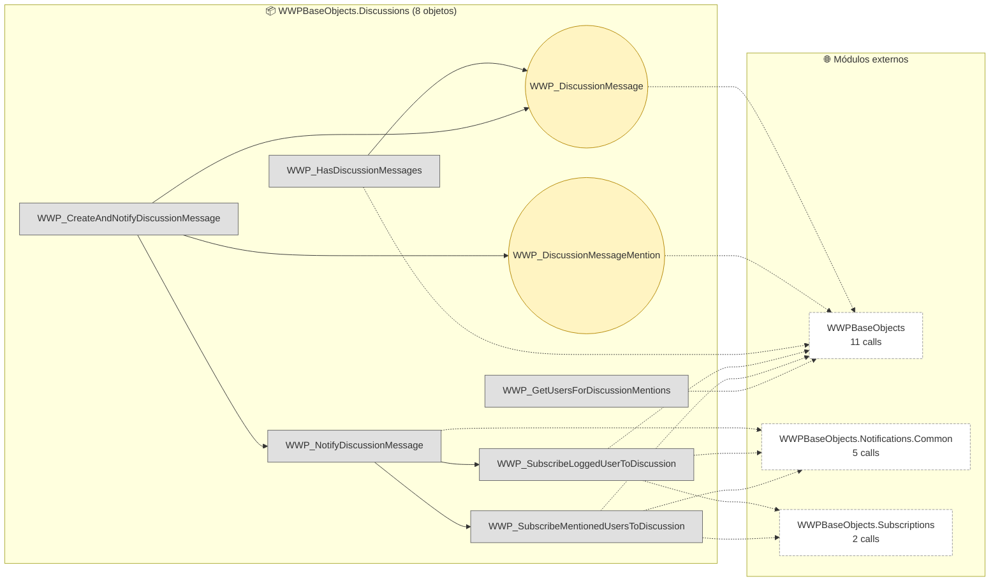

# Flujo del módulo: WWPBaseObjects.Discussions

> Generado por `Scripts/generate-module-flows.ps1` a partir de `_index.json` + `_menu.json` + `_processes.json` + `Modules/WWPBaseObjects.Discussions.md`.
> Renderización: Mermaid (VS Code Mermaid Preview, GitHub, GitLab).

---

## 📊 Resumen

| Métrica | Valor |
|---|---|
| Objetos totales | 8 |
| Transactions | 2 (WWP_DiscussionMessageMention, WWP_DiscussionMessage) |
| WebPanels | 0 |
| Procedures | 6 |
| DataProviders | 0 |
| SDTs | 0 |
| Módulos que LLAMA | 3 (18 calls) |
| Módulos que LO LLAMAN | 6 (28 calls) |
| Procesos canónicos | 0 |

---

## 🚪 Entry points

_Módulo no navegable directamente desde el menú y sin caller cross-module identificado._

---

## 🔀 Diagrama general del módulo

**Leyenda:**
- 🟡 círculo = Transaction (entidad de negocio)
- 🔵 caja = WebPanel (pantalla)
- ⬜ caja gris = Procedure / DataProvider / SDT
- ➡️ sólida = navegación/invocación principal
- ➡️ punteada = llamada secundaria (audit, cross-module)
- ➡️ gruesa `==>` = dependencia pesada (>30 calls al mismo peer)

---

## 📦 Procesos del módulo

_Este módulo no tiene procesos canónicos cuyo entry-point le pertenezca. Sus objetos son invocados desde procesos de otros módulos (ver sección cross-module)._

---

## 🔗 Llamadas cross-module detalladas

### → Llama a otros módulos

| Módulo destino | Llamadas | Top 3 objetos invocados |
|---|---:|---|
| `WWPBaseObjects` | 11 | `WWP_GetEntityByName`, `WWP_GetUserFullName`, `WWP_Logger` |
| `WWPBaseObjects.Notifications.Common` | 5 | `WWP_NotificationDefinition`, `WWP_SendMentionNotification`, `WWP_SDTNotificationMetadata` |
| `WWPBaseObjects.Subscriptions` | 2 | `WWP_Subscription` |

### ← Lo llaman desde

| Módulo origen | Llamadas | Top 3 callers |
|---|---:|---|
| `DB` | 20 | `ExtrusoraMezcladoraView`, `TroquelView`, `BudgetView` |
| `Reportes` | 3 | `ExtrusoraObservacionView`, `PrensaObservacionView`, `CausaInterrupcionView` |
| `Calidad` | 2 | `reclamoview`, `CarreteDefectoView` |
| `Downtime` | 1 | `DownTimeCodeView` |
| `WWPBaseObjects` | 1 | `AuditView` |
| `WWPBaseObjects.Mail` | 1 | `WWP_MailTemplateView` |

---

## 🗃️ Datos tocados (extraído de la matrix)

_(ningún proceso de este módulo toca entidades en la matrix)_

---

## 🧭 Lectura rápida del módulo

- **Propósito:** Top entidades con descripción sustantiva en el KB: "Discussion Message" (`WWP_DiscussionMessage`); "Discussion Message Mention" (`WWP_DiscussionMessageMention`).
- **Patrón dominante:** módulo mixto.
- **Valor diferencial:** ninguno — el módulo no ancla procesos propios, se mueve por invocación externa.
- **Acoplamiento externo:** 3 peers, 18 calls totales. Top: `WWPBaseObjects` (11), `WWPBaseObjects.Notifications.Common` (5), `WWPBaseObjects.Subscriptions` (2).
- **Riesgo de migración:** medio — revisar las aristas cross-module individualmente en Phase 3.3.

