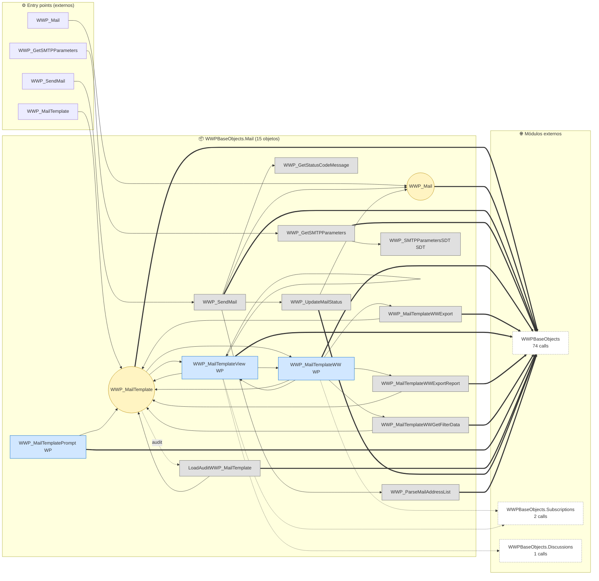
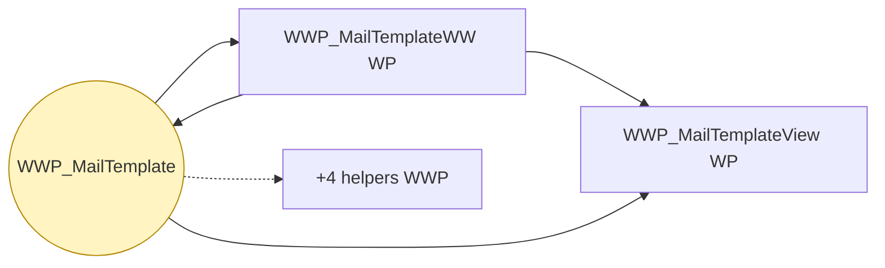
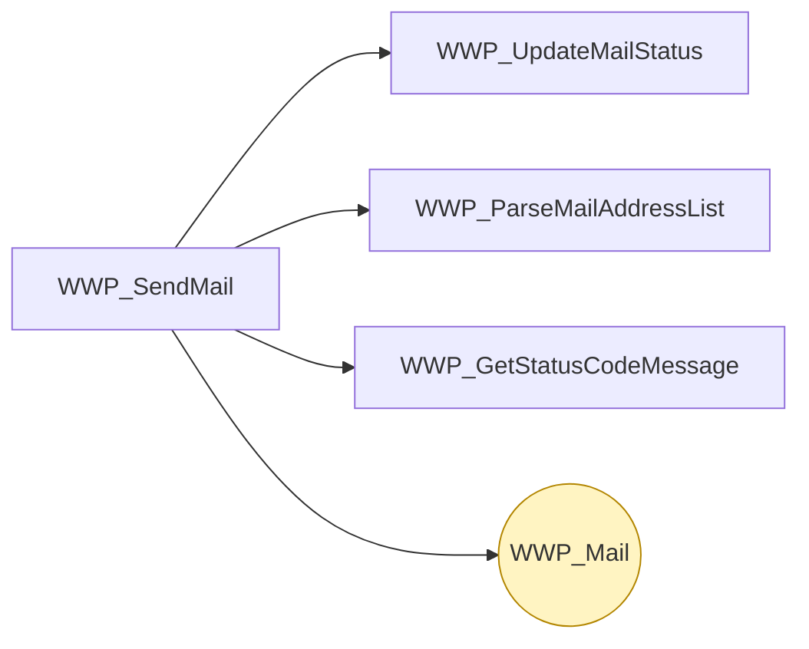
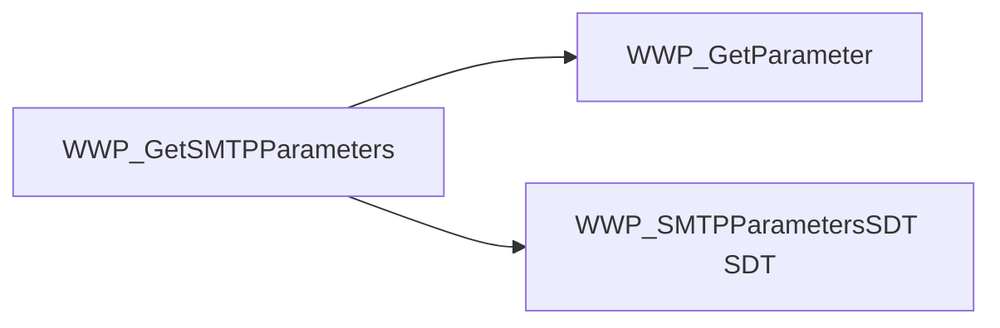
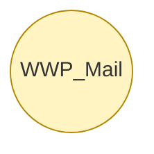

# Flujo del módulo: WWPBaseObjects.Mail

> Generado por `Scripts/generate-module-flows.ps1` a partir de `_index.json` + `_menu.json` + `_processes.json` + `Modules/WWPBaseObjects.Mail.md`.
> Renderización: Mermaid (VS Code Mermaid Preview, GitHub, GitLab).

---

## 📊 Resumen

| Métrica | Valor |
|---|---|
| Objetos totales | 15 |
| Transactions | 2 (WWP_MailTemplate, WWP_Mail) |
| WebPanels | 3 |
| Procedures | 9 |
| DataProviders | 0 |
| SDTs | 1 |
| Módulos que LLAMA | 3 (77 calls) |
| Módulos que LO LLAMAN | 3 (14 calls) |
| Procesos canónicos | 4 |

---

## 🚪 Entry points

| Entry | Tipo | Ruta / quién invoca |
|---|---|---|
| `WWP_GetSMTPParameters` | externo | WWPBaseObjects.Notifications.Common.WWP_SendPendingNotifications |
| `WWP_Mail` | externo | Embarques.NotificarImpresion, Embarques.NotificarSupervisor |
| `WWP_MailTemplate` | externo | Embarques.NotificarImpresion, Embarques.NotificarSupervisor |
| `WWP_SendMail` | externo | Embarques.NotificarImpresion, Embarques.NotificarSupervisor |

---

## 🔀 Diagrama general del módulo

**Leyenda:**
- 🟡 círculo = Transaction (entidad de negocio)
- 🔵 caja = WebPanel (pantalla)
- ⬜ caja gris = Procedure / DataProvider / SDT
- ➡️ sólida = navegación/invocación principal
- ➡️ punteada = llamada secundaria (audit, cross-module)
- ➡️ gruesa `==>` = dependencia pesada (>30 calls al mismo peer)

---

## 📦 Procesos del módulo

### Proceso 1 -- `proc_wwpbase_objects_mail_wwp_mail_template` (WWP_MailTemplate)

**7 objetos · 1 módulos tocados.**

### Proceso 2 -- `proc_wwpbase_objects_mail_wwp_send_mail` (WWP_SendMail)

**5 objetos · 1 módulos tocados.**

### Proceso 3 -- `proc_wwpbase_objects_mail_wwp_get_smtpparameters` (WWP_GetSMTPParameters)

**3 objetos · 2 módulos tocados.**

### Proceso 4 -- `proc_wwpbase_objects_mail_wwp_mail` (WWP_Mail)

**1 objetos · 1 módulos tocados.**

---

## 🔗 Llamadas cross-module detalladas

### → Llama a otros módulos

| Módulo destino | Llamadas | Top 3 objetos invocados |
|---|---:|---|
| `WWPBaseObjects` | 74 | `LoadWWPContext`, `WWPContext`, `LoadGridState` |
| `WWPBaseObjects.Subscriptions` | 2 | `WWP_HasSubscriptionsToDisplay` |
| `WWPBaseObjects.Discussions` | 1 | `WWP_HasDiscussionMessages` |

### ← Lo llaman desde

| Módulo origen | Llamadas | Top 3 callers |
|---|---:|---|
| `WWPBaseObjects.Notifications.Common` | 7 | `WWP_SendPendingNotifications`, `WWP_CreateNotificationToUser`, `WWP_UpdateNotificationDefinitions` |
| `Embarques` | 6 | `NotificarSupervisor`, `NotificarImpresion` |
| `WWPBaseObjects` | 1 | `ListWWPPrograms` |

---

## 🗃️ Datos tocados (extraído de la matrix)

| Entidad | Operación | Procesos del módulo que la tocan |
|---|---|---|
| `WWP_Mail` | **CW** | `proc_wwpbase_objects_mail_wwp_mail`, `proc_wwpbase_objects_mail_wwp_send_mail` |
| `WWP_MailTemplate` | **C** | `proc_wwpbase_objects_mail_wwp_mail_template` |

---

## 🧭 Lectura rápida del módulo

- **Propósito:** Top entidades con descripción sustantiva en el KB: "Mail Template" (`WWP_MailTemplate`); "Mail" (`WWP_Mail`).
- **Patrón dominante:** WWP CRUD standard (Trn + WW/View + audit helpers + export/filter helpers generados por el pattern).
- **Valor diferencial:** cluster más grande es `proc_wwpbase_objects_mail_wwp_mail_template` (7 objetos).
- **Acoplamiento externo:** 3 peers, 77 calls totales. Top: `WWPBaseObjects` (74), `WWPBaseObjects.Subscriptions` (2), `WWPBaseObjects.Discussions` (1).
- **Riesgo de migración:** alto — dependencia intensa de WWPBaseObjects (74 calls); requiere reimplementar el pattern WWP en el target o tolerar pérdida de audit/filter/export.

