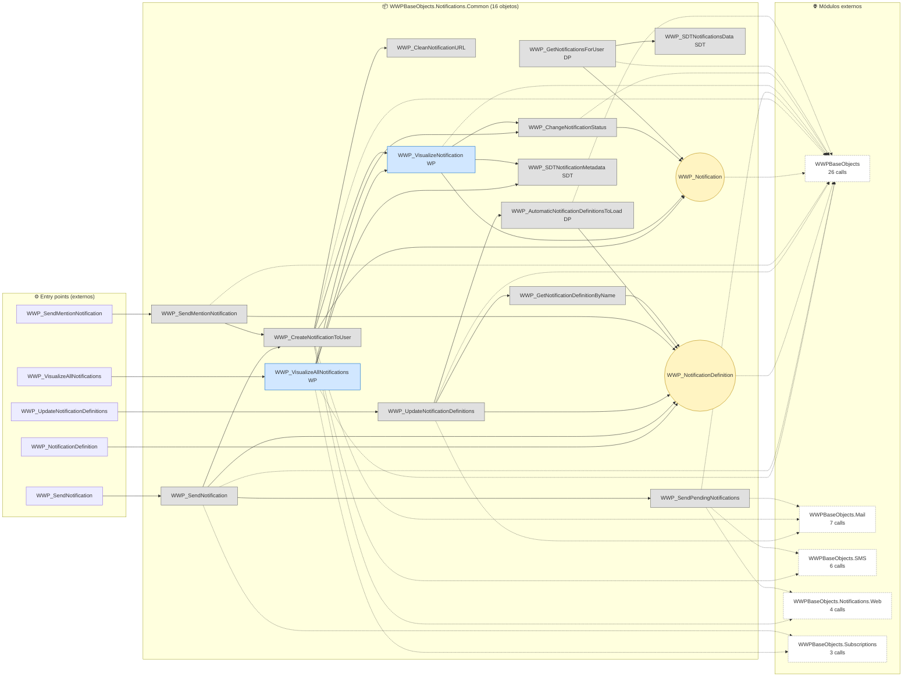
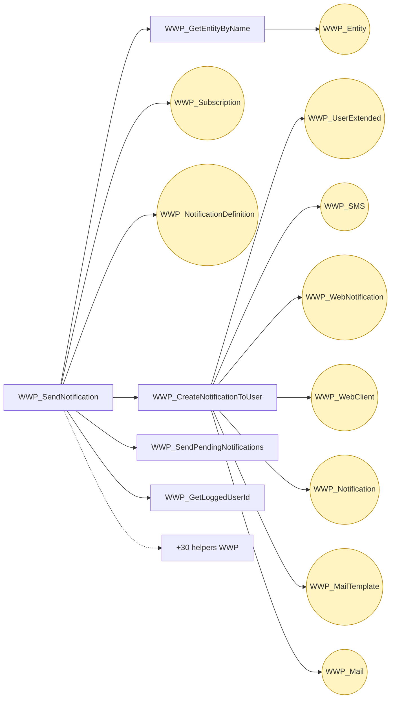
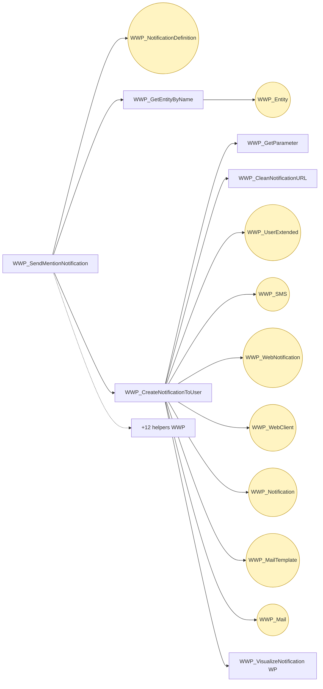
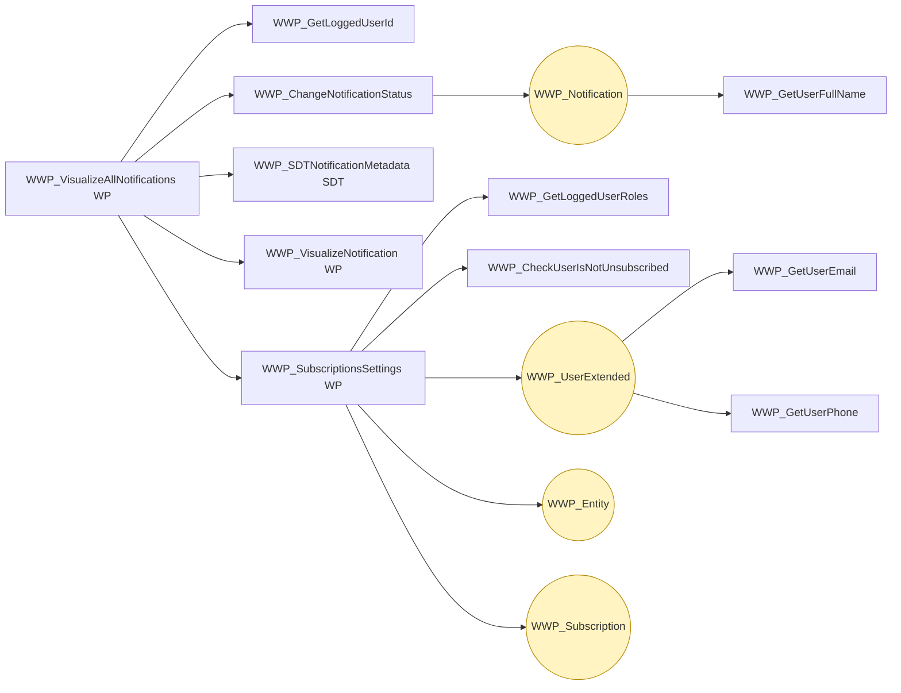
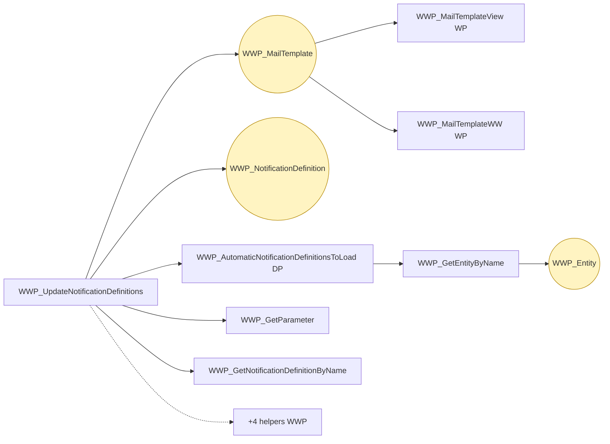
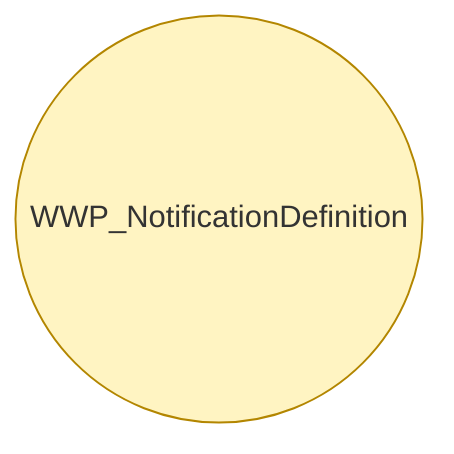

# Flujo del módulo: WWPBaseObjects.Notifications.Common

> Generado por `Scripts/generate-module-flows.ps1` a partir de `_index.json` + `_menu.json` + `_processes.json` + `Modules/WWPBaseObjects.Notifications.Common.md`.
> Renderización: Mermaid (VS Code Mermaid Preview, GitHub, GitLab).

---

## 📊 Resumen

| Métrica | Valor |
|---|---|
| Objetos totales | 16 |
| Transactions | 2 (WWP_Notification, WWP_NotificationDefinition) |
| WebPanels | 2 |
| Procedures | 8 |
| DataProviders | 2 |
| SDTs | 2 |
| Módulos que LLAMA | 5 (46 calls) |
| Módulos que LO LLAMAN | 7 (14 calls) |
| Procesos canónicos | 5 |

---

## 🚪 Entry points

| Entry | Tipo | Ruta / quién invoca |
|---|---|---|
| `WWP_NotificationDefinition` | externo | WWPBaseObjects.Discussions.WWP_SubscribeLoggedUserToDiscussion, WWPBaseObjects.Discussions.WWP_SubscribeMentionedUsersToDiscussion |
| `WWP_SendMentionNotification` | externo | WWPBaseObjects.Discussions.WWP_NotifyDiscussionMessage |
| `WWP_SendNotification` | externo | DB.Embarque, DB.Existencia |
| `WWP_UpdateNotificationDefinitions` | externo | WWPBaseObjects.WWP_ImpactMetadata |
| `WWP_VisualizeAllNotifications` | externo | WWPBaseObjects.ListWWPPrograms |

---

## 🔀 Diagrama general del módulo

**Leyenda:**
- 🟡 círculo = Transaction (entidad de negocio)
- 🔵 caja = WebPanel (pantalla)
- ⬜ caja gris = Procedure / DataProvider / SDT
- ➡️ sólida = navegación/invocación principal
- ➡️ punteada = llamada secundaria (audit, cross-module)
- ➡️ gruesa `==>` = dependencia pesada (>30 calls al mismo peer)

---

## 📦 Procesos del módulo

### Proceso 1 -- `proc_wwpbase_objects_notifications_common_wwp_send_notification` (WWP_SendNotification)

**45 objetos · 7 módulos tocados.**

### Proceso 2 -- `proc_wwpbase_objects_notifications_common_wwp_send_mention_notification` (WWP_SendMentionNotification)

**27 objetos · 5 módulos tocados.**

### Proceso 3 -- `proc_wwpbase_objects_notifications_common_wwp_visualize_all_notifications` (WWP_VisualizeAllNotifications)

**15 objetos · 3 módulos tocados.**

### Proceso 4 -- `proc_wwpbase_objects_notifications_common_wwp_update_notification_definitions` (WWP_UpdateNotificationDefinitions)

**14 objetos · 3 módulos tocados.**

### Proceso 5 -- `proc_wwpbase_objects_notifications_common_wwp_notification_definition` (WWP_NotificationDefinition)

**1 objetos · 1 módulos tocados.**

---

## 🔗 Llamadas cross-module detalladas

### → Llama a otros módulos

| Módulo destino | Llamadas | Top 3 objetos invocados |
|---|---:|---|
| `WWPBaseObjects` | 26 | `WWP_GetLoggedUserId`, `WWP_GetEntityByName`, `SecGAMIsAuthByFunctionalityKey` |
| `WWPBaseObjects.Mail` | 7 | `WWP_MailTemplate`, `WWP_Mail`, `WWP_SendMail` |
| `WWPBaseObjects.SMS` | 6 | `WWP_SMS`, `WWP_SendSMS`, `WWP_SMSParametersSDT` |
| `WWPBaseObjects.Notifications.Web` | 4 | `WWP_WebNotification`, `WWP_WebClient`, `WWP_SendWebNotification` |
| `WWPBaseObjects.Subscriptions` | 3 | `WWP_SubscriptionsSettings`, `WWP_Subscription` |

### ← Lo llaman desde

| Módulo origen | Llamadas | Top 3 callers |
|---|---:|---|
| `WWPBaseObjects.Discussions` | 5 | `WWP_NotifyDiscussionMessage`, `WWP_SubscribeLoggedUserToDiscussion`, `WWP_SubscribeMentionedUsersToDiscussion` |
| `DB` | 3 | `Embarque`, `PrensadoBobina`, `Existencia` |
| `WWPBaseObjects` | 2 | `WWP_ImpactMetadata`, `ListWWPPrograms` |
| `Embarques` | 1 | `InicializarEmbarque` |
| `Root` | 1 | `Home` |
| `WWPBaseObjects.Subscriptions` | 1 | `WWP_HasSubscriptionsToDisplay` |
| `WWPBaseObjects.Notifications.Web` | 1 | `WWP_GetUnreadWebNotifications` |

---

## 🗃️ Datos tocados (extraído de la matrix)

| Entidad | Operación | Procesos del módulo que la tocan |
|---|---|---|
| `WWP_Entity` | **W** | `proc_wwpbase_objects_notifications_common_wwp_send_mention_notification`, `proc_wwpbase_objects_notifications_common_wwp_update_notification_definitions`, `proc_wwpbase_objects_notifications_common_wwp_visualize_all_notifications` _(+1)_ |
| `WWP_Mail` | **W** | `proc_wwpbase_objects_notifications_common_wwp_send_mention_notification`, `proc_wwpbase_objects_notifications_common_wwp_send_notification` |
| `WWP_MailTemplate` | **W** | `proc_wwpbase_objects_notifications_common_wwp_send_mention_notification`, `proc_wwpbase_objects_notifications_common_wwp_update_notification_definitions`, `proc_wwpbase_objects_notifications_common_wwp_send_notification` |
| `WWP_Notification` | **W** | `proc_wwpbase_objects_notifications_common_wwp_send_mention_notification`, `proc_wwpbase_objects_notifications_common_wwp_visualize_all_notifications`, `proc_wwpbase_objects_notifications_common_wwp_send_notification` |
| `WWP_NotificationDefinition` | **CW** | `proc_wwpbase_objects_notifications_common_wwp_notification_definition`, `proc_wwpbase_objects_notifications_common_wwp_send_mention_notification`, `proc_wwpbase_objects_notifications_common_wwp_update_notification_definitions` _(+1)_ |
| `WWP_SMS` | **W** | `proc_wwpbase_objects_notifications_common_wwp_send_mention_notification`, `proc_wwpbase_objects_notifications_common_wwp_send_notification` |
| `WWP_Subscription` | **W** | `proc_wwpbase_objects_notifications_common_wwp_visualize_all_notifications`, `proc_wwpbase_objects_notifications_common_wwp_send_notification` |
| `WWP_UserExtended` | **W** | `proc_wwpbase_objects_notifications_common_wwp_send_mention_notification`, `proc_wwpbase_objects_notifications_common_wwp_visualize_all_notifications`, `proc_wwpbase_objects_notifications_common_wwp_send_notification` |
| `WWP_WebClient` | **W** | `proc_wwpbase_objects_notifications_common_wwp_send_mention_notification`, `proc_wwpbase_objects_notifications_common_wwp_send_notification` |
| `WWP_WebNotification` | **W** | `proc_wwpbase_objects_notifications_common_wwp_send_mention_notification`, `proc_wwpbase_objects_notifications_common_wwp_send_notification` |

---

## 🧭 Lectura rápida del módulo

- **Propósito:** Top entidades con descripción sustantiva en el KB: "Notification Definition" (`WWP_NotificationDefinition`); "Notification" (`WWP_Notification`).
- **Patrón dominante:** módulo mixto.
- **Valor diferencial:** cluster más grande es `proc_wwpbase_objects_notifications_common_wwp_send_notification` (45 objetos).
- **Acoplamiento externo:** 5 peers, 46 calls totales. Top: `WWPBaseObjects` (26), `WWPBaseObjects.Mail` (7), `WWPBaseObjects.SMS` (6).
- **Riesgo de migración:** medio — revisar las aristas cross-module individualmente en Phase 3.3.

