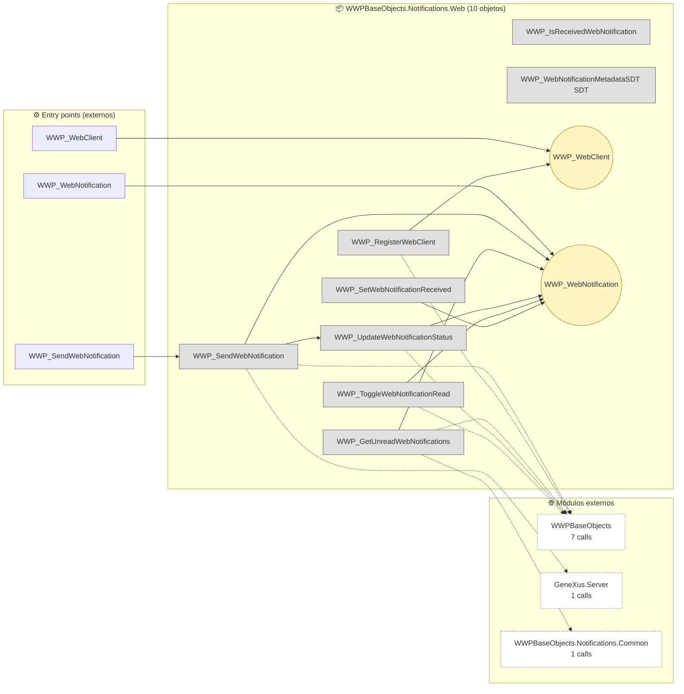
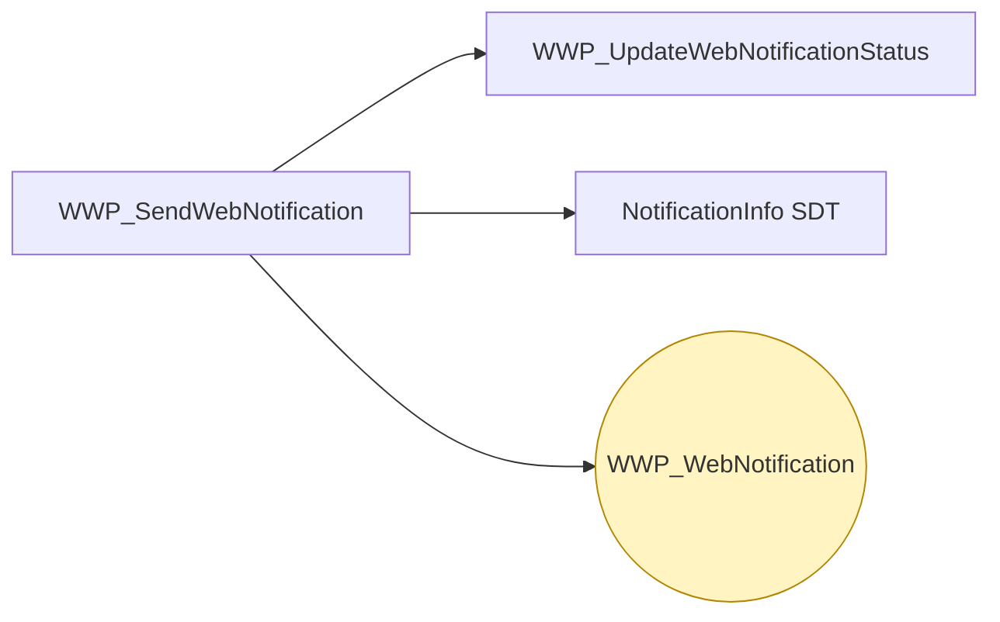
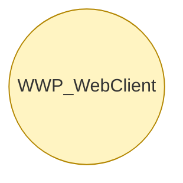
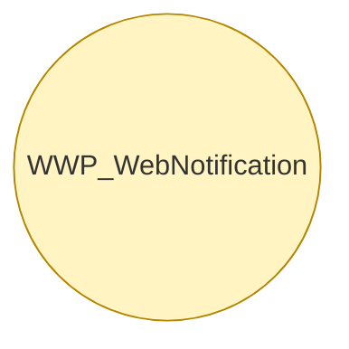

# Flujo del módulo: WWPBaseObjects.Notifications.Web

> Generado por `Scripts/generate-module-flows.ps1` a partir de `_index.json` + `_menu.json` + `_processes.json` + `Modules/WWPBaseObjects.Notifications.Web.md`.
> Renderización: Mermaid (VS Code Mermaid Preview, GitHub, GitLab).

---

## 📊 Resumen

| Métrica | Valor |
|---|---|
| Objetos totales | 10 |
| Transactions | 2 (WWP_WebClient, WWP_WebNotification) |
| WebPanels | 0 |
| Procedures | 7 |
| DataProviders | 0 |
| SDTs | 1 |
| Módulos que LLAMA | 3 (9 calls) |
| Módulos que LO LLAMAN | 1 (4 calls) |
| Procesos canónicos | 3 |

---

## 🚪 Entry points

| Entry | Tipo | Ruta / quién invoca |
|---|---|---|
| `WWP_SendWebNotification` | externo | WWPBaseObjects.Notifications.Common.WWP_SendPendingNotifications |
| `WWP_WebClient` | externo | WWPBaseObjects.Notifications.Common.WWP_CreateNotificationToUser |
| `WWP_WebNotification` | externo | WWPBaseObjects.Notifications.Common.WWP_CreateNotificationToUser, WWPBaseObjects.Notifications.Common.WWP_SendPendingNotifications |

---

## 🔀 Diagrama general del módulo

**Leyenda:**
- 🟡 círculo = Transaction (entidad de negocio)
- 🔵 caja = WebPanel (pantalla)
- ⬜ caja gris = Procedure / DataProvider / SDT
- ➡️ sólida = navegación/invocación principal
- ➡️ punteada = llamada secundaria (audit, cross-module)
- ➡️ gruesa `==>` = dependencia pesada (>30 calls al mismo peer)

---

## 📦 Procesos del módulo

### Proceso 1 -- `proc_wwpbase_objects_notifications_web_wwp_send_web_notification` (WWP_SendWebNotification)

**4 objetos · 2 módulos tocados.**

### Proceso 2 -- `proc_wwpbase_objects_notifications_web_wwp_web_client` (WWP_WebClient)

**1 objetos · 1 módulos tocados.**

### Proceso 3 -- `proc_wwpbase_objects_notifications_web_wwp_web_notification` (WWP_WebNotification)

**1 objetos · 1 módulos tocados.**

---

## 🔗 Llamadas cross-module detalladas

### → Llama a otros módulos

| Módulo destino | Llamadas | Top 3 objetos invocados |
|---|---:|---|
| `WWPBaseObjects` | 7 | `WWP_Logger`, `WWP_CreateUserExtended`, `WWP_ExistsUserExtended` |
| `GeneXus.Server` | 1 | `NotificationInfo` |
| `WWPBaseObjects.Notifications.Common` | 1 | `WWP_SDTNotificationsData` |

### ← Lo llaman desde

| Módulo origen | Llamadas | Top 3 callers |
|---|---:|---|
| `WWPBaseObjects.Notifications.Common` | 4 | `WWP_CreateNotificationToUser`, `WWP_SendPendingNotifications` |

---

## 🗃️ Datos tocados (extraído de la matrix)

| Entidad | Operación | Procesos del módulo que la tocan |
|---|---|---|
| `WWP_WebClient` | **C** | `proc_wwpbase_objects_notifications_web_wwp_web_client` |
| `WWP_WebNotification` | **CW** | `proc_wwpbase_objects_notifications_web_wwp_web_notification`, `proc_wwpbase_objects_notifications_web_wwp_send_web_notification` |

---

## 🧭 Lectura rápida del módulo

- **Propósito:** Módulo con 10 objetos parseados. Entidades centrales por referencias entrantes: `WWP_WebNotification`, `WWP_WebClient`. Sin entry points en `_menu.json` -- accedido indirectamente desde: WWPBaseObjects.Notifications.Common.
- **Patrón dominante:** módulo mixto.
- **Valor diferencial:** cluster más grande es `proc_wwpbase_objects_notifications_web_wwp_send_web_notification` (4 objetos).
- **Acoplamiento externo:** 3 peers, 9 calls totales. Top: `WWPBaseObjects` (7), `GeneXus.Server` (1), `WWPBaseObjects.Notifications.Common` (1).
- **Riesgo de migración:** medio — revisar las aristas cross-module individualmente en Phase 3.3.

