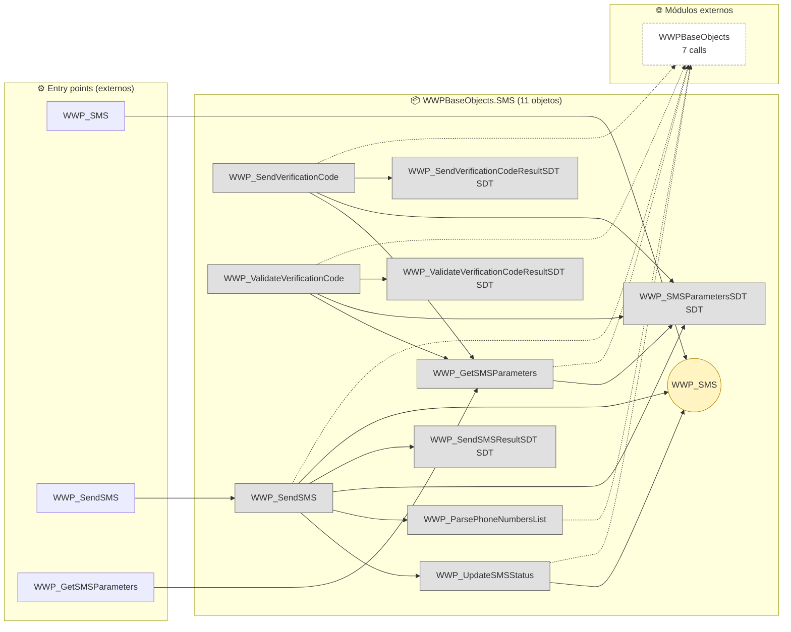
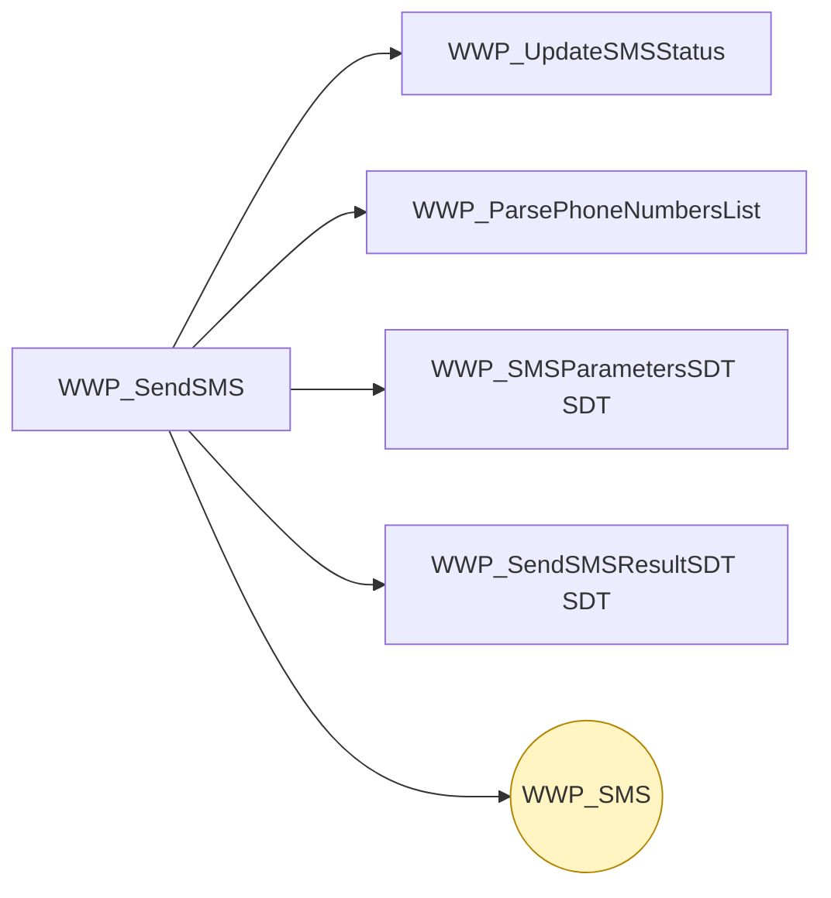
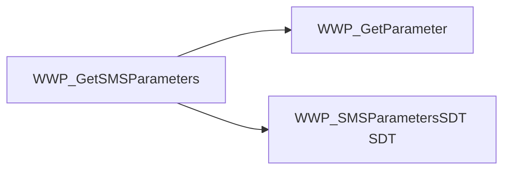
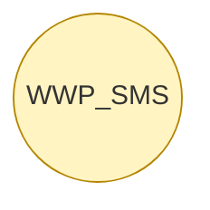

# Flujo del módulo: WWPBaseObjects.SMS

> Generado por `Scripts/generate-module-flows.ps1` a partir de `_index.json` + `_menu.json` + `_processes.json` + `Modules/WWPBaseObjects.SMS.md`.
> Renderización: Mermaid (VS Code Mermaid Preview, GitHub, GitLab).

---

## 📊 Resumen

| Métrica | Valor |
|---|---|
| Objetos totales | 11 |
| Transactions | 1 (WWP_SMS) |
| WebPanels | 0 |
| Procedures | 6 |
| DataProviders | 0 |
| SDTs | 4 |
| Módulos que LLAMA | 1 (7 calls) |
| Módulos que LO LLAMAN | 1 (6 calls) |
| Procesos canónicos | 3 |

---

## 🚪 Entry points

| Entry | Tipo | Ruta / quién invoca |
|---|---|---|
| `WWP_GetSMSParameters` | externo | WWPBaseObjects.Notifications.Common.WWP_SendPendingNotifications |
| `WWP_SendSMS` | externo | WWPBaseObjects.Notifications.Common.WWP_SendPendingNotifications |
| `WWP_SMS` | externo | WWPBaseObjects.Notifications.Common.WWP_CreateNotificationToUser, WWPBaseObjects.Notifications.Common.WWP_SendPendingNotifications |

---

## 🔀 Diagrama general del módulo

**Leyenda:**
- 🟡 círculo = Transaction (entidad de negocio)
- 🔵 caja = WebPanel (pantalla)
- ⬜ caja gris = Procedure / DataProvider / SDT
- ➡️ sólida = navegación/invocación principal
- ➡️ punteada = llamada secundaria (audit, cross-module)
- ➡️ gruesa `==>` = dependencia pesada (>30 calls al mismo peer)

---

## 📦 Procesos del módulo

### Proceso 1 -- `proc_wwpbase_objects_sms_wwp_send_sms` (WWP_SendSMS)

**6 objetos · 1 módulos tocados.**

### Proceso 2 -- `proc_wwpbase_objects_sms_wwp_get_smsparameters` (WWP_GetSMSParameters)

**3 objetos · 2 módulos tocados.**

### Proceso 3 -- `proc_wwpbase_objects_sms_wwp_sms` (WWP_SMS)

**1 objetos · 1 módulos tocados.**

---

## 🔗 Llamadas cross-module detalladas

### → Llama a otros módulos

| Módulo destino | Llamadas | Top 3 objetos invocados |
|---|---:|---|
| `WWPBaseObjects` | 7 | `WWP_Logger`, `WWP_GetParameter` |

### ← Lo llaman desde

| Módulo origen | Llamadas | Top 3 callers |
|---|---:|---|
| `WWPBaseObjects.Notifications.Common` | 6 | `WWP_SendPendingNotifications`, `WWP_CreateNotificationToUser` |

---

## 🗃️ Datos tocados (extraído de la matrix)

| Entidad | Operación | Procesos del módulo que la tocan |
|---|---|---|
| `WWP_SMS` | **CW** | `proc_wwpbase_objects_sms_wwp_sms`, `proc_wwpbase_objects_sms_wwp_send_sms` |

---

## 🧭 Lectura rápida del módulo

- **Propósito:** Módulo con 11 objetos parseados. Entidades centrales por referencias entrantes: `WWP_SMS`. Sin entry points en `_menu.json` -- accedido indirectamente desde: WWPBaseObjects.Notifications.Common.
- **Patrón dominante:** módulo mixto.
- **Valor diferencial:** cluster más grande es `proc_wwpbase_objects_sms_wwp_send_sms` (6 objetos).
- **Acoplamiento externo:** 1 peers, 7 calls totales. Top: `WWPBaseObjects` (7).
- **Riesgo de migración:** medio — revisar las aristas cross-module individualmente en Phase 3.3.

