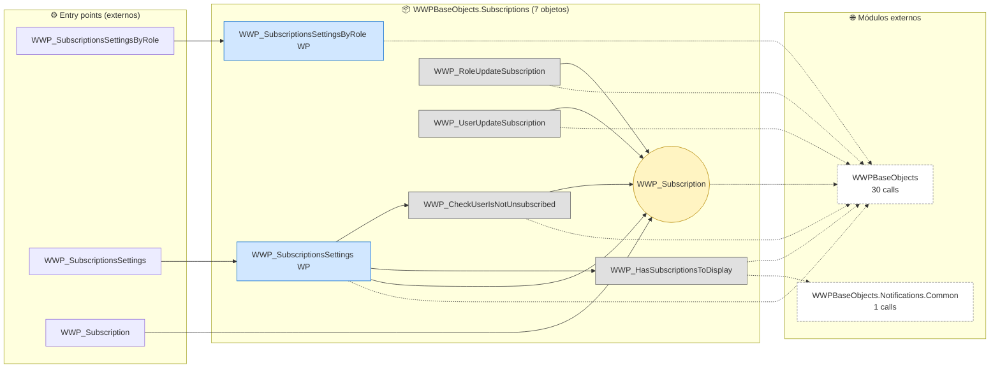
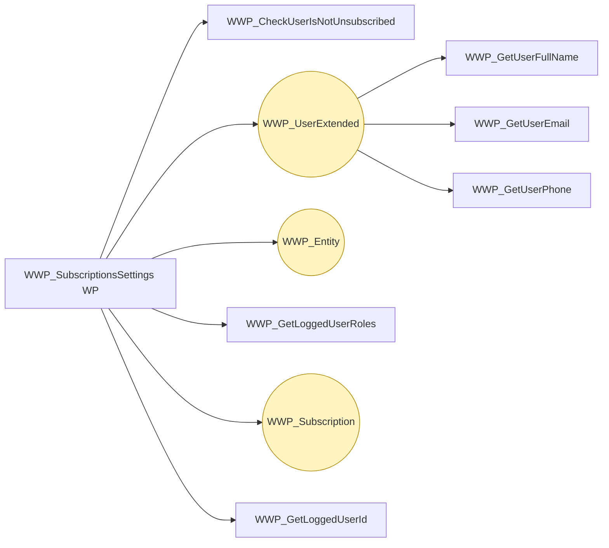
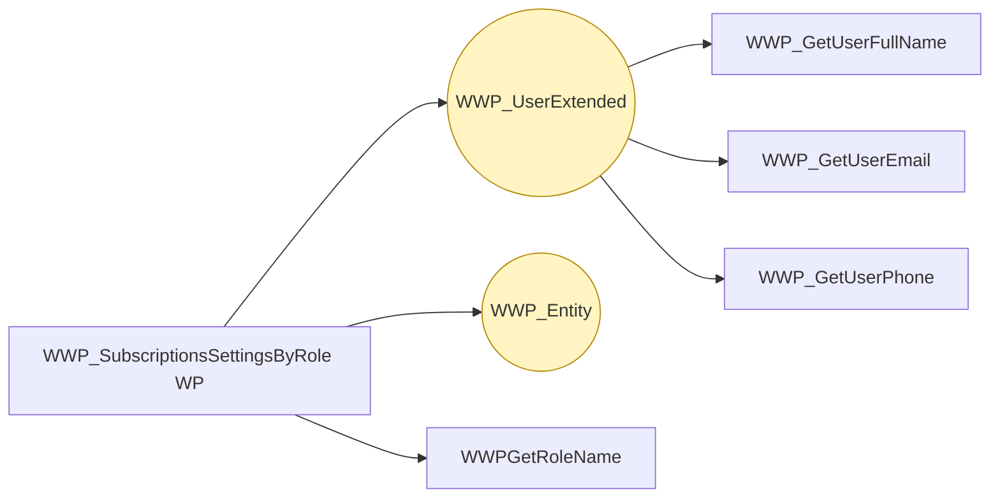
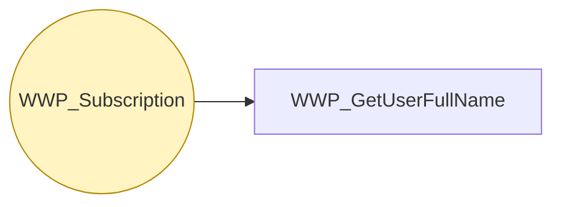

# Flujo del módulo: WWPBaseObjects.Subscriptions

> Generado por `Scripts/generate-module-flows.ps1` a partir de `_index.json` + `_menu.json` + `_processes.json` + `Modules/WWPBaseObjects.Subscriptions.md`.
> Renderización: Mermaid (VS Code Mermaid Preview, GitHub, GitLab).

---

## 📊 Resumen

| Métrica | Valor |
|---|---|
| Objetos totales | 7 |
| Transactions | 1 (WWP_Subscription) |
| WebPanels | 2 |
| Procedures | 4 |
| DataProviders | 0 |
| SDTs | 0 |
| Módulos que LLAMA | 2 (31 calls) |
| Módulos que LO LLAMAN | 11 (76 calls) |
| Procesos canónicos | 3 |

---

## 🚪 Entry points

| Entry | Tipo | Ruta / quién invoca |
|---|---|---|
| `WWP_Subscription` | externo | WWPBaseObjects.Discussions.WWP_SubscribeLoggedUserToDiscussion, WWPBaseObjects.Discussions.WWP_SubscribeMentionedUsersToDiscussion |
| `WWP_SubscriptionsSettings` | externo | WWPBaseObjects.ListWWPPrograms, WWPBaseObjects.Notifications.Common.WWP_VisualizeAllNotifications |
| `WWP_SubscriptionsSettingsByRole` | externo | Root.GAMWWRoles |

---

## 🔀 Diagrama general del módulo

**Leyenda:**
- 🟡 círculo = Transaction (entidad de negocio)
- 🔵 caja = WebPanel (pantalla)
- ⬜ caja gris = Procedure / DataProvider / SDT
- ➡️ sólida = navegación/invocación principal
- ➡️ punteada = llamada secundaria (audit, cross-module)
- ➡️ gruesa `==>` = dependencia pesada (>30 calls al mismo peer)

---

## 📦 Procesos del módulo

### Proceso 1 -- `proc_wwpbase_objects_subscriptions_wwp_subscriptions_settings` (WWP_SubscriptionsSettings)

**10 objetos · 2 módulos tocados.**

### Proceso 2 -- `proc_wwpbase_objects_subscriptions_wwp_subscriptions_settings_by_role` (WWP_SubscriptionsSettingsByRole)

**7 objetos · 2 módulos tocados.**

### Proceso 3 -- `proc_wwpbase_objects_subscriptions_wwp_subscription` (WWP_Subscription)

**2 objetos · 2 módulos tocados.**

---

## 🔗 Llamadas cross-module detalladas

### → Llama a otros módulos

| Módulo destino | Llamadas | Top 3 objetos invocados |
|---|---:|---|
| `WWPBaseObjects` | 30 | `LoadWWPContext`, `WWP_GetLoggedUserId`, `WWP_UserExtended` |
| `WWPBaseObjects.Notifications.Common` | 1 | `WWP_NotificationDefinition` |

### ← Lo llaman desde

| Módulo origen | Llamadas | Top 3 callers |
|---|---:|---|
| `DB` | 40 | `CompanyView`, `BudgetWW`, `EmbarquePalletView` |
| `Reportes` | 10 | `vwOrdenEtiquetado`, `ExtrusoraObservacionView`, `vwPrensadoResultado` |
| `Embarques` | 6 | `ListadoEmbarques`, `RemissionsWW`, `ListadoRemisiones` |
| `Calidad` | 4 | `reclamoview`, `CarreteDefectoWW`, `reclamosww` |
| `Produccion` | 3 | `vwAnaliticaBobina`, `vwAnaliticaCarrete`, `vwAnaliticaPrensado` |
| `WWPBaseObjects` | 3 | `AuditWW`, `AuditView`, `ListWWPPrograms` |
| `WWPBaseObjects.Notifications.Common` | 3 | `WWP_VisualizeAllNotifications`, `WWP_SendNotification` |
| `WWPBaseObjects.Mail` | 2 | `WWP_MailTemplateWW`, `WWP_MailTemplateView` |
| `Downtime` | 2 | `DownTimeCodeView`, `DownTimeCodeWW` |
| `WWPBaseObjects.Discussions` | 2 | `WWP_SubscribeLoggedUserToDiscussion`, `WWP_SubscribeMentionedUsersToDiscussion` |
| `Root` | 1 | `GAMWWRoles` |

---

## 🗃️ Datos tocados (extraído de la matrix)

| Entidad | Operación | Procesos del módulo que la tocan |
|---|---|---|
| `WWP_Entity` | **W** | `proc_wwpbase_objects_subscriptions_wwp_subscriptions_settings_by_role`, `proc_wwpbase_objects_subscriptions_wwp_subscriptions_settings` |
| `WWP_Subscription` | **CW** | `proc_wwpbase_objects_subscriptions_wwp_subscriptions_settings`, `proc_wwpbase_objects_subscriptions_wwp_subscription` |
| `WWP_UserExtended` | **W** | `proc_wwpbase_objects_subscriptions_wwp_subscriptions_settings_by_role`, `proc_wwpbase_objects_subscriptions_wwp_subscriptions_settings` |

---

## 🧭 Lectura rápida del módulo

- **Propósito:** Módulo con 7 objetos parseados. Entidades centrales por referencias entrantes: `WWP_Subscription`. Sin entry points en `_menu.json` -- accedido indirectamente desde: Calidad, DB, Downtime.
- **Patrón dominante:** módulo mixto.
- **Valor diferencial:** cluster más grande es `proc_wwpbase_objects_subscriptions_wwp_subscriptions_settings` (10 objetos).
- **Acoplamiento externo:** 2 peers, 31 calls totales. Top: `WWPBaseObjects` (30), `WWPBaseObjects.Notifications.Common` (1).
- **Riesgo de migración:** medio — revisar las aristas cross-module individualmente en Phase 3.3.

