# Flujo del módulo: WWPBaseObjects

> Generado por `Scripts/generate-module-flows.ps1` a partir de `_index.json` + `_menu.json` + `_processes.json` + `Modules/WWPBaseObjects.md`.
> Renderización: Mermaid (VS Code Mermaid Preview, GitHub, GitLab).

---

## 📊 Resumen

| Métrica | Valor |
|---|---|
| Objetos totales | 128 |
| Transactions | 4 (WWP_Entity, Audit, UserCustomizations, WWP_UserExtended) |
| WebPanels | 10 |
| Procedures | 79 |
| DataProviders | 8 |
| SDTs | 27 |
| Módulos que LLAMA | 12 (85 calls) |
| Módulos que LO LLAMAN | 17 (4427 calls) |
| Procesos canónicos | 19 |

---

## 🚪 Entry points

| Entry | Tipo | Ruta / quién invoca |
|---|---|---|
| `AuditDeleted` | externo | DB.CarreraWW, Produccion.listarTroquel |
| `DVMessageGetBasicNotificationMsg` | externo | admin.AgregarBobinas, Embarques.CargarEmbarque |
| `GetMenuAuthorizedOptions` | externo | Web.SetDefaultModule |
| `SecGAMGetAdvancedSecurityWWPFunctionalities` | externo | Root.SecGAMUpdatePermissions |
| `SetWWPContext` | externo | Root.Login, Web.SessionLoad |
| `WWP_CreateUserExtended` | externo | Root.GAMUserEntry, WWPBaseObjects.Notifications.Web.WWP_RegisterWebClient |
| `WWP_Entity` | externo | WWPBaseObjects.Subscriptions.WWP_SubscriptionsSettings, WWPBaseObjects.Subscriptions.WWP_SubscriptionsSettingsByRole |
| `WWP_ExistsUserExtended` | externo | WWPBaseObjects.Notifications.Web.WWP_RegisterWebClient |
| `WWP_GetEntityByName` | externo | WWPBaseObjects.Discussions.WWP_HasDiscussionMessages, WWPBaseObjects.Discussions.WWP_SubscribeLoggedUserToDiscussion |
| `WWP_GetLoggedUserId` | externo | DB.Embarque, WWPBaseObjects.Discussions.WWP_DiscussionMessage |
| `WWP_GetLoggedUserRoles` | externo | WWPBaseObjects.Subscriptions.WWP_SubscriptionsSettings |
| `WWP_GetParameter` | externo | Embarques.NotificarImpresion, Embarques.NotificarSupervisor |
| `WWP_GetUserEmail` | externo | WWPBaseObjects.Notifications.Common.WWP_CreateNotificationToUser |
| `WWP_GetUserFullName` | externo | DB.Embarque, WWPBaseObjects.Discussions.WWP_DiscussionMessage |
| `WWP_GetUserPhone` | externo | WWPBaseObjects.Notifications.Common.WWP_CreateNotificationToUser |
| `WWP_GetUsersFromRole` | externo | WWPBaseObjects.Notifications.Common.WWP_SendNotification, WWPBaseObjects.Subscriptions.WWP_RoleUpdateSubscription |
| `WWP_UpdateUserExtendedPhoto` | externo | Root.GAMUserEntry |
| `WWP_UserExtended` | externo | Root.GAMUserEntry, WWPBaseObjects.Discussions.WWP_GetUsersForDiscussionMentions |
| `WWPGetRoleName` | externo | WWPBaseObjects.Subscriptions.WWP_SubscriptionsSettingsByRole |

---

## 🔀 Diagrama general del módulo

Módulo de infraestructura (framework DVelop Work With Plus). Provee servicios transversales — auditoría, contexto de sesión, grid state, column selector, filtros, exportación, notificaciones (bridges), subscriptions, discussions. Sus objetos son invocados como utilidades desde todos los módulos de dominio. No tiene flujo de negocio propio que diagramar.

Si necesitás entender un servicio específico (ej. `LoadWWPContext`), abrir su archivo per-object en [`Procedures/WWPBaseObjects/`](../Procedures/WWPBaseObjects/).

---

## 📦 Procesos del módulo

### Proceso 1 -- `proc_wwpbase_objects_audit_deleted` (AuditDeleted)

**7 objetos · 1 módulos tocados.**

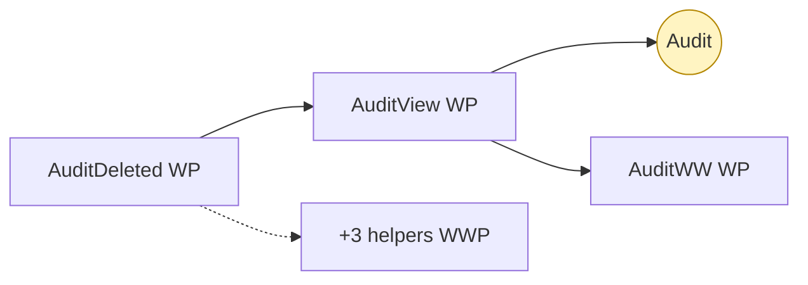

### Proceso 2 -- `proc_wwpbase_objects_wwp_create_user_extended` (WWP_CreateUserExtended)

**5 objetos · 1 módulos tocados.**

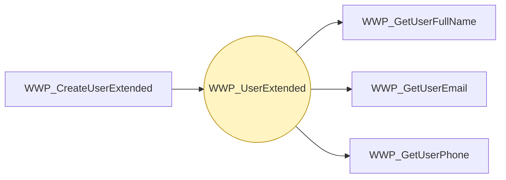

### Proceso 3 -- `proc_wwpbase_objects_wwp_exists_user_extended` (WWP_ExistsUserExtended)

**5 objetos · 1 módulos tocados.**

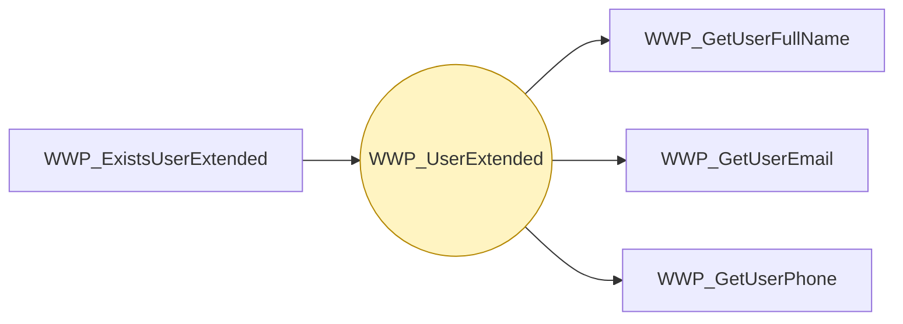

### Proceso 4 -- `proc_wwpbase_objects_wwp_update_user_extended_photo` (WWP_UpdateUserExtendedPhoto)

**5 objetos · 1 módulos tocados.**

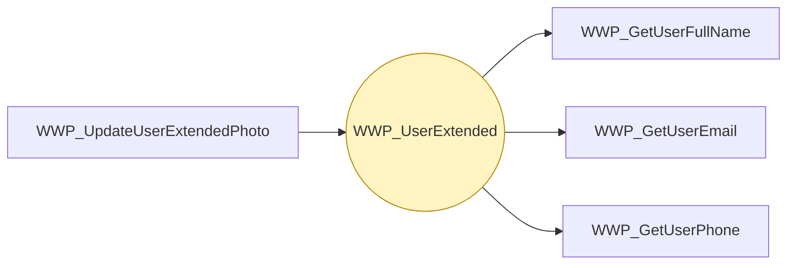

### Proceso 5 -- `proc_wwpbase_objects_wwp_user_extended` (WWP_UserExtended)

**4 objetos · 1 módulos tocados.**

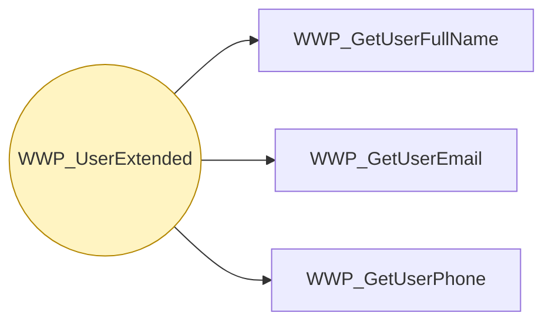

### Proceso 6 -- `proc_wwpbase_objects_get_menu_authorized_options` (GetMenuAuthorizedOptions)

**3 objetos · 1 módulos tocados.**

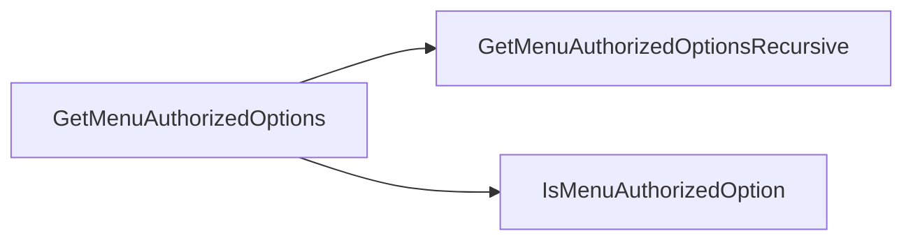

### Proceso 7 -- `proc_wwpbase_objects_dvmessage_get_basic_notification_msg` (DVMessageGetBasicNotificationMsg)

**2 objetos · 1 módulos tocados.**

### Proceso 8 -- `proc_wwpbase_objects_sec_gamget_advanced_security_wwpfunctionalities` (SecGAMGetAdvancedSecurityWWPFunctionalities)

**2 objetos · 1 módulos tocados.**

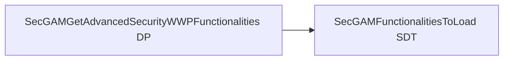

### Proceso 9 -- `proc_wwpbase_objects_wwp_get_entity_by_name` (WWP_GetEntityByName)

**2 objetos · 1 módulos tocados.**

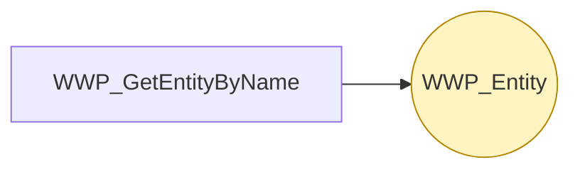

### Proceso 10 -- `proc_wwpbase_objects_set_wwpcontext` (SetWWPContext)

**1 objetos · 1 módulos tocados.**

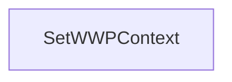

### Proceso 11 -- `proc_wwpbase_objects_wwp_entity` (WWP_Entity)

**1 objetos · 1 módulos tocados.**

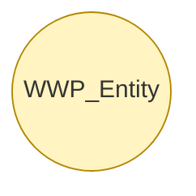

### Proceso 12 -- `proc_wwpbase_objects_wwp_get_logged_user_id` (WWP_GetLoggedUserId)

**1 objetos · 1 módulos tocados.**

### Proceso 13 -- `proc_wwpbase_objects_wwp_get_logged_user_roles` (WWP_GetLoggedUserRoles)

**1 objetos · 1 módulos tocados.**

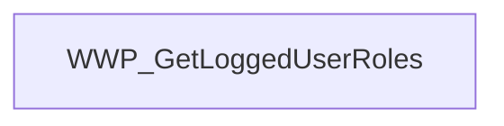

### Proceso 14 -- `proc_wwpbase_objects_wwp_get_parameter` (WWP_GetParameter)

**1 objetos · 1 módulos tocados.**

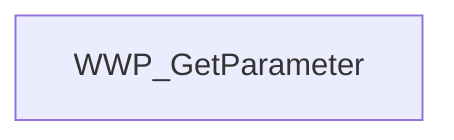

### Proceso 15 -- `proc_wwpbase_objects_wwp_get_user_email` (WWP_GetUserEmail)

**1 objetos · 1 módulos tocados.**

### Proceso 16 -- `proc_wwpbase_objects_wwp_get_user_full_name` (WWP_GetUserFullName)

**1 objetos · 1 módulos tocados.**

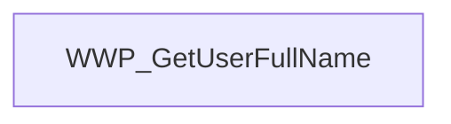

### Proceso 17 -- `proc_wwpbase_objects_wwp_get_user_phone` (WWP_GetUserPhone)

**1 objetos · 1 módulos tocados.**

### Proceso 18 -- `proc_wwpbase_objects_wwp_get_users_from_role` (WWP_GetUsersFromRole)

**1 objetos · 1 módulos tocados.**

### Proceso 19 -- `proc_wwpbase_objects_wwpget_role_name` (WWPGetRoleName)

**1 objetos · 1 módulos tocados.**

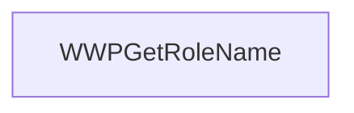

---

## 🔗 Llamadas cross-module detalladas

### → Llama a otros módulos

| Módulo destino | Llamadas | Top 3 objetos invocados |
|---|---:|---|
| `DB` | 23 | `BudgetWW`, `PrensadoInterrupcionWW`, `SalesPersonWW` |
| `Produccion` | 22 | `listarExtrusion`, `listarSilos`, `listarExtrusora` |
| `Root` | 9 | `GAMWWRoles`, `GAMWWUsers`, `GAMChangeYourPassword` |
| `Reportes` | 8 | `CausaInterrupcionWW`, `vwOrdenEtiquetado`, `CarreteEnPallet` |
| `GeneXus.Common` | 7 | `Messages` |
| `Embarques` | 6 | `ListadoEmbarques`, `RemissionsWW`, `ListadoRemisiones` |
| `WWPBaseObjects.Subscriptions` | 3 | `WWP_HasSubscriptionsToDisplay`, `WWP_SubscriptionsSettings` |
| `WWPBaseObjects.Notifications.Common` | 2 | `WWP_UpdateNotificationDefinitions`, `WWP_VisualizeAllNotifications` |
| `Calidad` | 2 | `CarreteDefectoWW`, `reclamosww` |
| `WWPBaseObjects.Discussions` | 1 | `WWP_HasDiscussionMessages` |
| `WWPBaseObjects.Mail` | 1 | `WWP_MailTemplateWW` |
| `Downtime` | 1 | `DownTimeCodeWW` |

### ← Lo llaman desde

| Módulo origen | Llamadas | Top 3 callers |
|---|---:|---|
| `DB` | 1750 | `CarreraWW`, `TroquelWW`, `ExtrusoraMezcladoraWW` |
| `Produccion` | 1155 | `listarTroquel`, `vwAnaliticaBobina`, `vwTrazabilidad` |
| `Reportes` | 543 | `ExtrusoraObservacionWW`, `vwPrensadoResultado`, `CarreteEnPallet` |
| `Embarques` | 340 | `OrdenesWW`, `RemissionsWW`, `ProductsWW` |
| `Root` | 198 | `GAMWWUsers`, `GAMWWRolePermissions`, `GAMWWUserRoles` |
| `Calidad` | 154 | `CarreteDefectoWW`, `reclamosww`, `reclamoswwExport` |
| `WWPBaseObjects.Mail` | 74 | `WWP_MailTemplateWW`, `WWP_MailTemplateWWExport`, `WWP_MailTemplate` |
| `Downtime` | 70 | `DownTimeCodeWW`, `DownTimeCodeWWExport`, `DownTimeCodeWWExportReport` |
| `Web` | 32 | `SessionLoad`, `SetDefaultModule`, `MenuConfiguracion` |
| `WWPBaseObjects.Subscriptions` | 30 | `WWP_SubscriptionsSettingsByRole`, `WWP_SubscriptionsSettings`, `WWP_HasSubscriptionsToDisplay` |
| `WWPBaseObjects.Notifications.Common` | 26 | `WWP_VisualizeAllNotifications`, `WWP_CreateNotificationToUser`, `WWP_SendNotification` |
| `admin` | 19 | `ImprimirBobinas`, `ImprimirBobinasGetFilterData`, `InsertarManualenteBobinas` |
| `WWPBaseObjects.Discussions` | 11 | `WWP_SubscribeLoggedUserToDiscussion`, `WWP_SubscribeMentionedUsersToDiscussion`, `WWP_GetUsersForDiscussionMentions` |
| `SAE` | 10 | `OrderPrompt`, `priceww`, `ProductDP` |
| `WWPBaseObjects.SMS` | 7 | `WWP_GetSMSParameters`, `WWP_UpdateSMSStatus`, `WWP_SendVerificationCode` |
| `WWPBaseObjects.Notifications.Web` | 7 | `WWP_RegisterWebClient`, `WWP_SendWebNotification`, `WWP_GetUnreadWebNotifications` |
| `Existencia` | 1 | `wpExistenciaMain` |

---

## 🗃️ Datos tocados (extraído de la matrix)

| Entidad | Operación | Procesos del módulo que la tocan |
|---|---|---|
| `Audit` | **W** | `proc_wwpbase_objects_audit_deleted` |
| `WWP_Entity` | **CW** | `proc_wwpbase_objects_wwp_entity`, `proc_wwpbase_objects_wwp_get_entity_by_name` |
| `WWP_UserExtended` | **CW** | `proc_wwpbase_objects_wwp_user_extended`, `proc_wwpbase_objects_wwp_exists_user_extended`, `proc_wwpbase_objects_wwp_create_user_extended` _(+1)_ |

---

## 🧭 Lectura rápida del módulo

- **Propósito:** Top entidades con descripción sustantiva en el KB: "Extended User from GAMUser" (`WWP_UserExtended`); "User Custom" (`UserCustomizations`).
- **Patrón dominante:** módulo de infraestructura (colección de SDTs / utilidades sin flujo propio).
- **Valor diferencial:** cluster más grande es `proc_wwpbase_objects_audit_deleted` (7 objetos).
- **Acoplamiento externo:** 12 peers, 85 calls totales. Top: `DB` (23), `Produccion` (22), `Root` (9).
- **Riesgo de migración:** ninguno si el framework target replica los SDTs. Alto si hay que reescribir código generado contra ellos.

