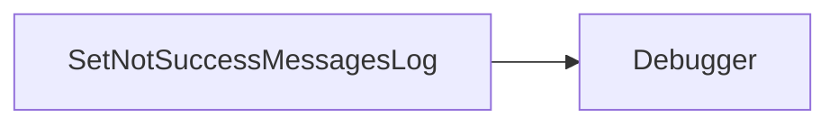

# Flujo del módulo: Web

> Generado por `Scripts/generate-module-flows.ps1` a partir de `_index.json` + `_menu.json` + `_processes.json` + `Modules/Web.md`.
> Renderización: Mermaid (VS Code Mermaid Preview, GitHub, GitLab).

---

## 📊 Resumen

| Métrica | Valor |
|---|---|
| Objetos totales | 23 |
| Transactions | 0 |
| WebPanels | 3 |
| Procedures | 6 |
| DataProviders | 12 |
| SDTs | 2 |
| Módulos que LLAMA | 11 (166 calls) |
| Módulos que LO LLAMAN | 6 (34 calls) |
| Procesos canónicos | 2 |

---

## 🚪 Entry points

| Entry | Tipo | Ruta / quién invoca |
|---|---|---|
| `Debugger` | externo | admin.AgregarBobinas, admin.InsertarManualenteBobinas |
| `SetNotSuccessMessagesLog` | externo | Produccion.CrearExtrusion, Seguridad.DeshabilitarOperador |

---

## 🔀 Diagrama general del módulo

```mermaid
flowchart LR
    subgraph XEN["⚙️ Entry points (externos)"]
        X1[Debugger]
        X2[SetNotSuccessMessagesLog]
    end

    subgraph MOD["📦 Web (23 objetos)"]
        direction TB
    DP_MenuCalidad[MenuCalidad DP]
    DP_MenuConfiguracion[MenuConfiguracion DP]
    DP_MenuEmbarques[MenuEmbarques DP]
    DP_MenuExtrusion[MenuExtrusion DP]
    DP_MenuInventario[MenuInventario DP]
    DP_MenuMateriaPrima[MenuMateriaPrima DP]
    DP_MenuModuleCatalogosSAE[MenuModuleCatalogosSAE DP]
    DP_MenuModuleInformesSAE[MenuModuleInformesSAE DP]
    DP_MenuPrensado[MenuPrensado DP]
    DP_MenuProduccion[MenuProduccion DP]
    DP_MenuSeguridad[MenuSeguridad DP]
    DP_Modules[Modules DP]
    P_Debugger[Debugger]
    P_MenuByModule[MenuByModule]
    P_SessionLoad[SessionLoad]
    P_SetDefaultModule[SetDefaultModule]
    P_SetNotSuccessMessagesLog[SetNotSuccessMessagesLog]
    S_ModuleAGridTodoListSDT[ModuleAGridTodoListSDT SDT]
    WP_ModuleA[ModuleA WP]
    WP_ModuleB[ModuleB WP]
        OTROS[+3 objetos internos]
    end

    subgraph EXT["🌐 Módulos externos"]
        E_Produccion[Produccion<br/>46 calls]
        E_DB[DB<br/>43 calls]
        E_WWPBaseObjects[WWPBaseObjects<br/>32 calls]
        E_GeneXusReporting[GeneXusReporting<br/>16 calls]
        E_SAE[SAE<br/>8 calls]
        E_Embarques[Embarques<br/>7 calls]
        E_Calidad[Calidad<br/>5 calls]
        E_Reportes[Reportes<br/>3 calls]
        E_Root[Root<br/>2 calls]
        E_Seguridad[Seguridad<br/>2 calls]
        E_GeneXus_Common[GeneXus.Common<br/>2 calls]
    end

    X1 --> P_Debugger
    X2 --> P_SetNotSuccessMessagesLog
    P_SetNotSuccessMessagesLog --> P_Debugger
    P_MenuByModule --> DP_MenuProduccion
    P_MenuByModule --> DP_MenuModuleInformesSAE
    P_MenuByModule --> DP_MenuModuleCatalogosSAE
    P_MenuByModule --> DP_MenuSeguridad
    P_MenuByModule --> DP_MenuExtrusion
    P_MenuByModule --> DP_MenuPrensado
    P_MenuByModule --> DP_MenuMateriaPrima
    P_MenuByModule --> DP_MenuConfiguracion
    P_MenuByModule --> DP_MenuInventario
    P_MenuByModule --> DP_MenuEmbarques
    P_MenuByModule --> DP_MenuCalidad
    WP_ModuleA --> S_ModuleAGridTodoListSDT
    P_SetDefaultModule --> DP_Modules
    P_SessionLoad --> P_SetDefaultModule
    OTROS -.-> P_Debugger
    P_SetNotSuccessMessagesLog -.-> E_GeneXus_Common
    DP_MenuProduccion ==> E_WWPBaseObjects
    DP_MenuProduccion ==> E_DB
    DP_MenuProduccion ==> E_Produccion
    DP_MenuMateriaPrima ==> E_WWPBaseObjects
    DP_MenuMateriaPrima ==> E_DB
    DP_MenuMateriaPrima ==> E_Produccion
    P_MenuByModule -.-> E_Reportes
    P_MenuByModule ==> E_WWPBaseObjects
    DP_MenuConfiguracion ==> E_WWPBaseObjects
    DP_MenuConfiguracion ==> E_DB
    DP_MenuConfiguracion ==> E_Produccion
    DP_MenuPrensado ==> E_WWPBaseObjects
    DP_MenuPrensado ==> E_DB
    DP_MenuPrensado ==> E_Produccion
    DP_Modules ==> E_WWPBaseObjects
    DP_Modules ==> E_Produccion
    DP_Modules -.-> E_SAE
    DP_Modules -.-> E_Seguridad
    DP_Modules -.-> E_Embarques
    DP_Modules -.-> E_Calidad
    DP_Modules -.-> E_Reportes
    WP_ModuleA ==> E_WWPBaseObjects
    WP_ModuleA -.-> E_GeneXusReporting
    WP_ModuleA ==> E_DB
    DP_MenuEmbarques ==> E_WWPBaseObjects
    DP_MenuEmbarques ==> E_DB
    DP_MenuEmbarques -.-> E_Embarques
    DP_MenuExtrusion ==> E_WWPBaseObjects
    DP_MenuExtrusion ==> E_DB
    DP_MenuExtrusion ==> E_Produccion
    DP_MenuModuleCatalogosSAE ==> E_WWPBaseObjects
    DP_MenuModuleCatalogosSAE ==> E_DB
    DP_MenuModuleCatalogosSAE -.-> E_SAE
    DP_MenuModuleCatalogosSAE -.-> E_Embarques
    DP_MenuModuleInformesSAE ==> E_WWPBaseObjects
    DP_MenuModuleInformesSAE ==> E_DB
    DP_MenuModuleInformesSAE -.-> E_SAE
    WP_ModuleB -.-> E_GeneXusReporting
    DP_MenuInventario ==> E_WWPBaseObjects
    DP_MenuInventario ==> E_Produccion
    DP_MenuCalidad ==> E_WWPBaseObjects
    DP_MenuCalidad -.-> E_Calidad
    P_SetDefaultModule ==> E_WWPBaseObjects
    DP_MenuSeguridad ==> E_WWPBaseObjects
    DP_MenuSeguridad -.-> E_Root
    DP_MenuSeguridad -.-> E_Seguridad
    P_SessionLoad ==> E_WWPBaseObjects

    classDef trn fill:#fff4c2,stroke:#b38600
    classDef wp fill:#d1e7ff,stroke:#0066cc
    classDef proc fill:#e0e0e0,stroke:#666
    classDef ext fill:#fff,stroke:#999,stroke-dasharray: 4 2
    class WP_ModuleA,WP_ModuleB wp
    class P_Debugger,P_SetNotSuccessMessagesLog,DP_MenuProduccion,DP_MenuMateriaPrima,P_MenuByModule,DP_MenuConfiguracion,DP_MenuPrensado,DP_Modules,DP_MenuEmbarques,DP_MenuExtrusion,DP_MenuModuleCatalogosSAE,DP_MenuModuleInformesSAE,DP_MenuInventario,DP_MenuCalidad,P_SetDefaultModule,DP_MenuSeguridad,P_SessionLoad,S_ModuleAGridTodoListSDT proc
    class E_Embarques,E_WWPBaseObjects,E_GeneXus_Common,E_DB,E_Root,E_Reportes,E_SAE,E_Produccion,E_Calidad,E_Seguridad,E_GeneXusReporting ext
```

**Leyenda:**
- 🟡 círculo = Transaction (entidad de negocio)
- 🔵 caja = WebPanel (pantalla)
- ⬜ caja gris = Procedure / DataProvider / SDT
- ➡️ sólida = navegación/invocación principal
- ➡️ punteada = llamada secundaria (audit, cross-module)
- ➡️ gruesa `==>` = dependencia pesada (>30 calls al mismo peer)

---

## 📦 Procesos del módulo

### Proceso 1 -- `proc_web_set_not_success_messages_log` (SetNotSuccessMessagesLog)

**2 objetos · 1 módulos tocados.**

### Proceso 2 -- `proc_web_debugger` (Debugger)

**1 objetos · 1 módulos tocados.**

---

## 🔗 Llamadas cross-module detalladas

### → Llama a otros módulos

| Módulo destino | Llamadas | Top 3 objetos invocados |
|---|---:|---|
| `Produccion` | 46 | `listarSilos`, `InicioProduccion`, `listarLotes` |
| `DB` | 43 | `WWConfiguracion`, `PaletWW`, `CarreraWW` |
| `WWPBaseObjects` | 32 | `DVelop_Menu`, `ProgramNames`, `GetMenuAuthorizedOptions` |
| `GeneXusReporting` | 16 | `QueryViewerParameters`, `QueryViewerDragAndDropData`, `QueryViewerElements` |
| `SAE` | 8 | `InicioCatalogosSAE`, `priceww`, `OrdersMoney` |
| `Embarques` | 7 | `InicioEmbarques`, `ProductsWW`, `ListadoRemisiones` |
| `Calidad` | 5 | `InicioCalidad`, `CarreteDefectoWW`, `reclamosww` |
| `Reportes` | 3 | `MenuReportesHC`, `InicioReportesHC` |
| `Root` | 2 | `GAMWWRoles`, `GAMWWUsers` |
| `Seguridad` | 2 | `inicioSeguridad` |
| `GeneXus.Common` | 2 | `Messages` |

### ← Lo llaman desde

| Módulo origen | Llamadas | Top 3 callers |
|---|---:|---|
| `PrinterSD` | 11 | `ObtenerSDTEtiquetaCarrete`, `PalletCarreteReportMainPCR`, `PaletReportSAP` |
| `Produccion` | 9 | `CrearExtrusion`, `vwAnaliticaCarrete`, `TieneTraslapePrensado` |
| `Seguridad` | 4 | `HabilitarOperador`, `DeshabilitarOperador` |
| `admin` | 4 | `AgregarBobinas`, `InsertarManualenteBobinas` |
| `Existencia` | 4 | `ExistenciaBobinasPorTurnoId`, `ExistenciaPalletPorTurnoId` |
| `DB` | 2 | `CarreteWW` |

---

## 🗃️ Datos tocados (extraído de la matrix)

_(ningún proceso de este módulo toca entidades en la matrix)_

---

## 🧭 Lectura rápida del módulo

- **Propósito:** Módulo con 23 objetos parseados. Sin entry points en `_menu.json` -- accedido indirectamente desde: admin, DB, Existencia.
- **Patrón dominante:** módulo funcional / dashboard sin entidades propias; consume Trns de `DB`.
- **Valor diferencial:** cluster más grande es `proc_web_set_not_success_messages_log` (2 objetos).
- **Acoplamiento externo:** 11 peers, 166 calls totales. Top: `Produccion` (46), `DB` (43), `WWPBaseObjects` (32).
- **Riesgo de migración:** medio-alto — fuerte acoplamiento a `DB` (43 calls). DB se migra primero o junto.

