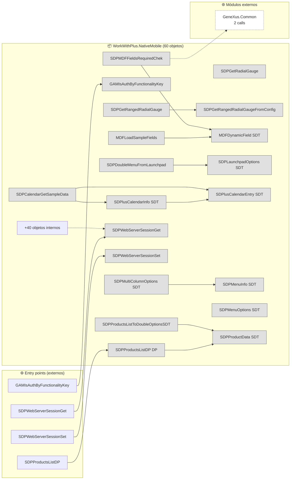
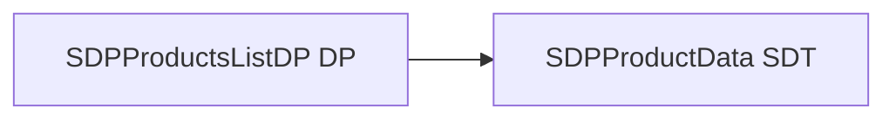
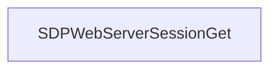

# Flujo del módulo: WorkWithPlus.NativeMobile

> Generado por `Scripts/generate-module-flows.ps1` a partir de `_index.json` + `_menu.json` + `_processes.json` + `Modules/WorkWithPlus.NativeMobile.md`.
> Renderización: Mermaid (VS Code Mermaid Preview, GitHub, GitLab).

---

## 📊 Resumen

| Métrica | Valor |
|---|---|
| Objetos totales | 60 |
| Transactions | 0 |
| WebPanels | 0 |
| Procedures | 34 |
| DataProviders | 11 |
| SDTs | 15 |
| Módulos que LLAMA | 1 (2 calls) |
| Módulos que LO LLAMAN | 1 (14 calls) |
| Procesos canónicos | 4 |

---

## 🚪 Entry points

| Entry | Tipo | Ruta / quién invoca |
|---|---|---|
| `GAMIsAuthByFunctionalityKey` | externo | Root.HICONESDOptionsDP |
| `SDPProductsListDP` | externo | Root.SDPGetProductData |
| `SDPWebServerSessionGet` | externo | Root.SDPCartAddressGetSelected, Root.SDPCartPaymentMethodsGetSelected |
| `SDPWebServerSessionSet` | externo | Root.SDPCartAddressSetSelected, Root.SDPCartPaymentMethodsSetSelected |

---

## 🔀 Diagrama general del módulo

**Leyenda:**
- 🟡 círculo = Transaction (entidad de negocio)
- 🔵 caja = WebPanel (pantalla)
- ⬜ caja gris = Procedure / DataProvider / SDT
- ➡️ sólida = navegación/invocación principal
- ➡️ punteada = llamada secundaria (audit, cross-module)
- ➡️ gruesa `==>` = dependencia pesada (>30 calls al mismo peer)

---

## 📦 Procesos del módulo

### Proceso 1 -- `proc_work_with_plus_native_mobile_sdpproducts_list_dp` (SDPProductsListDP)

**2 objetos · 1 módulos tocados.**

### Proceso 2 -- `proc_work_with_plus_native_mobile_gamis_auth_by_functionality_key` (GAMIsAuthByFunctionalityKey)

**1 objetos · 1 módulos tocados.**

### Proceso 3 -- `proc_work_with_plus_native_mobile_sdpweb_server_session_get` (SDPWebServerSessionGet)

**1 objetos · 1 módulos tocados.**

### Proceso 4 -- `proc_work_with_plus_native_mobile_sdpweb_server_session_set` (SDPWebServerSessionSet)

**1 objetos · 1 módulos tocados.**

---

## 🔗 Llamadas cross-module detalladas

### → Llama a otros módulos

| Módulo destino | Llamadas | Top 3 objetos invocados |
|---|---:|---|
| `GeneXus.Common` | 2 | `GeolocationInfo`, `Messages` |

### ← Lo llaman desde

| Módulo origen | Llamadas | Top 3 callers |
|---|---:|---|
| `Root` | 14 | `HICONESDOptionsDP`, `SDPGetProductData`, `HICONEInfoDP` |

---

## 🗃️ Datos tocados (extraído de la matrix)

_(ningún proceso de este módulo toca entidades en la matrix)_

---

## 🧭 Lectura rápida del módulo

- **Propósito:** Módulo con 60 objetos parseados. Sin entry points en `_menu.json` -- accedido indirectamente desde: Root.
- **Patrón dominante:** módulo de procesos / utilities sin UI directa.
- **Valor diferencial:** cluster más grande es `proc_work_with_plus_native_mobile_sdpproducts_list_dp` (2 objetos).
- **Acoplamiento externo:** 1 peers, 2 calls totales. Top: `GeneXus.Common` (2).
- **Riesgo de migración:** medio — revisar las aristas cross-module individualmente en Phase 3.3.

