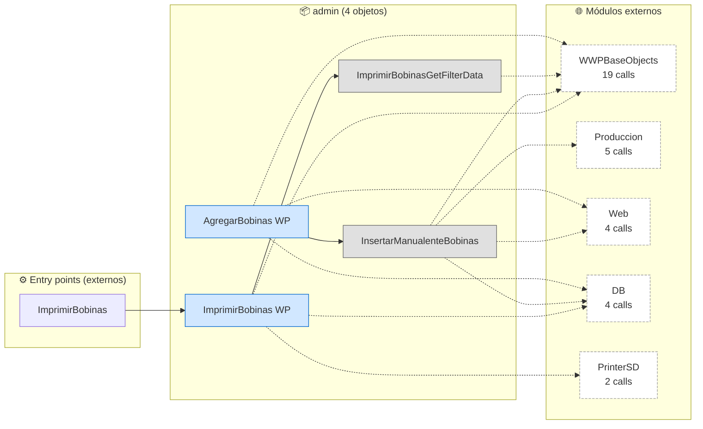
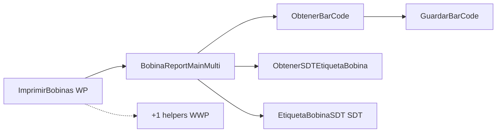

# Flujo del módulo: admin

> Generado por `Scripts/generate-module-flows.ps1` a partir de `_index.json` + `_menu.json` + `_processes.json` + `Modules/admin.md`.
> Renderización: Mermaid (VS Code Mermaid Preview, GitHub, GitLab).

---

## 📊 Resumen

| Métrica | Valor |
|---|---|
| Objetos totales | 4 |
| Transactions | 0 |
| WebPanels | 2 |
| Procedures | 2 |
| DataProviders | 0 |
| SDTs | 0 |
| Módulos que LLAMA | 5 (34 calls) |
| Módulos que LO LLAMAN | 1 (1 calls) |
| Procesos canónicos | 1 |

---

## 🚪 Entry points

| Entry | Tipo | Ruta / quién invoca |
|---|---|---|
| `ImprimirBobinas` | externo | Produccion.vwAnaliticaBobina |

---

## 🔀 Diagrama general del módulo

**Leyenda:**
- 🟡 círculo = Transaction (entidad de negocio)
- 🔵 caja = WebPanel (pantalla)
- ⬜ caja gris = Procedure / DataProvider / SDT
- ➡️ sólida = navegación/invocación principal
- ➡️ punteada = llamada secundaria (audit, cross-module)
- ➡️ gruesa `==>` = dependencia pesada (>30 calls al mismo peer)

---

## 📦 Procesos del módulo

### Proceso 1 -- `proc_admin_imprimir_bobinas` (ImprimirBobinas)

**7 objetos · 2 módulos tocados.**

---

## 🔗 Llamadas cross-module detalladas

### → Llama a otros módulos

| Módulo destino | Llamadas | Top 3 objetos invocados |
|---|---:|---|
| `WWPBaseObjects` | 19 | `LoadWWPContext`, `WWPContext`, `LoadGridState` |
| `Produccion` | 5 | `GuardarBobina`, `GenerarBobinaNo`, `SDTBobina` |
| `Web` | 4 | `Debugger` |
| `DB` | 4 | `Bobina`, `Extrusion` |
| `PrinterSD` | 2 | `BobinaReportMainMulti` |

### ← Lo llaman desde

| Módulo origen | Llamadas | Top 3 callers |
|---|---:|---|
| `Produccion` | 1 | `vwAnaliticaBobina` |

---

## 🗃️ Datos tocados (extraído de la matrix)

| Entidad | Operación | Procesos del módulo que la tocan |
|---|---|---|
| `Order` | **R** | `proc_admin_imprimir_bobinas` |

---

## 🧭 Lectura rápida del módulo

- **Propósito:** Módulo con 4 objetos parseados. Sin entry points en `_menu.json` -- accedido indirectamente desde: Produccion.
- **Patrón dominante:** módulo funcional / dashboard sin entidades propias; consume Trns de `DB`.
- **Valor diferencial:** cluster más grande es `proc_admin_imprimir_bobinas` (7 objetos).
- **Acoplamiento externo:** 5 peers, 34 calls totales. Top: `WWPBaseObjects` (19), `Produccion` (5), `Web` (4).
- **Riesgo de migración:** medio — revisar las aristas cross-module individualmente en Phase 3.3.

