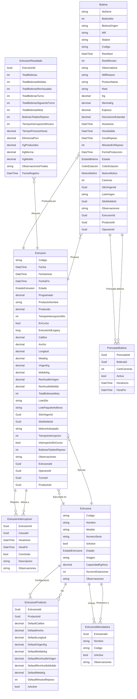

# Diagrama de Base de Datos - Extrusión

A continuación se muestra el diagrama Entidad-Relación enfocado exclusivamente en el módulo de Extrusión:

```mermaid
erDiagram
    Bobina {
        string NoSerie
        int BobinaNo
        string BobinaOrigen
        string Mill
        string Station
        string Codigo
        DateTime RestStart
        int RestMinutes
        string Observations
        string MillReason
        string ProductName
        string Reel
        decimal Kg
        decimal MermaKg
        decimal Espesor
        decimal DesviacionEstandar
        DateTime HoraInicio
        DateTime HoraSalida
        DateTime IniciaReposo
        int MinutosEnReposo
        DateTime FechaProduccion
        EstadoBobina Estado
        ColorEstacion ColorEstacion
        MotivoMolino MotivoMolino
        int Carreras
        Guid SiloVirgenId
        string LoteVirgen
        Guid SiloMolidoId
        string Observaciones
        Guid ExtrusionId
        Guid ProductoId
        Guid OperarioId
    }
    Extrusion {
        string Codigo
        DateTime Fecha
        DateTime FechaInicio
        DateTime FechaFin
        EstadoExtrusion Estado
        decimal Programado
        string ProductoNombre
        decimal Producido
        int TiempoInterrupcionMin
        bool EnCurso
        long ExtrusionIdLegacy
        decimal Calibre
        decimal Ancho
        decimal Longitud
        decimal MetaKg
        decimal VirgenKg
        decimal MolidoKg
        decimal RevHusilloVirgen
        decimal RevHusilloMolido
        int TotalBobinasMeta
        string LoteSilo
        string LotePaqueteAditivos
        Guid SiloVirgenId
        Guid SiloMolidoId
        string MotivoAnticipado
        int TiempoInterrupcion
        bool InterrupcionEnCurso
        int BobinasTotalesReposo
        string Observaciones
        Guid ExtrusoraId
        Guid OperarioId
        Guid TurnoId
        Guid ProductoId
    }
    ExtrusionInterrupcion {
        Guid ExtrusionId
        Guid CausaId
        DateTime HoraInicio
        DateTime HoraFin
        bool Concluida
        string Descripcion
        string Observaciones
    }
    ExtrusionResultado {
        Guid ExtrusionId
        int TotalBobinas
        int TotalBobinasMolidas
        int TotalBobinasRechazadas
        int TotalBobinasTurno
        int TotalBobinasSiguienteTurno
        int TotalBobinasMeta
        int BobinasTotalesReposo
        int TiempoInterrupcionMinutos
        decimal TiempoProcesoHoras
        decimal EficienciaPorc
        decimal KgProducidos
        decimal KgMerma
        decimal KgMolido
        string ObservacionesFinales
        DateTime FechaRegistro
    }
    Extrusora {
        string Codigo
        string Nombre
        string Modelo
        string NumeroSerie
        bool IsActive
        EstadoExtrusora Estado
        string Imagen
        decimal CapacidadKgHora
        int NumeroEstaciones
        string Observaciones
    }
    ExtrusoraMezcladora {
        Guid ExtrusoraId
        string Nombre
        string Codigo
        bool IsActive
        string Observaciones
    }
    ExtrusoraProducto {
        Guid ExtrusoraId
        Guid ProductoId
        decimal DefaultCalibre
        decimal DefaultAncho
        decimal DefaultLongitud
        decimal DefaultVirgenKg
        decimal DefaultMolidoKg
        decimal DefaultRevHusilloVirgen
        decimal DefaultRevHusilloMolido
        decimal DefaultMetaKg
        int DefaultMinutosReposo
        bool IsActive
    }
    PrensadoBobina {
        Guid PrensadoId
        Guid BobinaId
        int CantCarreras
        bool Activa
        DateTime HoraInicio
        DateTime HoraFin
    }

    Bobina }o--|| Extrusion : "Producida por"
    Bobina ||--o{ PrensadoBobina : "Prensada en"
    Extrusion }o--|| Extrusora : "Ejecutada en"
    Extrusion ||--o{ Bobina : "Produce"
    Extrusion ||--o{ ExtrusionInterrupcion : "Registra"
    ExtrusionInterrupcion }o--|| Extrusion : "Afecta a"
    ExtrusionResultado }o--|| Extrusion : "Resume"
    Extrusora ||--o{ Extrusion : "Ejecuta"
    Extrusora ||--o{ ExtrusoraProducto : "Configuracion"
    Extrusora ||--o{ ExtrusoraMezcladora : "Incluye"
    ExtrusoraMezcladora }o--|| Extrusora : "Pertenece a"
    ExtrusoraProducto }o--|| Extrusora : "De"
    PrensadoBobina }o--|| Bobina : "Utiliza"
```
