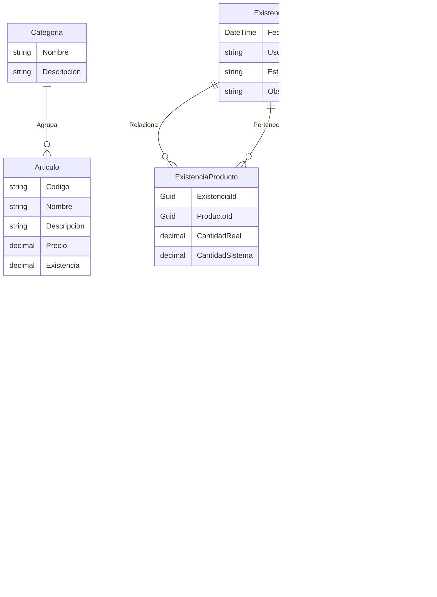

# Diagrama de Base de Datos - Inventario

A continuación se muestra el diagrama Entidad-Relación enfocado exclusivamente en el módulo de Inventario:

```mermaid
erDiagram
    Articulo {
        string Codigo
        string Nombre
        string Descripcion
        decimal Precio
        decimal Existencia
    }
    Categoria {
        string Nombre
        string Descripcion
    }
    Existencia {
        DateTime FechaHora
        string Usuario
        string Estado
        string Observaciones
    }
    ExistenciaProducto {
        Guid ExistenciaId
        Guid ProductoId
        decimal CantidadReal
        decimal CantidadSistema
    }
    ExistenciaSilo {
        Guid SiloId
        Guid ExistenciaId
        decimal Cantidad
        string LoteVirgen
        DateTime FechaRegistro
        string Observaciones
    }
    Silo {
        string Nombre
        string Codigo
        decimal CapacidadMaxima
        decimal ExistenciaActual
        decimal KgMinimo
        decimal KgMaximo
        string EstadoMaterial
        string TipoMaterial
        bool Activo
        Guid ArticuloId
        string Estado
        string Ubicacion
    }

    Categoria ||--o{ Articulo : "Agrupa"
    Existencia ||--o{ ExistenciaSilo : "Contiene"
    Existencia ||--o{ ExistenciaProducto : "Relaciona"
    ExistenciaProducto }o--|| Existencia : "Pertenece a"
    ExistenciaSilo }o--|| Silo : "Ubicado en"
    Silo ||--o{ ExistenciaSilo : "Almacena"
```
