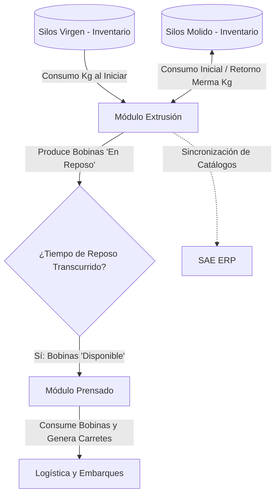

# Plan de Implementación y Prompt de Ejecución: Módulo de Extrusión

Este documento contiene un análisis detallado del estado del módulo de **Extrusión** en nuestro proyecto, sus conexiones con otros módulos y un plan de implementación estructurado en forma de **prompt profesional**. Este prompt está diseñado para guiar paso a paso la programación del backend y frontend para completar la integración.

---

## 🔍 Parte 1: Análisis Estructural y Funcional (HiCone3 & CodigosHi)

### 1. Objetos Legados de Extrusión Identificados
A partir del análisis en `C:\Users\FCO\Desktop\HiCone3` y las fuentes en `C:\Users\FCO\Downloads\CodigosHi`, se identificaron los siguientes componentes clave del módulo:

*   **Transacciones y Modelos de Base de Datos:**
    *   `Transactions/DB/Extrusion.md` / `.json`: Representa la orden de extrusión activa, control de operador, lote de materia prima y especificaciones de calibre, ancho y longitud.
    *   `Transactions/DB/ExtrusionResultado.md` / `.json`: Consolidación final de KPIs (total de bobinas, bobinas molidas, Kg producidos, eficiencia, tiempo de proceso).
    *   `Transactions/DB/ExtrusionInterrupcion.md` / `.json`: Bitácora de paros/tiempos de inactividad (Downtime).
    *   `Transactions/DB/Bobina.md` / `.json`: Detalle del rollo producido, peso, espesor y estado de calidad/reposo.
    *   `Transactions/DB/ExtrusoraMezcladora.md` / `.json`: Relación de silos mezcladores integrados.
    *   `Transactions/DB/ExtrusoraProducto.md` / `.json`: Configuración nominal por máquina-producto (calibre base, ancho, longitud, Kg base y tiempo de reposo en minutos).

*   **Procedimientos de Lógica de Negocio:**
    *   `Procedures/Produccion/SDInitExtrusion.md`: Inauguración de orden de extrusión, validación de stock y asignación de lote inicial.
    *   `Procedures/Produccion/SDFinalizarExtrusion.md`: Lógica crítica de fin de orden. Transfiere rollos "En Proceso" a la siguiente extrusión programada (`SgteExtrusionId`). Si hay cambio de material, recalibra la siguiente orden consultando `ExtrusoraProducto`.
    *   `Procedures/Produccion/SDCerrarExtrusion.md`: Pausa bobbins en curso, cambia el estado a Terminada y libera al operador (GAM `ExtrusionID` = '0').
    *   `Procedures/Produccion/SDPausarBobinas.md`: Cambia bobbins "En Proceso" a "En Reposo" e inserta la asociación a la extrusora.
    *   `Procedures/Produccion/ReposoTranscurrido.md` y `ReposoTranscurridoBobina.md`: Proceso de fondo que calcula la diferencia en minutos (`Now() - BobinaIniciaReposo`) y si excede el límite del catálogo, cambia el estado de la bobina a `Disponible` (estado 12).
    *   `Procedures/Produccion/SDRechazarBobina.md`: Lógica para descartar una bobina a molino, registrando merma y devolviendo transaccionalmente el peso de la bobina al silo de molido asignado.
    *   `Procedures/Produccion/SDTransferirBobina.md`: Permite reasignar una bobina a otra orden activa.
    *   `Procedures/Produccion/SDRecalibrarExtrusion.md`: Modifica en caliente las medidas nominales de calibre, ancho y longitud.

---

### 2. Conexión del Módulo de Extrusión con otros Módulos

El módulo de Extrusión es el corazón transaccional del flujo de material de la planta. Se conecta directamente con:



*   **Silos / Inventario (Materia Prima):**
    1.  **Consumo al Inaugurar:** Al iniciar la extrusión, se deduce del Silo Virgen (`SiloVirgenId`) la cantidad `virgenKg` y del Silo Molido (`SiloMolidoId`) la cantidad `molidoKg`. Si el stock es insuficiente, la transacción se aborta.
    2.  **Retorno de Merma:** Si una bobina es rechazada (durante el proceso en las estaciones A/B o en el historial), el peso total se suma transaccionalmente al stock del Silo de Molido configurado en la orden, registrando una bitácora en `AuditLogs` con el detalle de la acción.
    3.  **Lote Virgen:** Se obtiene el último lote registrado para el silo virgen (`Lotes`) y se asigna al campo `LoteSilo` de la Extrusión para asegurar la trazabilidad.

*   **Prensado (Consumo de Bobinas):**
    1.  El prensador no puede consumir cualquier bobina. Las bobinas producidas inician en estado `EnReposo` (o `EnProceso` hasta finalizar la orden).
    2.  Deben transcurrir los minutos configurados en `ExtrusoraProducto.DefaultMinutosReposo` antes de pasar a estado `Disponible`. El backend debe validar este estado y calcular dinámicamente si el tiempo ha transcurrido.

*   **SAE (ERP):**
    1.  Los artículos producidos y materias primas consumidas están vinculados al catálogo sincronizado de SAE (`SaeProduct`).

---

### 3. Diagnóstico de Gaps (Brechas) en el Proyecto Actual

*   **Backend (Brecha Crítica):**
    *   `IProduccionService` tiene definidos todos los métodos requeridos (`IniciarExtrusionAsync`, `FinalizarExtrusionAsync`, `GuardarBobinaAsync`, `ValidarBobinaAsync`, `RechazarBobinaAsync`, etc.), y `ProduccionService.cs` los tiene programados.
    *   **SIN EMBARGO, `ProduccionController.cs` NO EXPONE ESTAS ACCIONES.** Solo tiene endpoints para configuración de programación batch y lectura del tablero. El frontend Angular intenta consumir rutas como `api/v1/produccion/extrusion/iniciar` y recibe un error 404 porque el controlador no las expone.
    *   Falta automatización del proceso de **Reposo**. No hay un endpoint o proceso recurrente que actualice las bobinas en reposo a `Disponible`.
    *   Falta la lógica de **Transferencia de Bobinas** al finalizar una orden hacia la siguiente orden (`SgteExtrusionId`) y la **Recalibración** automática de la siguiente orden.

*   **Frontend (Brecha de Integración):**
    *   Las pantallas operativas de Angular (`extrusion-operador` y `extrusion-inicio`) están estructuradas estéticamente con HSL y Layouts premium, pero los botones y flujos de acción (Inaugurar, Registrar Bobina en A/B, Pausar, Validar, Rechazar, Transferir) están desconectados debido a los endpoints faltantes en el API Controller.
    *   Los componentes visuales como el **Sticker de Código de Barras**, la **Bitácora de Interrupciones**, y los modales de **Recalibración** requieren enlaces API correctos.

---
---

# 🤖 Parte 2: Prompt de Ejecución Profesional (docs/plan_extrusion_prompt.md)

Este es el prompt que se debe ejecutar en el entorno de desarrollo para realizar los cambios tanto en el Backend como en el Frontend y asegurar el correcto funcionamiento del módulo de Extrusión.

```markdown
# PROMPT DE DESARROLLO: INTEGRACIÓN DEL MÓDULO DE EXTRUSIÓN E INVENTARIO

Eres Antigravity, un desarrollador experto en .NET Core 8 Web API y Angular 17. Tu tarea es integrar por completo el flujo operacional de Extrusión en el ERP. Esto requiere exponer la lógica de negocio del servicio en el controlador de la API y conectar las pantallas del frontend.

Sigue detenidamente las siguientes fases e instrucciones paso a paso:

---

## 🛠️ FASE 1: EXTENSIÓN Y EXPOSICIÓN DE LA API DE EXTRUSIÓN (BACKEND)

### 1. Modificar [ProduccionController.cs](file:///C:/KBs/HiCone6/HiCone_ERP/src/Presentation/HiCone.API/Controllers/ProduccionController.cs)
Debes inyectar la interfaz `IProduccionService` en el constructor de `ProduccionController` y agregar los endpoints operacionales que el frontend está llamando en [produccion.ts](file:///C:/KBs/HiCone6/HiCone_ERP/src/Frontend/hicone-web/src/app/core/services/produccion.ts).

Asegúrate de agregar los siguientes endpoints bajo la ruta base `api/v1/produccion`:

#### A. Inaugurar Extrusión
*   **Ruta:** `POST extrusion/iniciar`
*   **Request Body (JSON):**
    ```json
    {
      "extrusoraId": "guid",
      "operarioId": "guid",
      "turnoId": "guid",
      "productoId": "guid",
      "siloVirgenId": "guid",
      "virgenKg": 0.0,
      "siloMolidoId": "guid?",
      "molidoKg": 0.0,
      "metaKg": 0.0,
      "revHusilloVirgen": 0.0,
      "revHusilloMolido": 0.0,
      "lotePaqueteAditivos": "string?",
      "observaciones": "string?"
    }
    ```
*   **Comportamiento:** Llama a `IniciarExtrusionAsync` de `IProduccionService`. Controla y retorna un `BadRequest(new { message = ex.Message })` si ocurre un error de stock o validación.

#### B. Finalizar Extrusión (Con soporte de Siguiente Orden/Recalibración)
*   **Ruta:** `POST extrusion/{id}/finalizar`
*   **Query Params / Body:** Permite recibir opcionalmente un motivo final y el ID de la siguiente extrusión programada (`sgteExtrusionId` / `nextExtrusionId`).
*   **Comportamiento:**
    *   Llama a `FinalizarExtrusionAsync(id, motivo)`.
    *   **Adición de Lógica Parity (Legacy `SDFinalizarExtrusion`):** Si se pasa un `sgteExtrusionId`, transfiere todas las bobinas en estado `EnProceso` de la extrusión finalizada a la siguiente extrusión. Si el producto de la siguiente extrusión es diferente, busca la configuración predeterminada en `ExtrusoraProductos` y recalibra la siguiente orden actualizando calibre, ancho y longitud.

#### C. Registrar/Guardar Bobina (Estación A y B)
*   **Ruta:** `POST extrusion/guardar-bobina`
*   **Request Body:**
    ```json
    {
      "extrusionId": "guid",
      "bobinaNo": 1,
      "origen": "A|B",
      "peso": 0.0,
      "calibre": 0.0,
      "desviacion": 0.0,
      "color": 1,
      "mermaKg": 0.0,
      "motivo": 0,
      "observaciones": "string?"
    }
    ```
*   **Comportamiento:** Llama a `GuardarBobinaAsync`. Si `mermaKg` es mayor a 0, la bobina se marca en estado `Molido` y el servicio sumará transaccionalmente ese peso al Silo de Molido configurado, registrando una bitácora en `AuditLogs`.

#### D. Obtener Extrusión Activa y Consecutivo
*   **Ruta:** `GET extrusion/activa/{extrusoraId}`
    *   Retorna la orden activa (`Estado == EstadoExtrusion.EnProceso`) de la máquina con sus bobinas ordenadas por estación y fecha.
*   **Ruta:** `GET extrusion/siguiente-bobina-no`
    *   Query Params: `extrusoraId`, `productoId`. Mapea a `ObtenerSiguienteBobinaNoAsync`.

#### E. Acciones Transaccionales de Bobina
*   **Ruta:** `POST bobina/{id}/pausar` -> Llama a `PausarBobinaAsync` (estado = `Pausada`).
*   **Ruta:** `POST bobina/{id}/validar` -> Llama a `ValidarBobinaAsync` (estado = `Disponible`).
*   **Ruta:** `POST bobina/{id}/rechazar` -> Recibe en el body `{ motivo, observaciones }` y llama a `RechazarBobinaAsync`. Debe retornar los kilos de la bobina al silo de molido asociado.
*   **Ruta:** `POST bobina/{id}/transferir` -> Recibe `{ extrusionDestinoId }` y llama a `TransferirBobinaAsync` para reasignar la bobina.

#### F. Recalibrar Extrusión en Caliente
*   **Ruta:** `POST extrusion/{id}/recalibrar`
    *   Body: `{ calibre?, ancho?, longitud? }`. Llama a `RecalibrarExtrusionAsync`.

#### G. Resultados y Consulta de Bobinas
*   **Ruta:** `GET extrusion/{id}/resultado` -> Mapea a `GetExtrusionResultadoAsync`.
*   **Ruta:** `GET extrusion/{id}/bobinas` -> Mapea a `GetBobinasByExtrusionAsync`.
*   **Ruta:** `GET extrusiones` -> Retorna todas las extrusiones.
*   **Ruta:** `GET disponibilidad/bobinas` -> Retorna las bobinas disponibles (`Disponible` o `EnReposo` que ya cumplieron su tiempo).

---

### 2. Implementar Proceso de Automatización de Reposo (Background check / Endpoint)
En `ProduccionService.cs`:
*   Modifica el método `GetBobinasDisponiblesParaPrensadoAsync` o implementa un método que se ejecute al consultar bobinas disponibles:
    1.  Obtiene todas las bobinas en estado `EnReposo`.
    2.  Para cada una, calcula los minutos transcurridos: `(DateTime.UtcNow - IniciaReposo).TotalMinutes`.
    3.  Consulta los minutos de reposo configurados en `ExtrusoraProductos` para la extrusora y producto de la bobina.
    4.  Si los minutos transcurridos son mayores o iguales a la configuración, actualiza automáticamente el estado de la bobina a `Disponible` en la base de datos.
    5.  Guarda los cambios de forma masiva.

---

## 💻 FASE 2: CONEXIÓN Y DEPURACIÓN DEL CLIENTE WEB (ANGULAR FRONTEND)

### 1. Verificar y Corregir Inyecciones en [extrusion-operador.ts](file:///C:/KBs/HiCone6/HiCone_ERP/src/Frontend/hicone-web/src/app/features/produccion/extrusion-operador/extrusion-operador.ts)
*   Asegúrate de que las rutas relativas de importación de `ProduccionService` e `InventarioService` estén correctas.
*   Valida que los métodos de `iniciarExtrusion`, `guardarBobina`, `finalizarExtrusion`, `pausarBobina`, `validarBobina`, `rechazarBobina` y `transferirBobina` mapeen exactamente a las llamadas de `this.prodService` y manejen los mensajes de error (`errorMessage`) y éxito (`successMessage`) en pantalla.
*   Revisa que el dropdown de Silo Virgen y Silo Molido filtre de manera dinámica utilizando los métodos `getSilosVirgenes()` y `getSilosMolidos()`.

### 2. Añadir y Vincular Modales Adicionales
*   **Modal de Interrupciones (Downtime):**
    *   En `extrusion-inicio.ts` y su respectiva tabla de operación, cuando el operador hace clic en "Act. Tiempos de Interrupción", debe abrirse un modal interactivo premium.
    *   Este modal debe permitir:
        1.  Ver las causas de interrupción cargadas desde el catálogo.
        2.  Registrar una nueva interrupción (Downtime) enviando `POST extrusion/interrupcion` con `{ entidadId, causaId, descripcion }`.
        3.  Cerrar la interrupción activa enviando `POST extrusion/interrupcion/activa/{id}/finalizar` para restablecer el estado de la máquina a `EnProceso`.
*   **Visualizador de Sticker y Generación de PDF/Impresión:**
    *   Verifica que al registrar con éxito una bobina, se cargue la previsualización del sticker interactivo con código de barras y que el botón de impresión mande a llamar a `window.print()` estilizado en CSS para ocultar el resto del panel y solo imprimir el sticker de 4x6 pulgadas.

---

## 🧪 FASE 3: PLAN DE VERIFICACIÓN (COMPILACIÓN Y PRUEBAS)

### 1. Pruebas de Compilación
*   Navega a la carpeta backend `HiCone_ERP` y ejecuta:
    ```powershell
    dotnet build
    ```
    Verifica que no existan errores de firmas, inyecciones de dependencias o namespaces.
*   Navega a la carpeta frontend `HiCone_ERP/src/Frontend/hicone-web` y ejecuta:
    ```powershell
    npm run build
    ```
    Confirma que Angular compile de forma exitosa sin advertencias o tipos incompatibles en TypeScript.

### 2. Pruebas Operativas de Flujo (End-to-End)
1.  **Inauguración con Validación de Stock:** Intenta inaugurar una orden con una cantidad mayor a la existencia del Silo Virgen. Debe mostrar la alerta: `❌ Cantidad excede existencia en Silo Virgen`.
2.  **Inauguración Exitosa:** Inaugura con valores válidos. Revisa en la base de datos o en la pantalla de existencias que la cantidad haya sido descontada del Silo Virgen.
3.  **Registro de Bobinas A/B:** Registra un par de bobinas. Verifica que se genere el secuencial correcto de código de barras y muestre el sticker.
4.  **Rechazo a Molino:** Rechaza una bobina desde el historial. El peso de la bobina debe sumarse automáticamente al Silo de Molido configurado.
5.  **Cierre de Extrusión:** Finaliza la orden. Verifica que las bobinas "En Proceso" cambien a "En Reposo" y la extrusora quede en estado "Disponible".
6.  **Simulación de Reposo:** Modifica la fecha de una bobina en la base de datos para simular el transcurso de los minutos de reposo. Verifica que pase a estado `Disponible` y pueda ser consumida por el módulo de Prensado.
```
